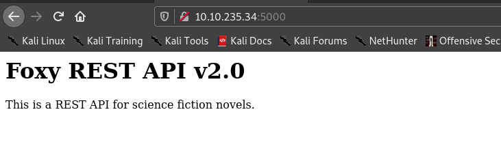
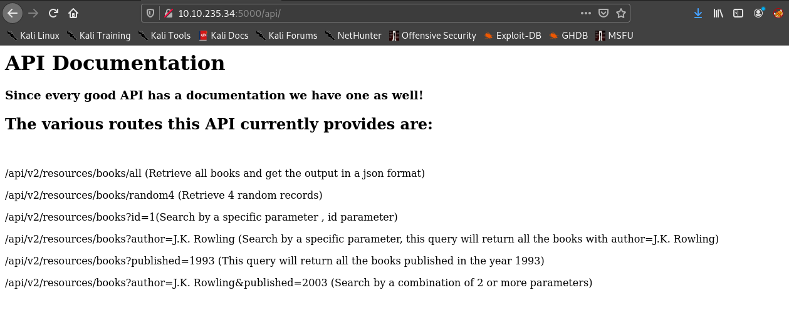

# Writeup of [BookStore](https://tryhackme.com/room/bookstoreoc) Room TryHackMe


## First Stage : Enumeration.


Let's start with nmap.

```nmap
Scanned at 2020-12-21 10:52:27 IST for 817s
Not shown: 65532 closed ports
Reason: 65532 conn-refused
PORT     STATE SERVICE REASON  VERSION
22/tcp   open  ssh     syn-ack OpenSSH 7.6p1 Ubuntu 4ubuntu0.3 (Ubuntu Linux; protocol 2.0)
| ssh-hostkey: 
|   2048 44:0e:60:ab:1e:86:5b:44:28:51:db:3f:9b:12:21:77 (RSA)
| ssh-rsa AAAAB3NzaC1yc2EAAAADAQABAAABAQCs5RybjdxaxapwkXwbzqZqONeX4X8rYtfTsy7wey7ZeRNsl36qQWhTrurBWWnYPO7wn2nEQ7Iz0+tmvSI3hms3eIEufCC/2FEftezKhtP1s4/qjp8UmRdaewMW2zYg+UDmn9QYmRfbBH80CLQvBwlsibEi3aLvhi/YrNCzL5yxMFQNWHIEMIry/FK1aSbMj7DEXTRnk5R3CYg3/OX1k3ssy7GlXAcvt5QyfmQQKfwpOG7UM9M8mXDCMiTGlvgx6dJkbG0XI81ho2yMlcDEZ/AsXaDPAKbH+RW5FsC5R1ft9PhRnaIkUoPwCLKl8Tp6YFSPcANVFYwTxtdUReU3QaF9
|   256 59:2f:70:76:9f:65:ab:dc:0c:7d:c1:a2:a3:4d:e6:40 (ECDSA)
| ecdsa-sha2-nistp256 AAAAE2VjZHNhLXNoYTItbmlzdHAyNTYAAAAIbmlzdHAyNTYAAABBBCbhAKUo1OeBOX5j9stuJkgBBmhTJ+zWZIRZyNDaSCxG6U817W85c9TV1oWw/A0TosCyr73Mn73BiyGAxis6lNQ=
|   256 10:9f:0b:dd:d6:4d:c7:7a:3d:ff:52:42:1d:29:6e:ba (ED25519)
|_ssh-ed25519 AAAAC3NzaC1lZDI1NTE5AAAAIAr3xDLg8D5BpJSRh8OgBRPhvxNSPERedYUTJkjDs/jc
80/tcp   open  http    syn-ack Apache httpd 2.4.29 ((Ubuntu))
|_http-favicon: Unknown favicon MD5: 834559878C5590337027E6EB7D966AEE
| http-methods: 
|_  Supported Methods: OPTIONS HEAD GET POST
|_http-server-header: Apache/2.4.29 (Ubuntu)
|_http-title: Book Store
5000/tcp open  http    syn-ack Werkzeug httpd 0.14.1 (Python 3.6.9)
| http-methods: 
|_  Supported Methods: HEAD GET OPTIONS
| http-robots.txt: 1 disallowed entry 
|_/api </p> 
|_http-server-header: Werkzeug/0.14.1 Python/3.6.9
|_http-title: Home
Service Info: OS: Linux; CPE: cpe:/o:linux:linux_kernel

Read data files from: /usr/bin/../share/nmap
Service detection performed. Please report any incorrect results at https://nmap.org/submit/ .
# Nmap done at Mon Dec 21 11:06:04 2020 -- 1 IP address (1 host up) scanned in 818.86 seconds
```

Hence let's visit port 80.


Let's visit port 5000.





From nmap scan we can see there is directory called **/api**.




