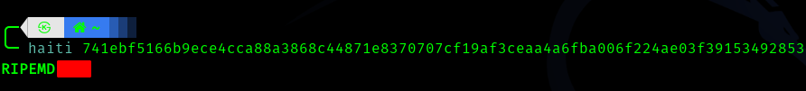
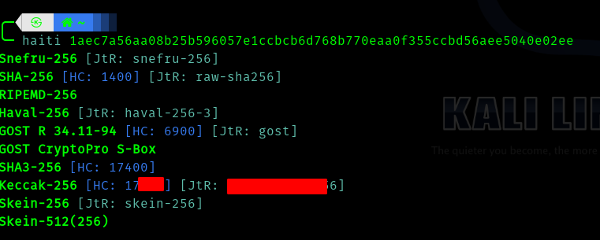
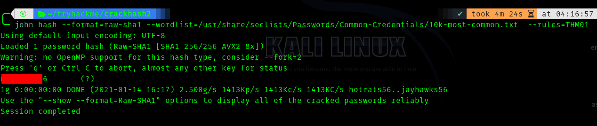
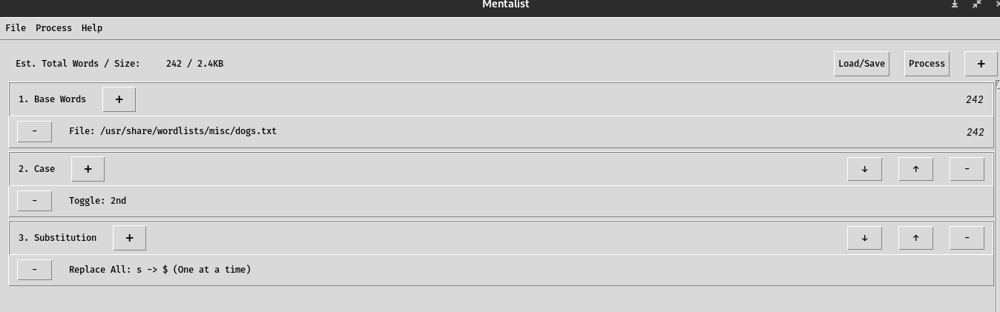
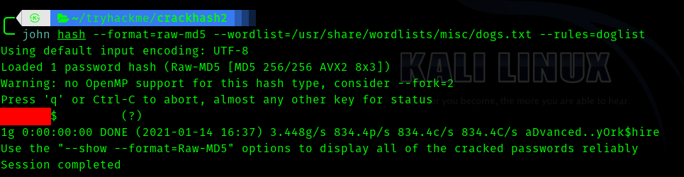

# [Crack_The_Hash_Level_2](https://tryhackme.com/room/crackthehashlevel2) Writeup


<p align="center">
  
</p>


## __Hash Identification__

First install the [haiti](https://noraj.github.io/haiti/) tool using the following command.

> sudo gem install haiti-hash

Task 1



Task 2 




## Wordlists 


Clone the "https://github.com/BlackArch/wordlistctl" repositry .

```shell
cd wordlistctl
pip3 -r requirements.txt
python3 wordlistctl.py
```

Play around with the tool and answer the tasks . This tool is easy and very powerful for password cracking.


## Cracking tools, modes & rules 


Use these commands to add a rule.

```shell
locate john.conf
cd <directory>
touch john-local.conf
nano john-local.conf
```

U can use your favorite editor to edit the file.

So the rule is :

```
[List.Rules:THM01]
$[0-9]$[0-9]
```

> So let me explain the rule given here. The rule says $[0-9]$[0-9] which means suppose there is a password in the wordlist which has  2 numbers consecutively , this rule makes the tool to try combination of numbers between 0-9 .




## Custom wordlist generation 


So we have to first fetch the wordlist named dogs

> python3 wordlistctl.py fetch -l dogs -d 


Now download the binary from the [github](https://github.com/sc0tfree/mentalist/releases) releases.


Now run the tool using:
> ./Mentalist




Save it as a rule and add it in John. OR save it as wordlist it is your choice.

```
[List.Rules:doglist]
<redacted rule>
```




Next tool is [Cewl](https://github.com/digininja/CeWL)


> cewl -d 2 -w $(pwd)/example.txt https://example.org

And the last word is your answer.


Next tool is [TTPassGen](https://github.com/tp7309/TTPassGen)

Install it using 
>pip install ttpassgen


This task is pretty much straight forward . Hence do it as instructed.


##  It's time to crack hashes 


### First hash

So it is a male name .

> python3 wordlistctl.py search male     

I downloaded **malenames-usa-top1000**


