# [Delivery](https://app.hackthebox.eu/machines/308) HackTheBox Writeup


This was a very interesting and a different box .


## __First Stage : Enumeration__


Hence as usual we fire up nmap.


```
# Nmap 7.91 scan initiated Sun Jan 31 19:38:00 2021 as: nmap -sC -sV -T4 -vv -p- -oN nmapscan 10.10.10.222
Nmap scan report for 10.10.10.222
Host is up, received syn-ack (0.24s latency).
Scanned at 2021-01-31 19:38:02 IST for 1456s
Not shown: 65532 closed ports
Reason: 65532 conn-refused
PORT     STATE SERVICE REASON  VERSION
22/tcp   open  ssh     syn-ack OpenSSH 7.9p1 Debian 10+deb10u2 (protocol 2.0)
| ssh-hostkey: 
|   2048 9c:40:fa:85:9b:01:ac:ac:0e:bc:0c:19:51:8a:ee:27 (RSA)
| ssh-rsa AAAAB3NzaC1yc2EAAAADAQABAAABAQCq549E025Q9FR27LDR6WZRQ52ikKjKUQLmE9ndEKjB0i1qOoL+WzkvqTdqEU6fFW6AqUIdSEd7GMNSMOk66otFgSoerK6MmH5IZjy4JqMoNVPDdWfmEiagBlG3H7IZ7yAO8gcg0RRrIQjE7XTMV09GmxEUtjojoLoqudUvbUi8COHCO6baVmyjZRlXRCQ6qTKIxRZbUAo0GOY8bYmf9sMLf70w6u/xbE2EYDFH+w60ES2K906x7lyfEPe73NfAIEhHNL8DBAUfQWzQjVjYNOLqGp/WdlKA1RLAOklpIdJQ9iehsH0q6nqjeTUv47mIHUiqaM+vlkCEAN3AAQH5mB/1
|   256 5a:0c:c0:3b:9b:76:55:2e:6e:c4:f4:b9:5d:76:17:09 (ECDSA)
| ecdsa-sha2-nistp256 AAAAE2VjZHNhLXNoYTItbmlzdHAyNTYAAAAIbmlzdHAyNTYAAABBBAiAKnk2lw0GxzzqMXNsPQ1bTk35WwxCa3ED5H34T1yYMiXnRlfssJwso60D34/IM8vYXH0rznR9tHvjdN7R3hY=
|   256 b7:9d:f7:48:9d:a2:f2:76:30:fd:42:d3:35:3a:80:8c (ED25519)
|_ssh-ed25519 AAAAC3NzaC1lZDI1NTE5AAAAIEV5D6eYjySqfhW4l4IF1SZkZHxIRihnY6Mn6D8mLEW7
80/tcp   open  http    syn-ack nginx 1.14.2
| http-methods: 
|_  Supported Methods: GET HEAD
|_http-server-header: nginx/1.14.2
|_http-title: Welcome
8065/tcp open  unknown syn-ack
| fingerprint-strings: 
|   GenericLines, Help, RTSPRequest, SSLSessionReq, TerminalServerCookie: 
|     HTTP/1.1 400 Bad Request
|     Content-Type: text/plain; charset=utf-8
|     Connection: close
|     Request
|   GetRequest: 
|     HTTP/1.0 200 OK
|     Accept-Ranges: bytes
|     Cache-Control: no-cache, max-age=31556926, public
|     Content-Length: 3108
|     Content-Security-Policy: frame-ancestors 'self'; script-src 'self' cdn.rudderlabs.com
|     Content-Type: text/html; charset=utf-8
|     Last-Modified: Sat, 30 Jan 2021 22:46:39 GMT
|     X-Frame-Options: SAMEORIGIN
|     X-Request-Id: qhy3etdhgt8k5pyka1789dqomr
|     X-Version-Id: 5.30.0.5.30.1.57fb31b889bf81d99d8af8176d4bbaaa.false
|     Date: Sun, 31 Jan 2021 14:38:27 GMT
|     <!doctype html><html lang="en"><head><meta charset="utf-8"><meta name="viewport" content="width=device-width,initial-scale=1,maximum-scale=1,user-scalable=0"><meta name="robots" content="noindex, nofollow"><meta name="referrer" content="no-referrer"><title>Mattermost</title><meta name="mobile-web-app-capable" content="yes"><meta name="application-name" content="Mattermost"><meta name="format-detection" content="telephone=no"><link re
|   HTTPOptions: 
|     HTTP/1.0 405 Method Not Allowed
|     Date: Sun, 31 Jan 2021 14:38:27 GMT
|_    Content-Length: 0

Service Info: OS: Linux; CPE: cpe:/o:linux:linux_kernel

Read data files from: /usr/bin/../share/nmap
Service detection performed. Please report any incorrect results at https://nmap.org/submit/ .
# Nmap done at Sun Jan 31 20:02:18 2021 -- 1 IP address (1 host up) scanned in 1458.01 seconds
```


So open ports are :

* 22
* 80
* 8065


> Note : add **delivery.htb** in /etc/hosts

So let's visit port 80.


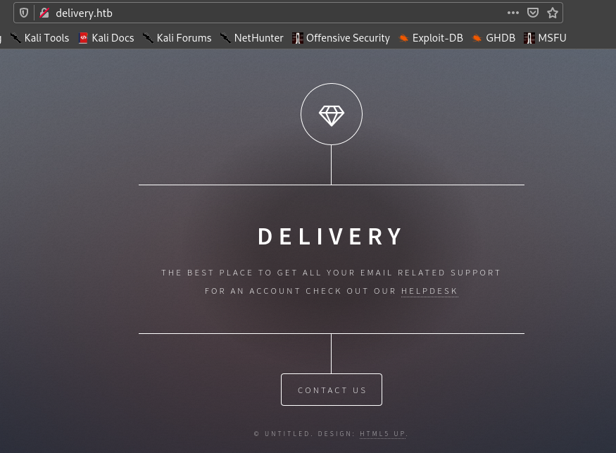


So the page provides link to Helpdesk which is **helpdesk.delivery.htb** , so add this in __/etc/hosts__.


So let's visit helpdesk.

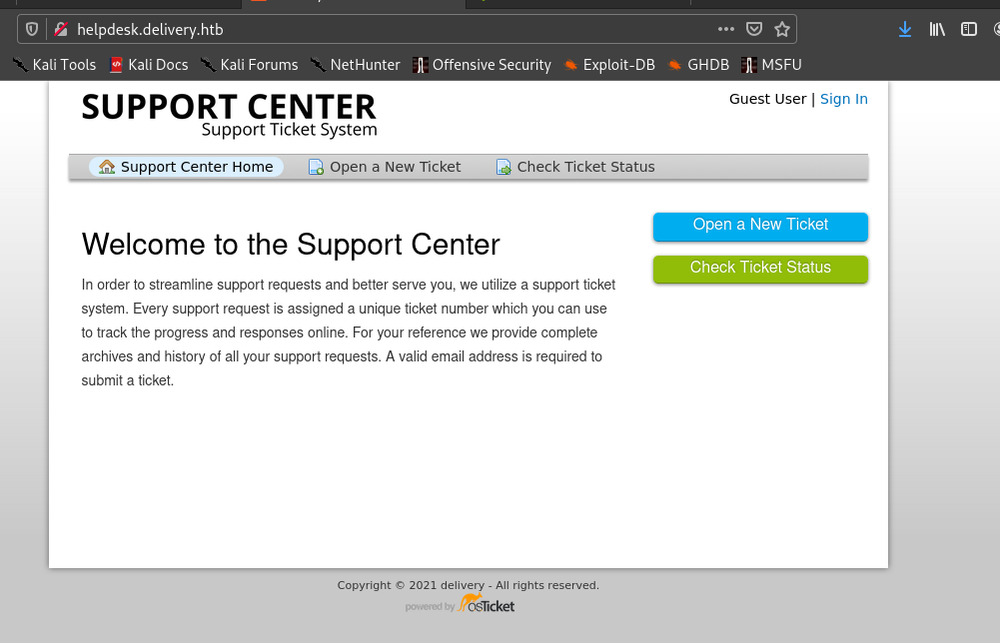.


If we go to contact us page we can see they have given link to another service which is at port 8065 , the **MatterMost**.


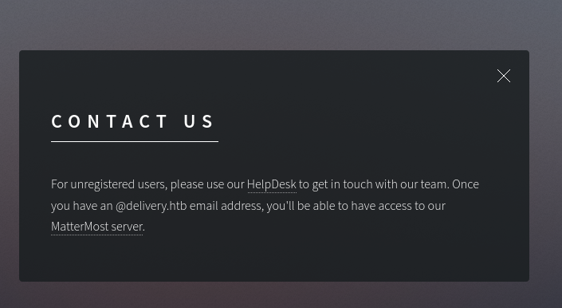

## __Second Stage : Initial access as maildeliverer__
Steps to follow :


```
1.So first open a ticket in helpdesk
2. You will be provided with a ticket and mail id.
3. Go to MatterMost and create an account with the given mail id.
4. The verification email will be sent to you
5. Go to helpdesk and check ticket status and go to the url provided in the mail .
6. Ur email is verified , now login to the MatterMost server with email id and password given .
7. U will get the password for **maildeliverer** .
```

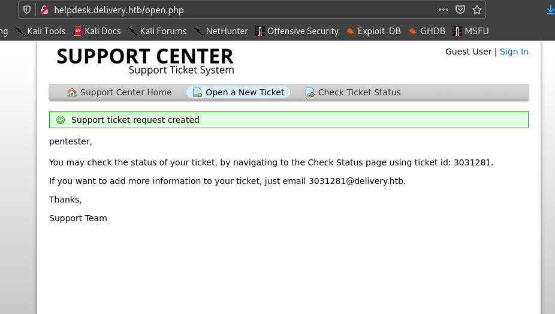

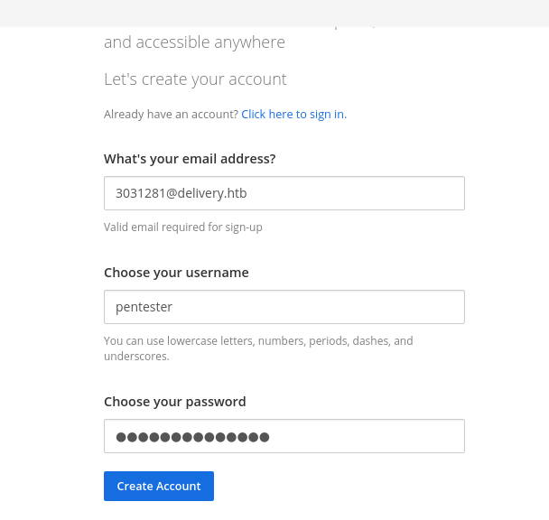


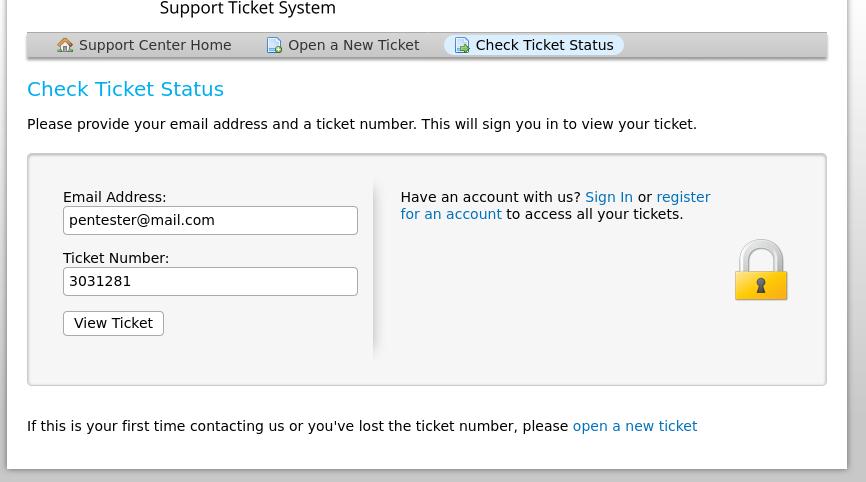


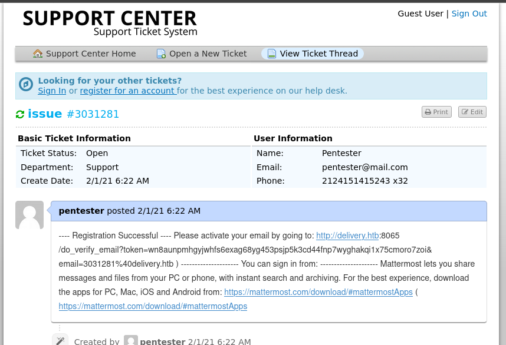


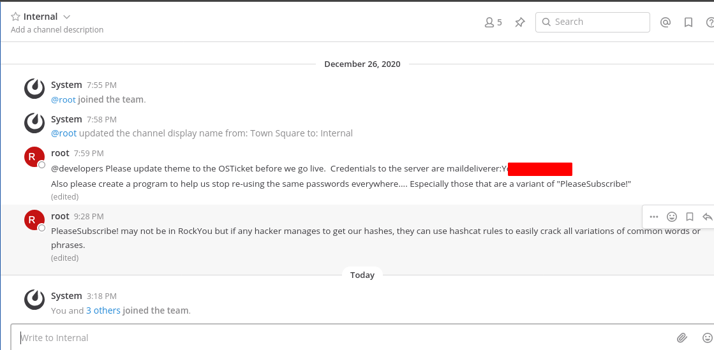


## __Third Stage : maildeliverer to root__


So we can ssh into the machine and get **user.txt**.


I ran linpeas found mysql server running in port 3306 and started searching for passwords in config files.


With the hint from a friend I looked in **/opt** .


And found it.


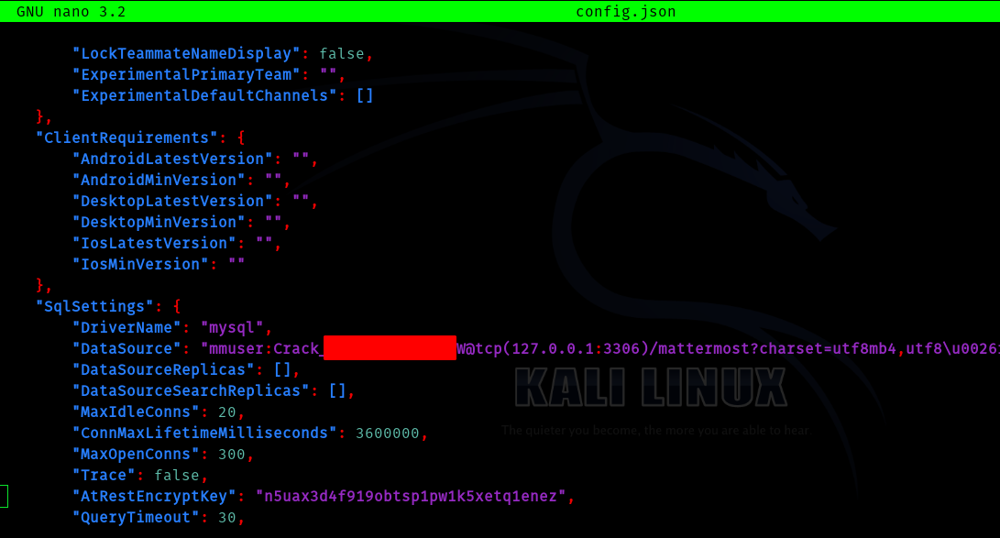


So I logged in to mysql .

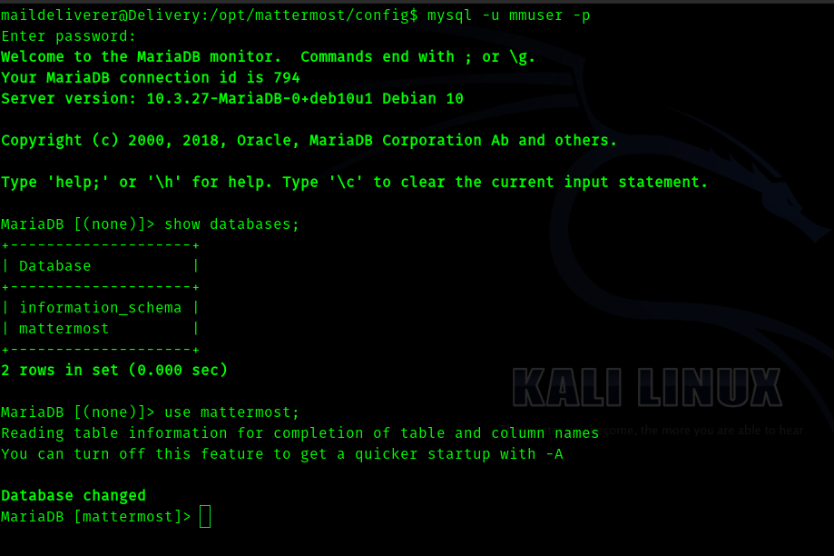


So after that I saw a table got users.


> select Username,Password from Users;


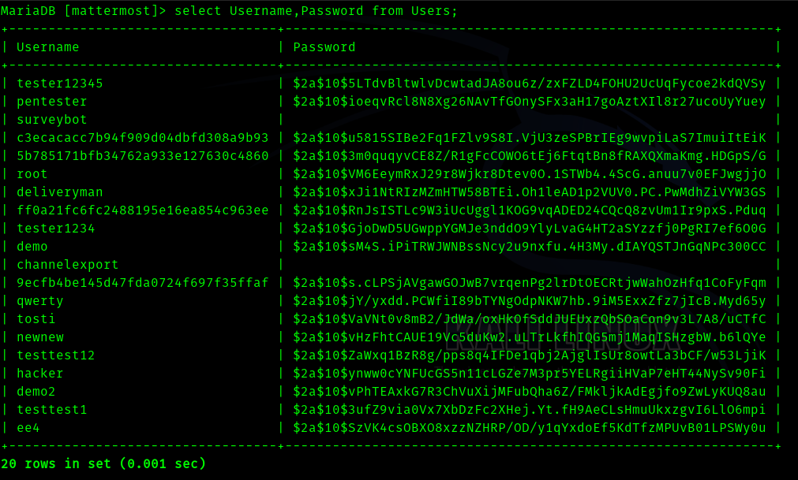


So I started cracking root's password blindly . But It took too long , after that I understood the mistake I was making . In mattermost server **root** has messaged that change password and don't use passwords like __PleaseSubscribe!__. 


So I created a wordlist with only one password and that was **"PleaseSubscribe!"**. 

Then I used best64 rule from https://github.com/hashcat/hashcat/blob/master/rules/best64.rule 

And used hashcat to crack . It cracked within seconds!!!.


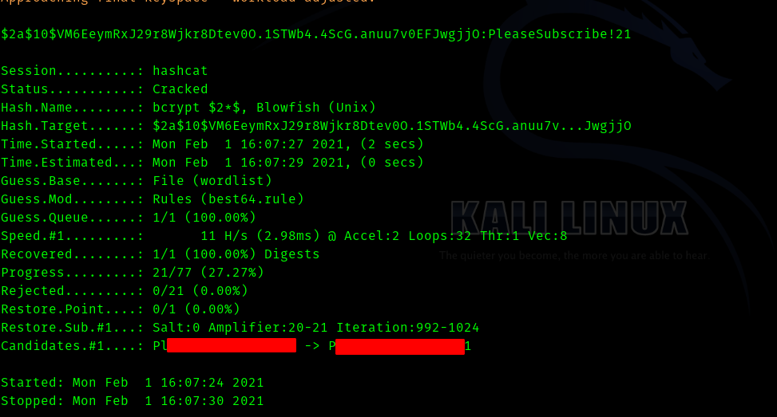

And got root flag.


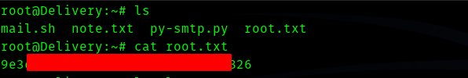


