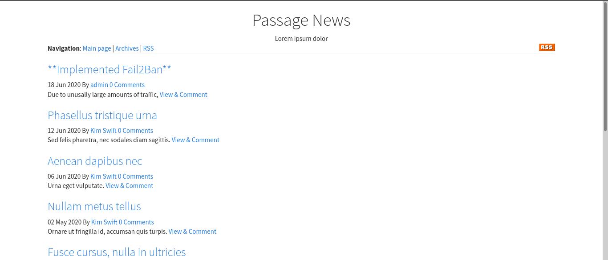
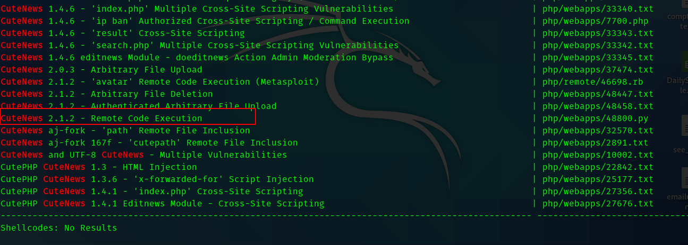
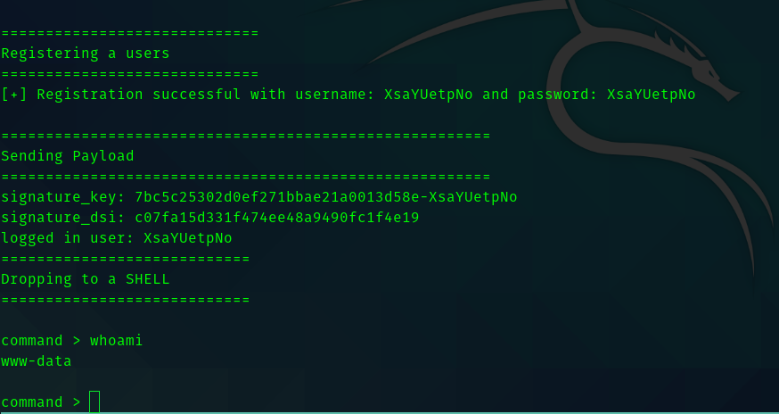
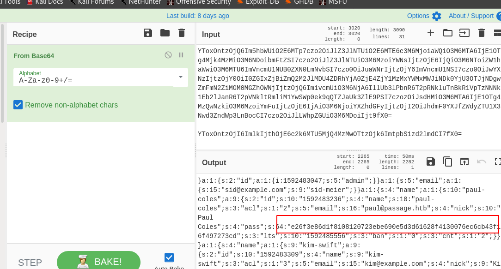
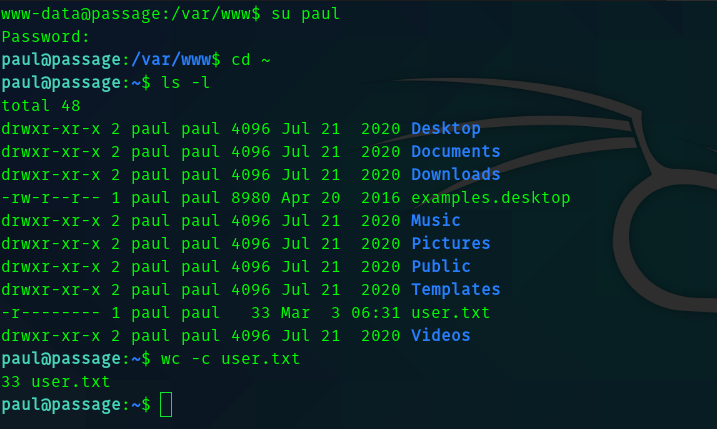
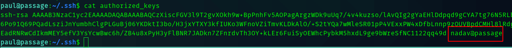
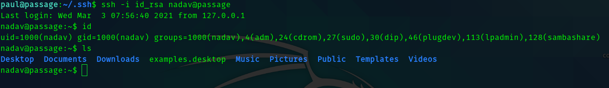
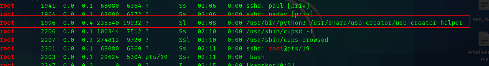
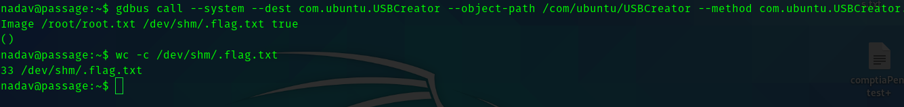

# Passage HackTheBox Writeup


## __First Stage : Enumeration__


As usual we start with nmap scan.

```
# Nmap 7.91 scan initiated Wed Mar  3 20:20:14 2021 as: nmap -sC -sV -T4 -vv -p- -oN nmapscan 10.10.10.206
Nmap scan report for 10.10.10.206
Host is up, received syn-ack (0.23s latency).
Scanned at 2021-03-03 20:20:16 IST for 771s
Not shown: 65533 closed ports
Reason: 65533 conn-refused
PORT   STATE SERVICE REASON  VERSION
22/tcp open  ssh     syn-ack OpenSSH 7.2p2 Ubuntu 4 (Ubuntu Linux; protocol 2.0)
| ssh-hostkey: 
|   2048 17:eb:9e:23:ea:23:b6:b1:bc:c6:4f:db:98:d3:d4:a1 (RSA)
| ssh-rsa AAAAB3NzaC1yc2EAAAADAQABAAABAQDVnCUEEK8NK4naCBGc9im6v6c67d5w/z/i72QIXW9JPJ6bv/rdc45FOdiOSovmWW6onhKbdUje+8NKX1LvHIiotFhc66Jih+AW8aeK6pIsywDxtoUwBcKcaPkVFIiFUZ3UWOsWMi+qYTFGg2DEi3OHHWSMSPzVTh+YIsCzkRCHwcecTBNipHK645LwdaBLESJBUieIwuIh8icoESGaNcirD/DkJjjQ3xKSc4nbMnD7D6C1tIgF9TGZadvQNqMgSmJJRFk/hVeA/PReo4Z+WrWTvPuFiTFr8RW+yY/nHWrG6LfldCUwpz0jj/kDFGUDYHLBEN7nsFZx4boP8+p52D8F
|   256 71:64:51:50:c3:7f:18:47:03:98:3e:5e:b8:10:19:fc (ECDSA)
| ecdsa-sha2-nistp256 AAAAE2VjZHNhLXNoYTItbmlzdHAyNTYAAAAIbmlzdHAyNTYAAABBBCdB2wKcMmurynbHuHifOk3OGwNcZ1/7kTJM67u+Cm/6np9tRhyFrjnhcsmydEtLwGiiY5+tUjr2qeTLsrgvzsY=
|   256 fd:56:2a:f8:d0:60:a7:f1:a0:a1:47:a4:38:d6:a8:a1 (ED25519)
|_ssh-ed25519 AAAAC3NzaC1lZDI1NTE5AAAAIGRIhMr/zUartoStYphvYD6kVzr7TDo+gIQfS2WwhSBd
80/tcp open  http    syn-ack Apache httpd 2.4.18 ((Ubuntu))
| http-methods: 
|_  Supported Methods: GET HEAD POST OPTIONS
|_http-server-header: Apache/2.4.18 (Ubuntu)
|_http-title: Passage News
Service Info: OS: Linux; CPE: cpe:/o:linux:linux_kernel

```


So the open ports are 

* 80
* 22

Hence I visited port 80.


So in the first post we can see that they have implemented **Fail2Ban** which blocks IP addresses if the server recieves repeated or malicious requests. Hence I know that gobuster wont work. But in the bottom of the page was something interesting.


Hence I searched for exploits using searchsploit.




The RCE exploit caught my eye. Hence I copied the exploit to current directory and analysed the code . So the code registers with a random username and password . And then tries to upload a php reverse shell in place of the avatar image. And executes the php file and gives you a shell in the box as www-data.


## __Second Stage : Initial Access as www-data__


Hence if we run the exploit.py and enter url. 




So using this I got a netcat shell in my local machine becuase it is comfortable than this one.


## __Third Stage : www-data to paul__


Linpeas didn't gave anything useful , so while searching manually I found this file .

> /var/www/html/CuteNews/cdata/users/lines


Which had base64 encoded hashes . Upon using CyberChef we can get the hashes.




So cracking the SHA-256 hash we get the password and we can su as paul




## __Fourth Stage : paul to nadav__


After getting the private key of paul we can ssh into the machine as paul. After running linpeas I got nothing.

I tried searching for privesc manually , then I found nadav's public key in authorized_keys.




Hence I thought maybe paul's public key is stored in nadav's authorized keys. 

So I tried this.

> ssh -i  id_rsa  nadav@passage




## __Fourth Stage : nadav to root__

After learning that nadav is in sudo group and adm group I started trying privlege escalation using those methods.

But after many rabbit holes , I ran  ```ps aux ```




Hence when I searched for the exploit using the usb-creator I found this article.

Article Link : https://unit42.paloaltonetworks.com/usbcreator-d-bus-privilege-escalation-in-ubuntu-desktop/


Please read this article to understand how does this exploit work.

> gdbus call --system --dest com.ubuntu.USBCreator --object-path /com/ubuntu/USBCreator --method com.ubuntu.USBCreator.Image /root/root.txt /dev/shm/.flag.txt true


Hence we get the root flag.


