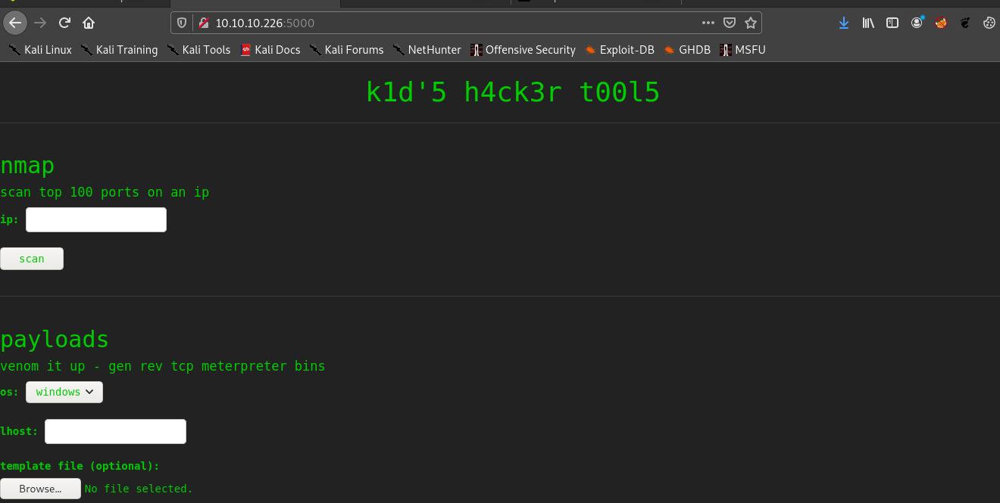
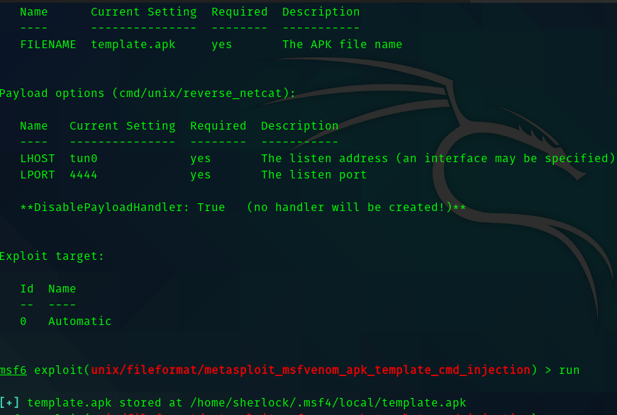
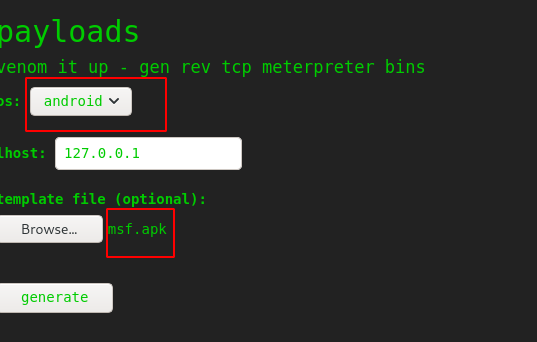
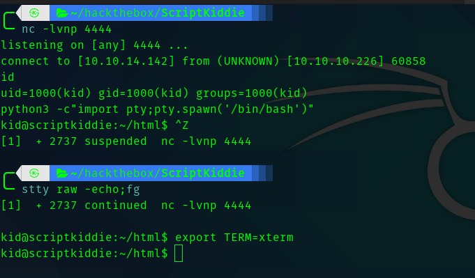
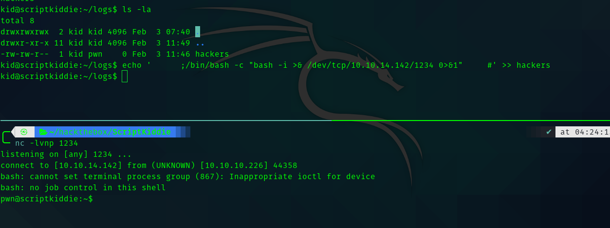
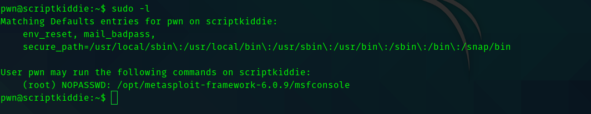
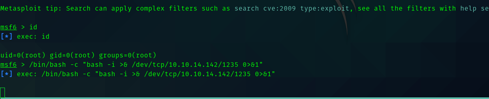
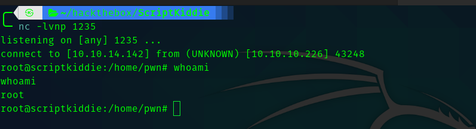

# ScriptKiddie HacktheBox Writeup


## __First Stage : Enumeration__


As usual we start with nmap .

```
# Nmap 7.91 scan initiated Wed Feb 10 20:50:05 2021 as: nmap -sC -sV -T4 -vv -p- -oN nmapscan 10.129.76.93
Warning: 10.129.76.93 giving up on port because retransmission cap hit (6).
Nmap scan report for 10.129.76.93
Host is up, received conn-refused (0.23s latency).
Scanned at 2021-02-10 20:50:06 IST for 977s
Not shown: 65345 closed ports, 188 filtered ports
Reason: 65345 conn-refused and 188 no-responses
PORT     STATE SERVICE REASON  VERSION
22/tcp   open  ssh     syn-ack OpenSSH 8.2p1 Ubuntu 4ubuntu0.1 (Ubuntu Linux; protocol 2.0)
| ssh-hostkey: 
|   3072 3c:65:6b:c2:df:b9:9d:62:74:27:a7:b8:a9:d3:25:2c (RSA)
| ssh-rsa AAAAB3NzaC1yc2EAAAADAQABAAABgQC/YB1g/YHwZNvTzj8lysM+SzX6dZzRbfF24y3ywkhai4pViGEwUklIPkEvuLSGH97NJ4y8r9uUXzyoq3iuVJ/vGXiFlPCrg+QDp7UnwANBmDqbVLucKdor+JkWHJJ1h3ftpEHgol54tj+6J7ftmaOR29Iwg+FKtcyNG6PY434cfA0Pwshw6kKgFa+HWljNl+41H3WVua4QItPmrh+CrSoaA5kCe0FAP3c2uHcv2JyDjgCQxmN1GoLtlAsEznHlHI1wycNZGcHDnqxEmovPTN4qisOKEbYfy2mu1Eqq3Phv8UfybV8c60wUqGtClj3YOO1apDZKEe8eZZqy5eXU8mIO+uXcp5zxJ/Wrgng7WTguXGzQJiBHSFq52fHFvIYSuJOYEusLWkGhiyvITYLWZgnNL+qAVxZtP80ZTq+lm4cJHJZKl0OYsmqO0LjlMOMTPFyA+W2IOgAmnM+miSmSZ6n6pnSA+LE2Pj01egIhHw5+duAYxUHYOnKLVak1WWk/C68=
|   256 b9:a1:78:5d:3c:1b:25:e0:3c:ef:67:8d:71:d3:a3:ec (ECDSA)
| ecdsa-sha2-nistp256 AAAAE2VjZHNhLXNoYTItbmlzdHAyNTYAAAAIbmlzdHAyNTYAAABBBJA31QhiIbYQMUwn/n3+qcrLiiJpYIia8HdgtwkI8JkCDm2n+j6dB3u5I17IOPXE7n5iPiW9tPF3Nb0aXmVJmlo=
|   256 8b:cf:41:82:c6:ac:ef:91:80:37:7c:c9:45:11:e8:43 (ED25519)
|_ssh-ed25519 AAAAC3NzaC1lZDI1NTE5AAAAIOWjCdxetuUPIPnEGrowvR7qRAR7nuhUbfFraZFmbIr4
5000/tcp open  http    syn-ack Werkzeug httpd 0.16.1 (Python 3.8.5)
| http-methods: 
|_  Supported Methods: GET POST HEAD OPTIONS
|_http-server-header: Werkzeug/0.16.1 Python/3.8.5
|_http-title: k1d'5 h4ck3r t00l5
Service Info: OS: Linux; CPE: cpe:/o:linux:linux_kernel
```

So open ports are :

* 5000
* 22

Let's visit port 5000





## __Second Stage : Initial access__


So there are 3 tools nmap, msfpayload generator , searchsploit.

Initially I tried command injection , RFI but got nothing.
But this one caught my eyes 

[Msfvenom APK Template Cmnd Injection](https://www.rapid7.com/db/modules/exploit/unix/fileformat/metasploit_msfvenom_apk_template_cmd_injection/).

So I created a payload. Named in msf.apk .

So select os as Android and upload the payload as the template.









So we get the user flag . And we can see that there is another user called pwn .

## __Third Stage : kid to pwn__

And in the pwn user's home directory we can see that there is a file called scanlosers.sh . 

```bash
#!/bin/bash

log=/home/kid/logs/hackers

cd /home/pwn/
cat $log | cut -d' ' -f3- | sort -u | while read ip; do
    sh -c "nmap --top-ports 10 -oN recon/${ip}.nmap ${ip} 2>&1 >/dev/null" &
done

if [[ $(wc -l < $log) -gt 0 ]]; then echo -n > $log; fi
```

Hence in the place of ${ip} we can insert our command and get shell , if there exists a cronjob run by user pwn.

And hackers file is owned by kid and pwn. So we can edit the file and insert our payload and get shell.




## __Fourth Stage : pwn to root__


When I tried sudo -l I got this interesting output.





So I typed **sudo msfconsole**

And did this 



Hence we get shell as root.




